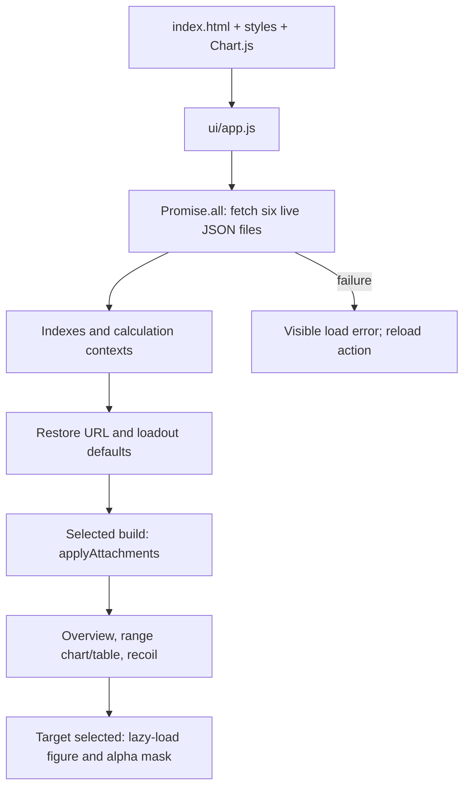

# Application architecture

[Documentation index](README.md) · [Data sources](DATA_SOURCES.md) · [User guide](USER_GUIDE.md)

## Runtime boundary and startup

The root site is a static ES-module application. [index.html](../index.html) supplies
markup, [ui/styles.css](../ui/styles.css) supplies styling, and the vendored
[Chart.js bundle](../vendor/chart.umd.min.js) supplies the damage chart. There is no
package-install requirement, bundler, application server, or database.

The six startup requests are `weapons.json`, `recoil_decay.json`,
`balance_tables.json`, `attachments.json`, `ammo.json`, and `ballistics.json` under
`data/`. These are ordinary `fetch()` requests, not JSON module imports. A failed
request rejects initialization. Provenance, reload-exception registers, reference
workbooks, and raw Frosty exports are not browser dependencies.

[ship-surface.json](../ship-surface.json) declares the live surface and three
published historical versions. It is a validation contract, not an access-control
or deployment-exclusion mechanism: reference material may be published without being
loaded by the application.

## Module ownership

| Module | Responsibility |
|---|---|
| [ui/app.js](../ui/app.js) | Startup, application state, orchestration, charts, plot sampling/projection, events, responsive behavior. |
| [sim/loadout.js](../sim/loadout.js), [sim/attachments.js](../sim/attachments.js) | Defaults, availability, slot definitions, point totals, assumption detection. |
| [sim/applyAttachments.js](../sim/applyAttachments.js) | Base weapon → effective build; tier composition, reload, velocity, handling, ammo effects. |
| [sim/damage.js](../sim/damage.js) | Damage curves, hit-zone policy, pellet totals, BTK. |
| [sim/ballistics.js](../sim/ballistics.js) | Flight-time approximation, vector trajectory integration, zeroing. |
| [sim/core.js](../sim/core.js) | Shot intervals, recoil generation, spread growth/recovery, shared display ceiling. |
| [sim/target.js](../sim/target.js) | Lazy target image, geometry/alpha hit test, zone classification, impact summaries. |
| [sim/share-state.js](../sim/share-state.js) | Compact and legacy URL encoding/decoding and selection validation. |
| [ui/loadout.js](../ui/loadout.js), [ui/target-stats.js](../ui/target-stats.js) | Attachment controls and target-result presentation. |
| [ui/capture.js](../ui/capture.js) | Current-view PNG capture; no independent weapon calculations. |

The simulation layer is reusable but not entirely context-free: `setSimContext()`
and the attachment context inject shared tables, aim/stance, compensation and
platform behavior. Tests or tools calling these functions must initialize/reset
their contexts deliberately. Source records are treated as read-only; the attachment
resolver constructs a selected build rather than mutating the base weapon.

## State and rendering

`state` holds two loadout slots, comparison mode, chart options, recoil options,
and collapsed panels. Loadout changes flow through the shared resolver; rendering
must not independently reapply modifiers. Overview, range charts, contextual recoil
stats, and target results consume the selected build, with different display contexts.

Selected builds are cached by slot, weapon reference and attachment selection.
Default builds, recoil patterns, spread sequences and trajectory calculations have
input-keyed caches. Hidden panels skip detailed rendering. Pan/zoom redraws are
scheduled on an animation frame; resize observation rebuilds plot dimensions.
Canvas backing dimensions account for device-pixel ratio. Chart.js instances are
reused rather than recreated for every ordinary update.

The target PNG and alpha mask load only when the target view is visible, including
entry through a shared link or popout. A missing image disables hit classification.
Keyboard/ARIA behavior includes labeled selects, pressed/selected controls, and a
compact-layout loadout dialog with focus trapping, Escape dismissal, inert background,
and focus restoration. These contracts require manual browser verification for UI changes.

## URL compatibility contract

URL writes are debounced by 200 ms and use `history.replaceState`. The fragment is
encoded with `URLSearchParams`. The codec validates weapon IDs and attachments
against per-weapon availability; unknown/out-of-range tokens are ignored.

| Fragment field | Meaning |
|---|---|
| `w`, `a`; `cmp=1`, `w2`, `a2` | Primary/secondary weapon and attachment tokens, comparison. |
| `cm`, `hs`, `ads`, `vel` | Chart mode, headshot count, optional ADS/flight-time additions. |
| `ra`, `rs`, `rp`, `rcc`, `sh` | Aim, stance, platform, recoil-control percentage, shot count. |
| `rv`, `rd`, `rz`, `rta`, `rax`, `ray` | Target view, distance, zero, aim preset/custom coordinates. |
| `cl` | Dot-separated collapsed panel keys. |

Compact attachment tokens use **zero-based decimal catalog positions**, not IDs:
`S` sights, `M` muzzles, `B` barrels, `G` grips, `L` lasers, `T` lights, `A` ammo,
`E` ergonomics, and `K` magazine keys. `R` means a grip in a combined laser slot;
`H` means a light in that slot. Only differences from the weapon's defaults are emitted.
Magazine positions use `Object.keys(WEAPON_MAG[id].mags)` insertion order.

Legacy dash-separated IDs use this fixed order:
`sight, muzzle, barrel, grip, laser, light, ammo, ergo, mag`.
Preserve both existing catalog order **and magazine object-key order**. UI-only menu
sorting is safe when it does not reorder the source catalogs.

New target links always carry distance (default 20 m). Old target links lacking
`rd` restore 30 m. The codec clamps decoded distance to 5–300 m and recoil control
to 0–125%; the UI subsequently snaps target distance and clamps shots to 1–100.
It validates zeroing against 100/200/300/400/500 m. See
[share-state tests](../scripts/share-state.test.mjs) for protected cases.

Seeds, layers, plot pan/zoom/magnification, spread-circle custom selections, target
stats tab, and display resolution/FOV are not encoded. Display preferences use
local storage. The popout carries this same partial state using `?popout=1` and
operates independently after opening.

## Image capture and published history

Capture clones the rendered main column and header, snapshots canvases, removes
interactive controls, and measures an independent iframe at 1280 CSS pixels.
It serializes an SVG `foreignObject` and produces a 2× PNG. Overview is temporarily
expanded and restored in `finally`; other collapsed panels stay collapsed. The
layout is standardized, but existing chart bitmaps are captured rather than
recomputed into a new simulation. Clipboard failures fall back to PNG download;
render/encoding failures produce an error state.

`v1.3.3.0/`, `v1.3.1.0/`, and `v1.2.3.0/` are self-contained historical products.
They are not imports for the current application. Keep maintenance in the live
root unless correcting a defect specific to a historical page.
