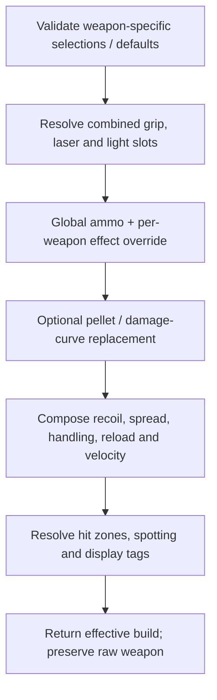

# Attachment and loadout calculations

[Documentation index](README.md) · [Stat ladders](STAT_LADDERS.md) · [Data reference](DATA_REFERENCE.md)

The authoritative composition function is
[applyAttachments()](../sim/applyAttachments.js). [sim/loadout.js](../sim/loadout.js)
owns defaults, availability and cost. Keeping selection and calculation separate
lets the UI and URL decoder use the same supported choices.

## From selection to effective build



This is a dependency overview; axes can be evaluated independently. Modifier
composition is not an arbitrary sequence of mutating the weapon once per dropdown.
The resolver starts from the base record and combines the applicable fields once.

Blank selections have nine keys: sight, muzzle, barrel, grip, laser, light, ammo,
mag and ergo. Weapon defaults supply barrel/ammo/magazine IDs. Combined rail slots
resolve a selected grip or light stored in `atts.laser`; neutral laser/light/grip
records fill unused branches. Costs count the actual shared-slot choice once.
Sight costs may be overridden per weapon; ammo costs are per-weapon; magazines
carry their own costs. The UI warns above 100 points without rejecting the build.

## Modifier composition by axis

| Axis | Current composition |
|---|---|
| ADS recoil amount | Base effective `recoilV` times the per-weapon factor raised to the sum of grip, muzzle, ammo and ergo ADS tiers; rounded to three decimals. |
| ADS variation | Raw ADS `dirVar` times `dirVarMult` raised to base exponent plus muzzle/grip/ergo variation changes; rounded to three decimals. |
| Hip recoil amount / variation | Add supported hip tiers to the raw hip group's exponents. Amount includes ammo; variation comes from muzzle/grip/ergo. The per-aim simulator evaluates the group. |
| Hip minimum spread | Muzzle/barrel/laser/grip/ammo shifts select one source row. Replace standing/moving minima and preserve each maximum. |
| ADS dynamics | Merge raw ADS dynamics, then ammo override, then ergo override. Ergo wins for overlapping fields; ADS barrel increment scaling follows. |
| Hip dynamics | Merge raw hip dynamics with ergonomic hip override. Heavy-barrel ADS modifiers do not alter this branch. |
| Moving ADS minimum | Shared base plus grip/laser/barrel/magazine modifiers selects the moving-spread row. |
| ADS time / movement | Resolve reviewed bases with the axis-specific signed modifier equations in the ladder guide. |
| Sprint / deploy / undeploy | Sum timing effects independently across magazine, grip, ergo, barrel, muzzle, laser, light and ammo; clamp once. Deploy/undeploy share their selected index. |

There is no universal rule that a named attachment affects every aim state or every
recovery phase. Heavy-type barrels use source ADS increment ×0.666667, firing
coefficient ×1.837117 and firing/not-firing offsets ×0.666667. Increment precision
is retained for simulation. AK4D recordings support the ADS reduction; transfer
to other weapons and barrel variants remains source-based. Muzzle ADS recovery
boosts and light hip boosts scale firing offsets
separately. [Recoil and spread](RECOIL_SPREAD_MODEL.md) explains fallback parameters
and why retained native fields are not all executed.

## Tactical reload and magazine capacity

For ordinary magazines:

```text
tacticalSeconds = baseTacRld /
                  (RELOAD_SPEED_MULTIPLIERS[reloadSpeedTier or 0] × ergoReloadMult)
```

For an explicit animation override:

```text
tacticalSeconds = tacRldOverrideMs / ergoReloadMult / 1000
```

The override already supplies the magazine animation time; do not also divide it
by the ordinary magazine factor. An absent ergonomic multiplier is 1. Invalid
present scalar inputs or an unsupported normal factor yield null timing.
For example, PP-19's 53-round override is 2667 ms; Improved Mag Catch at 1.063
gives about 2508.937 ms, displaying 2509 ms. Its composed-loadout evidence is distinct
from a single-attachment panel observation.

The [exception register](../data/reload-exceptions.json) preserves four animation
record identities covering five magazine entries, plus a screenshot exception and
composed-loadout evidence. The browser does not load this file; the maintained
magazine fields contain the accepted values and validation checks their agreement.
The PP-19 20 Fast suspected-game-bug note must not be treated as proof that expected
fixed behavior has occurred.

Selected `magData.mag` overrides the base weapon's capacity. Do not infer chamber
rules by subtracting one from every record. Empty reload is retained from the weapon;
the tactical resolver does not derive attachment-adjusted empty reload or per-shell
reload cycles.

## Projectile velocity and ammunition

Merge the global ammo record with `WEAPON_AMMO[id].effectOverrides[ammoId]` before
using its effects. A projectile override replaces pellet count/damage curve for
that weapon/ammo pair; no override retains the base projectile data.

Velocity composition has two stages. A `subsonic-tier` treatment applies the stored
nonnegative tier to the 0.8 factor; an absolute treatment supplies the recorded
pre-barrel velocity. Then the barrel applies `0.8^(−velTierMod)`. If the barrel has
no tier field, a valid legacy `velMult` can be used. A present invalid tier does
not silently fall back to the legacy multiplier. An invalid/unrecognized ammo
treatment currently returns the base velocity with a diagnostic reason; it does
not fail closed in the same way as an invalid barrel or reload input.

`_projectileVelocityMps` retains precision; `bulletVel` is the floored display value
with a narrow floating-point epsilon correction. Physics must not reuse the floored
card value when the precise result is available. Ammo drag is selected separately
in UI projectile-model assembly; it is not a velocity-tier effect.

## Other effects and disclosure

Head/limb multipliers follow [damage policy](DAMAGE_BALLISTICS.md), including ammo
and weapon-specific exceptions. Spot-on-fire ranges take the minimum of applicable
muzzle, barrel and ammo distances: baseline world range 54 m and minimap range
150 m. A suppressor on either muzzle or barrel can activate ammo's suppressed
minimap value. Zero metres is a real configured result, not missing data.

Collateral uses the per-weapon/ammo override first, then the ammo's class mapping,
else null. Regeneration delay is the ammo value or the 5 s baseline (Frangible
carries 9 s). Both are displayed descriptors, not a simulated penetration path or
regenerating opponent in the TTK calculation.

Ergonomics can change fire mode. Auto takes precedence over burst and clears burst
metadata; a configured `autoRpm` can change cadence, as with VSSM Folding Stock's
800 RPM. Folding Stock also sets `recoilDecreaseFactorOverride: 76` and
`recoilDecreaseTimeExponentOverride: 1.24`. The resolver copies these to `decFactor`
and `decTimeExp` in both aim-state groups, without modifying the base weapon.
The current recovery equation consumes them. Smooth recoil uses source operands:
`1.2` recovery and a `0.05`-second duration override for ordinary modifiers, or
`1.728` and `0.066667` for 17 mapped Bolt weapon–muzzle combinations. The resolver
merges `muzzle.weaponOverrides[weaponId]` over the muzzle catalog record first.
This selects the attachment-specific values in both aim states; it is not a
weapon-class override. Base duration is read from each weapon's recoil group.
The override precedes ergonomics duration additions; the simulation delivers
recoil over the resulting duration with concurrent recovery. See the
[per-attachment table](RECOIL_SPREAD_MODEL.md#duration-and-smooth-attachment-selection)
and [validation and assumptions](RECOIL_MODEL_VALIDATION_2026-09-11.md). Visual recoil, sway and
laser visibility are descriptors; there is no separate camera/sway/visibility model.

`assumed:true` or nonempty `assumedFields` marks a selectable effect as assumed.
Old annotation keys can survive renames, so check the current consumer as well as
the label. Combined laser records retain a hip recovery boost that is currently
not read from that slot; standalone resolved lights do apply their boost. That
limitation and deferred source-native alternatives are documented in
[model limitations](MODEL_LIMITATIONS.md), not silently promoted by this guide.
