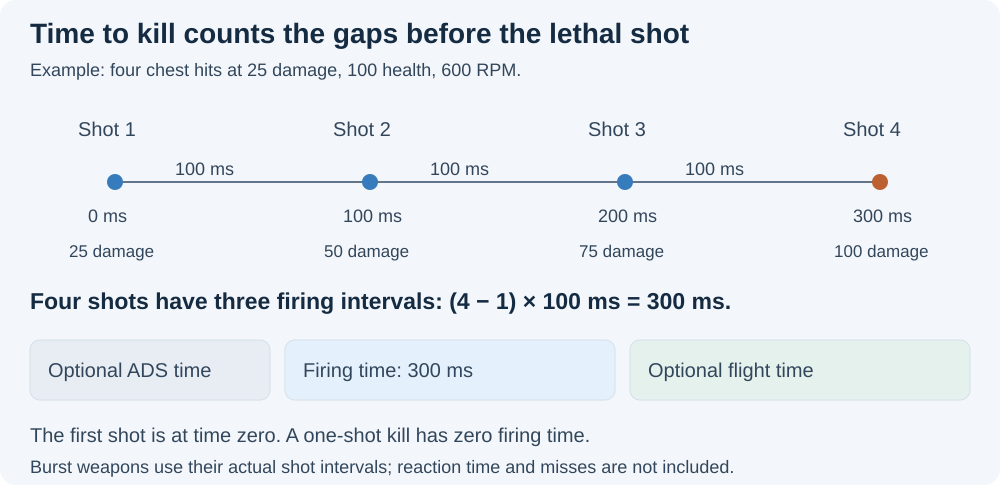

# Damage, firing cadence, and ballistics

[Documentation index](README.md) · [Attachment model](ATTACHMENT_MODEL.md) · [Recoil and spread](RECOIL_SPREAD_MODEL.md)

Sources of current behavior: [sim/damage.js](../sim/damage.js),
[sim/core.js](../sim/core.js), [sim/ballistics.js](../sim/ballistics.js),
[sim/target.js](../sim/target.js), and chart/projectile assembly in
[ui/app.js](../ui/app.js). These equations explain the analyzer, with physical
validation boundaries listed below.

## Range/damage curves

A `dmg` array contains ordered `{r,d,source?}` points: `r` in metres and `d` in
health points per projectile/pellet. Clamp below/above the recorded extent to the
first/last damage. Between distinct adjacent ranges, interpolate linearly:

```text
D(r) = d0 + (d1 − d0) × (r − r0) / (r1 − r0)
```

Repeated ranges encode instantaneous tier changes. At the exact repeated range,
the earlier/outgoing value wins; immediately beyond it the incoming tier applies.
For example, M433's curve retains 26.05 at exactly 21 m and uses 20.67 just beyond
21 m. Never sort equal-range points by damage, collapse duplicates, or replace a
gradual falloff with steps. Sniper sweet spots can increase damage with distance;
shotgun curves can contain short linear transitions.

Damage per shot is `D(r) × (pellets or 1)`. Ammo-specific projectile overrides can
replace both curve and pellet count. This assumes all pellets hit the same selected
zone for ordinary damage/BTK calculations. It does not simulate pellet distribution.
The chart samples integer metres, rounds plotted damage to two decimals and caps
that display at 100; the underlying damage calculation remains uncapped.

## Hit-zone policy

Chest multiplier is 1. Head uses the headshot multiplier; stomach/abdomen, arms and
legs use the limb multiplier. Both come from Frosty per weapon and ammo in
[data/hit_zones.json](../data/hit_zones.json), generated by
[scripts/frosty-hit-zones.py](../scripts/frosty-hit-zones.py).

| Value | Frosty chain |
|---|---|
| Headshot | Material-grid head row (projectile material against the soldier head material), read at the weapon's `DamageProtectionMultiplierIndex` plus ammo protection steps (`WME_Protection_P10` adds 1, `P20` adds 2). |
| Limb | Material-grid record for the projectile material against the soldier limb material. The abdomen record is the same value. |
| Ammo | Selector-linked ammo modifiers can add protection steps or swap the projectile, which can change its material. |

Examples: automatics 1.4 head and 0.84 limb; bolt-action snipers 1.75 and 0.67;
M39 EMR, SVK-8.6 and SVDM 1.5 and 0.91. VSSM has its own protection index (1.8 head)
but a 5.56 carbine-material projectile (0.84 limb). The generated headshot values
match all 321 ammo-panel readings, after four misread screenshot records were
corrected by visual review. Do not add class-level overrides: regenerate the file
after a game update (see [maintenance](../MAINTENANCE.md)).

## Bullets to kill

For health `H` (UI: 100), shot damage `D`, head multiplier `h`, body multiplier `b`,
and requested headshots `n` (floored, nonnegative):

```text
lethalHeadshots = ceil((H − 1e−9) / (D × h))
if n >= lethalHeadshots: BTK = lethalHeadshots
otherwise: BTK = n + max(0, ceil((H − n × D × h − 1e−9) / (D × b)))
```

The epsilon prevents floating-point noise at exact lethal thresholds. Missing
curves return unavailable; nonpositive damage/health cannot yield an ordinary finite
BTK. A 25-damage chest-only weapon needs four hits against 100 health. If its head
multiplier is 2, one headshot plus two chest hits needs three shots; two headshots
need two. This counts a chosen hit sequence, not probability or player accuracy.

## Firing cadence and TTK

Normal inter-shot interval is `60 / rpm` seconds. For a burst with `B` rounds,
within-burst rate `R` and bursts per minute `Q`:

```text
normal = 60 / R
interval after an internal burst shot = normal
interval after a burst's last shot = max(normal, 60 / Q − (B − 1) × normal)
TTK_ms = round(1000 × sum(interval after shots 1 through BTK−1))
```

The first shot occurs at time zero. Four shots at 600 RPM take 300 ms. A one-shot
kill takes zero firing time. Bolt-action and pump-action intervals use the Frosty
manual cycle: bolt time ÷ bolt speed + bolt delay + the fire interval. The DB-12
fires two rounds per pump cycle. The UI can add ADS time and one projectile
flight time at the selected distance. Missing flight-model output makes that
flight-inclusive point unavailable; missing resolved ADS time currently contributes
zero. These additions do not simulate reacting, aiming while sprinting, recoil
causing misses, reloading, armor, suppression, or healing.



## Projectile model assembly

The build retains precise velocity after ammo and barrel composition. UI assembly
prefers that value, then the base weapon velocity.
[data/ballistics.json](../data/ballistics.json) is generated by
`scripts/frosty-ballistics.py` from current Frosty projectile XML and the generated
hit-zone attachment trace. It links 63 weapons and 328 ammo selections to 64
projectiles. All linked base projectiles have gravity −9.81 m/s² and drag
0.0035 m⁻¹. Match selections use their explicit replacement projectiles with
drag 0.002 m⁻¹. Missing selections remain unavailable; there is no class or global
coefficient fallback. Non-ammo SP branches are outside this selection map.

Validation requires positive finite velocity, finite nonnegative drag, and finite
gravity. The source coefficients do not
independently confirm each weapon's full native trajectory.

### Flight time

For the level-shot drag equation `dv/dt = −k v²`, distance `x` and initial velocity `v0`:

```text
T(x) = expm1(k × x) / (k × v0)    when k > 0
T(x) = x / v0                     when k = 0
```

This closed form drives the optional TTK flight-time addition. It describes the
level drag model and does not include the vector solver's gravity/zeroing solution.

### Trajectory and zeroing

The target view uses a two-dimensional model with positive y upward:

```text
dp/dt = v
dvx/dt = −k × |v| × vx
dvy/dt = gravity − k × |v| × vy
```

The solver uses RK4 steps of 1/500 s, interpolates the target-plane crossing, and
stops after 30 s if no crossing is reached. For a selected zero, bisection over
launch angles −0.1 to +0.1 radians (36 iterations) finds a trajectory crossing y=0
at that range; the same angle is then evaluated at the target distance. It omits
sight height. An unbracketed/invalid solution returns null. DMR/sniper UI builds
use selected zeroing; others use the bore-relative trajectory.

## Target projection and impact statistics

Each angular point projects to `distanceM × tan(angleDeg × π/180) × 100` centimetres.
The target view adds the aim offset and the modeled vertical displacement. The
current UI uses zero vertical displacement if trajectory/model resolution fails;
that fallback is not a measured no-drop result.

The soldier image is scaled to 180 cm. Its alpha mask (threshold 32/255) decides
whether a point hits the silhouette; approximate piecewise body-zone boundaries
classify head, upper/lower torso, arms and legs. Resolution, magnification and FOV
change viewing geometry rather than the generated angular sample. Missing image
means no target hit result.

Impact damage uses the same range and hit-zone helpers. It counts hits/misses,
zone totals and the first shot reaching 100 damage. Total damage continues after
lethality, and the displayed hit rate describes this sample. Pellet loads suppress
these statistics: the plot has one direction per shell, not individual pellets.
The 75-damage styling is a presentation threshold, not a further kill calculation.

Target geometry, sampling, the drag equation and source-composition uncertainty
limit physical interpretation. See [limitations](MODEL_LIMITATIONS.md); tests
protect implementation behavior rather than establishing in-game accuracy.
