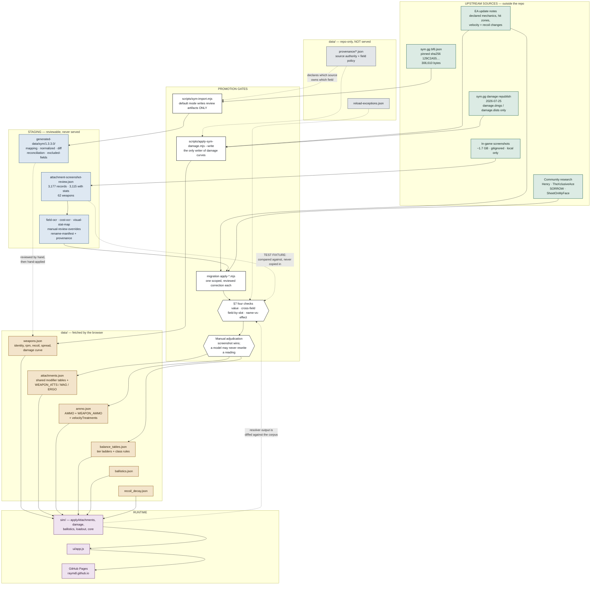
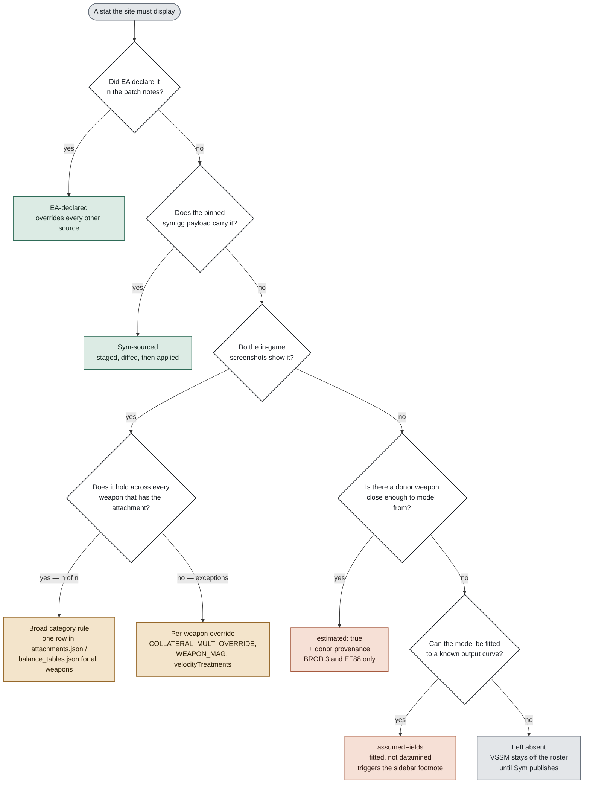

# Data Flow and Validation

Where every number on the site comes from, and what each gate checks before a value ships.

Four kinds of evidence feed this project, and only two of them are allowed to write into `data/`.
The screenshot corpus — the largest body of evidence by far — is deliberately not one of them.

> **"The scrape is a test fixture, not a data source."**
> — [DERIVED_ATTACHMENT_MODEL.md](../migration/1.3.3.0/DERIVED_ATTACHMENT_MODEL.md) §7

---

## Contents

- [The pipeline](#the-pipeline)
- [Which source owns which field](#which-source-owns-which-field)
- [How a value earns its status](#how-a-value-earns-its-status)
- [The validation gates](#the-validation-gates)
- [Reading the runtime boundary](#reading-the-runtime-boundary)

---

## The pipeline

Solid arrows move values. **Dashed arrows carry no values at all** — they are comparisons, where one
artifact is used to test another. The screenshot corpus reaches `data/` only through a human
promotion step, never automatically.



<details open>
<summary>Diagram source (mermaid)</summary>

The SVG above is rendered from this source and committed alongside it, so the diagram
looks the same everywhere. GitHub's mermaid renderer lays subgraphs out differently from
the one this was drawn with, which is why it is embedded as an image rather than a live
fence. Re-render with `node scripts/render-docs-diagrams.mjs` after editing.



</details>

The two dashed edges at the bottom are the important ones: the screenshot corpus and the resolver
are compared *to each other*, and a disagreement is recorded rather than auto-resolved.

---

## Which source owns which field

`data/provenance/1.3.3.0.json` is the tiebreaker. It records not just where a value came from, but
which source **wins** when two disagree, and which fields no remote source can answer at all.

| Policy | Fields | Reaches `data/` how |
|---|---|---|
| `eaOverride` | Hit-zone multipliers, automatic headshot multipliers, explicitly listed velocity and recoil changes, sniper sweet-spot ranges | Overrides Sym wherever the two disagree |
| `symImport` | Weapon identity and class, rate of fire, velocity, gravity, drag, magazine and reload, deploy, recoil, spread and recovery | Staged to `generated-data/`, reviewed, then applied |
| `inGameRequired` | Post-patch damage floats, PP-19 attachment availability and point costs, all barrel × ammunition velocity combinations, attachment effects no current source exposes | Screenshot evidence → §7 gates → manual promotion |
| `deferred` | REDSEC armor simulation; bullet drag, travel-time, remaining-velocity, lead and drop simulation | Not modeled — absent rather than guessed |

---

## How a value earns its status

Not every value in `data/` has the same standing. Two of these classes carry an explicit marker so
the UI can footnote them; the rest are load-bearing without qualification.



<details open>
<summary>Diagram source (mermaid)</summary>

The SVG above is rendered from this source and committed alongside it, so the diagram
looks the same everywhere. GitHub's mermaid renderer lays subgraphs out differently from
the one this was drawn with, which is why it is embedded as an image rather than a live
fence. Re-render with `node scripts/render-docs-diagrams.mjs` after editing.



</details>

The bottom path is the one that keeps the model honest: a value with no evidence is omitted, not
filled with a plausible default.

### The four classes in practice

**Broad category rule.** The shared tables in `attachments.json` — one entry per barrel, muzzle,
grip, ammo — apply to every weapon offering that attachment. Class-level rules live alongside them
in `balance_tables.json`: `HIP_CLS`, `LIMB_CLASS`, `AUTO_HS_MULT`, and collateral by weapon class.

**Per-weapon override.** When a broad rule holds for most weapons but not all, the exception is
named explicitly rather than weakening the rule — `COLLATERAL_MULT_OVERRIDE`, `WEAPON_MAG` tier
shifts, and per-pair `velocityTreatments`.

**Assumed.** `assumedFields` marks a value that reproduces an observed output curve without being a
confirmed game parameter — the heavy-barrel `adsSpreadIncMult: 0.80` is the standing example. The UI
footnotes these.

**Visually calibrated.** Chart scale defaults, scatter run count, spread-bubble schedule, cone shape,
distance-panel sizing. Design choices; they make no claim about game behaviour.

---

## The validation gates

The §7 checks are executable, not described. Each catches a different failure mode, and the third
exists specifically because assuming a stat's inputs is how a wrong model survives review.

| Check | Question | Caught in practice |
|---|---|---|
| 1 · value | Does the reading match the model? | 8 of 9 reload errors; 22 recoil-variation errors |
| 2 · cross-field | Does the capacity in the attachment *name* match its `magazineSize`? | RPK-74M 36Rnd — value right, name wrong |
| 3 · field-by-slot | Which slots change this stat, and does the resolver agree? | Heavy Extended moving sprint recovery — a slot the resolver modeled as inert |
| 4 · name-vs-effect | Does a name implying a speed effect actually have one? | 11 unnamed 1.13 magazines; PP-19 20Rnd Fast Mag |

**Check 1 may never rewrite a reading on its own.** A model–panel disagreement is a request to
re-read the screenshot. The one time this was inverted, the model was wrong and the scrape was right
— and the bad record became invisible to every later sweep precisely because it now agreed with the
model.

**Disagreements are inventoried, not resolved by rule.** `model-tier-mismatch-inventory` and
`field-slot-asymmetry-inventory` hold findings open with an explicit `unadjudicated` status.

**Corrections are executable receipts.** Each `migration/1.3.3.0/attachment-audit/apply-*.mjs`
carries pinned before/after values, the reason the correction is safe, and mirrors itself into the
manual-review override ledger. Reruns report `noOp` and change nothing.

**`scripts/validate-data.mjs` guards referential and derivational integrity** — every id referenced
by `WEAPON_AMMO`, `HIP_CLS`, `COLLATERAL_MULT_OVERRIDE` and friends must resolve, and coupled fields
must agree (for example `drawTimeTier === defSpr + sprintOrigin`).

---

## Reading the runtime boundary

`ship-surface.json` pins what the live site actually loads. Six JSON files are fetched by the
browser:

```
data/ammo.json          data/balance_tables.json     data/recoil_decay.json
data/attachments.json   data/ballistics.json         data/weapons.json
```

Everything else under `data/` is build- and validation-only. `data/provenance/` and
`data/reload-exceptions.json` are never served, and neither is anything under `migration/`,
`scripts/`, `generated-data/`, or `docs/`.

---

*Drawn against `main` at v1.3.3.0. Record counts from the tracked attachment audit
(3,177 records / 62 weapons); field policy from `data/provenance/1.3.3.0.json`.*
