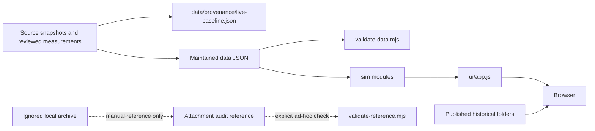

# Current Data Flow

The live site has one short production path. Reference evidence and historical working material are
kept outside it.

## Live boundary

`ship-surface.json` declares the live entrypoint, module/data directories, assets, vendor files, and the
two published historical folders. `scripts/validate-ship-surface.mjs` checks declared paths and local
runtime references. The current page never reads the attachment audit or `.local-archive/`.

## Maintained data

The browser consumes weapon, attachment, ammunition, balance, recoil-decay, and ballistics JSON. Reload
exceptions and provenance are repository contracts used by validation but are not fetched by the live
page unless explicitly added to the ship surface.

The data validator checks roster completeness, IDs, cross-file references, supported classes, source
coverage, estimated-weapon disclosure, reload exceptions, and other current invariants. Calculation
tests then check behavior using the same maintained data.

## Source priority

Use the most exact applicable source. Exact game/source arrays outrank rounded UI panels. Reviewed direct
measurements outrank inference. When a value is estimated from a donor or model, keep that provenance and
the visible estimate warning; do not relabel it as measured.

Source version numbers remain useful facts in provenance and in the site header. They identify what the
current values represent.

## Attachment reference

`reference-data/attachment-audit/attachment-screenshot-review.json` and its workbook are a completed,
portable reference. The generic validator checks package integrity and derived counts. It is run manually
when new weapons or attachments make the reference relevant again.

The sorted captures live beside the reference at
`reference-data/attachment-audit/Weapon Attachments/` and are ignored by Git. Contact sheets,
correction utilities, old inventories, and other intermediate materials remain in
`.local-archive/2026-08-12-live-baseline/`. Nothing in either ignored location is required for a clone,
test run, or deployment.

## Historical pages

`v1.3.1.0/` and `v1.2.3.0/` are published snapshots for visitors who want to inspect older weapon
behavior. They are linked by the current page but are not dependencies of current calculations.
