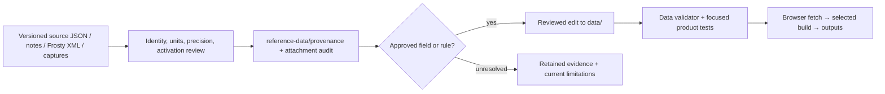

# Data sources and provenance

[Documentation index](README.md) · [Data reference](DATA_REFERENCE.md) · [Stat ladders](STAT_LADDERS.md)

## What the current baseline means

[data/provenance/live-baseline.json](../data/provenance/live-baseline.json) identifies
the accepted live dataset and its source policy. At this review it contains 63
weapons and three source records. This is a mixed-source baseline, not a wholesale
export of every field from a single game version.

| Source record | Scope and evidence | Boundary |
|---|---|---|
| `sym-bf6-json`, data version **1.4.2.0**, data version date **18 AUG 2026** | Base weapon fields and exact damage curves from [Sym's BF6 JSON](https://sym.gg/legacy/pages/bf6/data/bf6.json); version/date confirmed by the maintainer. | The data-version date is not a retrieval date. Historical snapshot metadata below does not identify the 1.4.2.0 payload. |
| `ea-update-notes`, version 1.3.3.0 | [EA's update notes](https://www.ea.com/games/battlefield/redsec/news/battlefield-6-game-update-1-3-3-0), for declared mechanics and explicit changes. | Notes do not supply every internal coefficient or prove unmentioned fields. |
| `frosty-local-export`, labeled 1.4.2.5 | Reviewed local XML exports, per-weapon/attachment provenance, source arrays, and configuration joins. | Version is a user-supplied export label; source literals and their activation/native arithmetic are separate claims. |
| In-game captures and attachment audit | Displayed defaults, point costs, labels, attachment changes, and composed-loadout checks. | Panel rounding, capture version, defaults, identity and composition must be retained. A displayed stat is not automatically an exact internal value. |

The Sym record stores the data-version date as `sourceVersionDate: 2026-08-18`.
Its earlier recorded 1.3.3.0 snapshot's 25 July 2026 retrieval date and SHA-256 are
preserved under `historicalSnapshot`; neither is attributed to the 1.4.2.0 payload.
A retrieval date and full-payload hash for 1.4.2.0 are not recorded in the baseline.
A source-version label does not mean every live field was reimported from that
release; older field-level import notes remain historical provenance.

The baseline's `damageStatus: verified` records project acceptance. Individual
`damageSource` notes can still say provisional or pending in-game confirmation.
There are no currently listed estimated weapon IDs, but fitted attachment effects,
source-composition questions, and historical donor notes remain. Read field-level
provenance and [limitations](MODEL_LIMITATIONS.md) rather than interpreting a single
status as validation of the entire simulator.

## Source-to-runtime flow

No scraper or research script automatically refreshes production JSON at startup.
The maintained files in `data/` are the runtime contract. Research output is
review input, and the test suite checks consistency/behavior rather than independently
remeasuring the game.

## Frosty review pipeline

[scripts/frosty-configuration.py](../scripts/frosty-configuration.py) reads a supplied
local export and compares configuration without writing live data. Its semantic
entry point is `Common/GameSetup/Tweakables/GameRemixer/GRX_Weapons.xml`.
WB assets identify weapon/projectile configuration; GS assets identify recoil and
spread. Field paths are retained, including zoomed/unzoomed variants.

Attachment tracing follows explicit EBX path/GUID references and selector/progression
joins from active ability-root branches. A nearby asset name, similar numeric value,
or embedded object is insufficient evidence that a modifier is selected. Magazine
identity requires the selector and UI/loadout context, not capacity alone.

Keep source path, object GUID, field path/index, raw literal, decoded value, units,
source version, input hash, and derivation whenever available. Unknown hashed fields
remain unknown. Arrays/structs and empty arrays are excluded from scalar inference.
SDK metadata can justify primitive decoding: signed Int32 hex needs explicit signed
conversion; Single values retain exported decimal precision; booleans require the
literal type. Numeric resemblance alone must not assign signedness or enum meaning.

[research-attachment-modifiers.py](../scripts/research-attachment-modifiers.py)
examines linked effect boundaries. [frosty-sdk-metadata.ps1](../scripts/frosty-sdk-metadata.ps1)
extracts local SDK field-type evidence. Both are research aids, not an alternative
production calculation engine or a reason to infer unresolved native behavior.

## Important evidence families

| Evidence | Use |
|---|---|
| [Array review](../reference-data/provenance/frosty-array-review-2026-09-09.json) | Source row order, hashed columns, base indices, tier factors, 187 input hashes. Its site-comparison hashes describe the pre-integration snapshot. |
| [Draw-time review](../reference-data/provenance/frosty-draw-time-2026-09-09.json) | Sprint/deploy/undeploy source seconds, exact millisecond tables, base indices and source hashes. |
| [Magazine identity](../reference-data/provenance/frosty-magazine-identity-review-2026-09-07.json) and [model update](../reference-data/provenance/frosty-magazine-model-update-2026-09-07.json) | Mapping decisions, normalization, reviewed handling/reload changes. |
| [Attachment boundary](../reference-data/provenance/frosty-all-attachment-effect-boundary.json) and [approved changes](../reference-data/provenance/frosty-approved-attachment-updates-2026-09-06.json) | Exact linked effects versus implemented/deferred model behavior. |
| [Shotgun ammo](../reference-data/provenance/frosty-shotgun-ammo.json), [ammo drag](../reference-data/provenance/frosty-1.4.2.5-ammo-drag.json) | Pellet/slug curves and projectile coefficients. |
| [Attachment audit](../reference-data/attachment-audit/README.md) | Canonical screenshot review JSON and derived workbook; raw capture library is local-only. |

The [evidence index](../reference-data/provenance/README.md) covers the remaining
families. Original narrative investigations are in the [archive](../archive/README.md).
Their checkpoint counts and proposed next steps are historical, not current defects
or a current implementation backlog.

## Promotion and reproducibility rules

Promote only the fields whose identity, units and intended activation are supported.
Preserve distinct range points, source array order, repeated endpoint rows, and literal
precision. Round for presentation only. An exact native coefficient can still need
an explicitly reviewed simulator mapping; changing both together conceals that distinction.

Compare a candidate against the current default build and the relevant composed
loadouts. Preserve captures that contradict the candidate. Record why an override,
normalized base, donor value, or fitted constant remains, with its limitations.
Keep the code/data change and its provenance reviewable together.

A clean checkout runs the product and its tests. It cannot reproduce all historical
research without the original XML exports, SDK, screenshots, or ignored local archive.
Retained hashes identify inputs; they do not make missing inputs available. Do not
regenerate evidence simply to force old snapshot hashes to match current live files.
