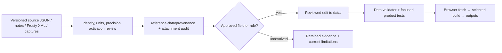

# Data sources and provenance

## September 13 source integration

The current model uses explicit projectile and hit-zone selections for 63 weapons
and 328 ammo choices. Collateral values come from the named ten-row source table
with the operator-confirmed final index clamp. Regeneration uses 5 s plus the
source ammo delay; sway compares supported amount factors against the default
loadout; spotting multiplies source factors against the existing 54/150 m bases.
The latter bases and native composition remain model assumptions.

Source spread exponents now drive `radius = spread * U ** exponent`: usually 0.5,
with 0.67 for moving ADS on Interdictor. Controller recoil uses 0.8836 in the
existing platform amount model. The decoded light fields replace the former
15% hip-recovery estimate for all 137 supported light/combination selections.
Selected lights are modeled as active; idle recovery is not simulated.

Reproduction uses [projectile extraction](../scripts/frosty-ballistics.py),
[hit-zone extraction](../scripts/frosty-hit-zones.py), and
[collateral generation](../scripts/frosty-collateral.py). The collateral generator
reads the retained compiled trace, not a new XML export. Source paths, hashes,
field identities and comparison evidence are indexed in
[provenance](../reference-data/provenance/README.md). The
[global audit](working/FROSTY_GLOBAL_CANDIDATES_2026-09-13.md) records the decisions;
[model limitations](MODEL_LIMITATIONS.md) separates configuration from native proof.


[Documentation index](README.md) · [Data reference](DATA_REFERENCE.md) · [Stat ladders](STAT_LADDERS.md)

## Attachment source generation

Four generators now read current XML operands for barrel ADS, grip/laser/magazine
handling, sniper brake amount steps, and Linear Comp/burst recoil. Retained audits
supply identities and source joins, not replacement numeric values. Generated
reports retain field paths, GUIDs and hashes. The burst review follows nested
fire-mode selectors; field source status and simulation support are separate.

The [attachment generation report](working/FROSTY_ATTACHMENT_GENERATION_2026-09-13.md)
records 233 unique barrel selections, 1,488 handling selections, 16 sniper brake
pairs and 53 Linear Comp/burst pairs. Two belt-box description mismatches remain recorded as possible bugs; their
unsupported spread penalties were removed after matched screenshot review.
The [maintenance workflow](../MAINTENANCE.md#regenerate-attachment-modifiers)
provides the commands. Source-only ability branches do not establish availability.

## What the current baseline means

Attachment tooltip text is maintained separately from mechanics. The
[display-name and description audit](working/FROSTY_DISPLAY_NAMES.md#current-site-mapping)
records 2,952 choices with resolved Frosty text, 15 with explicitly approved
game-panel text, and 45 still missing text. Panel transcriptions preserve the
original unresolved Frosty pointers and do not populate other weapons. The
[reverse inventory](working/FROSTY_UNMATCHED_WEAPONS_ATTACHMENTS.md) separates
known attachment types, possible matches, and records with no known menu counterpart.

[data/provenance/live-baseline.json](../data/provenance/live-baseline.json) identifies
the accepted live dataset and its source policy. At this review it contains 63
weapons and three source records. This is a mixed-source baseline, not a wholesale
export of every field from a single game version.

| Source record | Scope and evidence | Boundary |
|---|---|---|
| `sym-bf6-json`, data version **1.4.2.0**, data version date **18 AUG 2026** | Recorded baseline for base weapon fields and the former damage curves (now Frosty; see below) from [Sym's BF6 JSON](https://sym.gg/legacy/pages/bf6/data/bf6.json); embedded metadata and full-payload SHA-256 checked against the [recorded September 6 snapshot](../reference-data/provenance/sym-1.4.2.0-interdictor.json). | Verification used a user-supplied full payload on 9 September 2026, not a fresh HTTP retrieval. The data-version date and recorded retrieval date are distinct. |
| `ea-update-notes`, version 1.3.3.0 | [EA's update notes](https://www.ea.com/games/battlefield/redsec/news/battlefield-6-game-update-1-3-3-0), for declared mechanics and explicit changes. | Notes do not supply every internal coefficient or prove unmentioned fields. |
| `frosty-local-export`, labeled 1.4.2.5 | Reviewed local XML exports, per-weapon/attachment provenance, source arrays, and configuration joins. | Version is a user-supplied export label; source literals and their activation/native arithmetic are separate claims. |
| In-game captures and attachment audit | Displayed defaults, point costs, labels, attachment changes, and composed-loadout checks. | Panel rounding, capture version, defaults, identity and composition must be retained. A displayed stat is not automatically an exact internal value. |

The Sym record maps the payload's `info.version` and `info.versionDate` to
`sourceVersion` and the ISO-formatted `sourceVersionDate`. On 9 September 2026,
the complete 327,287-byte user-supplied JSON was hashed without reformatting. Its
SHA-256 exactly matches the full-source hash in the retained September 6 evidence
record; its embedded metadata and entire Interdictor object also match that record.
The payload contains 63 weapon records plus a separate `info` object.

The baseline now records that verified hash, the evidence path, and
`retrievedDate: 2026-09-06`. This retrieval date comes from the existing source
record; the upload verification does not establish a new HTTP retrieval date or
the endpoint's present contents. The retained evidence file contains the Interdictor
extract and full-source hash, rather than a complete copy of the source payload.

The earlier recorded 1.3.3.0 snapshot's 25 July 2026 retrieval date and SHA-256 remain
under `historicalSnapshot`; neither identifies the 1.4.2.0 payload. Source identity
and roster count do not establish that every live value matches Sym or was reimported
from this release; older field-level import notes remain historical provenance.

The baseline's `damageStatus: verified` records project acceptance. Frosty is the
golden damage source: every `damageSource` names the Frosty 1.4.2.5 projectile curve
that supplies `dmg`. The 59 curves formerly labelled Sym were compared with Frosty and
kept their values; the M45A1 keeps an in-game-confirmed step at 75 m
([damage curve review](../reference-data/provenance/frosty-damage-curve-review-2026-09-13.json)).
Weapon display names use the in-game spelling from Frosty localization
([method](working/FROSTY_DISPLAY_NAMES.md)).
No weapon is estimated or uses donor values. BROD 3, EF88 and VSSM, which Sym does
not publish, use Frosty 1.4.2.5 values. Fitted attachment effects and
source-composition questions remain. Read field-level
provenance and [limitations](MODEL_LIMITATIONS.md) rather than interpreting a single
status as validation of the entire simulator.

## Local Frosty export location

As of 9 September 2026, the local XML export root is:

```text
C:\Users\royal\Documents\BF6 Datamining\Frosty
```

The export root contains `_AF`, `Animations`, `Common`, and `Game`. Frosty asset
routes are unchanged; resolve source-relative XML paths beneath this root.
The manifests (`ebx_manifest.txt`, `ebx_manifest.csv`, `ebx_directories.txt`),
extraction scripts, handoff, and `research-1.4.2.5` remain in the parent
`BF6 Datamining` folder. The `Battlefield 6 Offsets HTML` collection also remains
in that parent folder.

For analyzer tools that accept the XML export root, use `--root "../BF6 Datamining/Frosty"`
from the analyzer repository. Historical reports and provenance can retain the
old absolute export paths; substitute the new root when locating their XML inputs,
without rewriting recorded hashes or moving manifest/research paths.

The separate `audit_weapon_exports.py` in the datamining workspace expects
`ebx_manifest.txt` inside `--root`. Its historical command requires adaptation
for the split layout; changing only `--root` is insufficient.

## Source-to-runtime flow



No scraper or research script automatically refreshes production JSON at startup.
The maintained files in `data/` are the runtime contract. Research output is
review input, and the test suite checks consistency/behavior rather than independently
remeasuring the game.

## Frosty review pipeline

[scripts/frosty-configuration.py](../scripts/frosty-configuration.py) reads a supplied
local export and compares configuration without writing live data. Its semantic
entry point is `Common/GameSetup/Tweakables/GameRemixer/GRX_Weapons.xml`.
WB assets identify weapon/projectile configuration; GS assets identify recoil and
spread. Field paths are retained, including zoomed/unzoomed variants.

Attachment tracing follows explicit EBX path/GUID references and selector/progression
joins from active ability-root branches. A nearby asset name, similar numeric value,
or embedded object is insufficient evidence that a modifier is selected. Magazine
identity requires the selector and UI/loadout context, not capacity alone.

Keep source path, object GUID, field path/index, raw literal, decoded value, units,
source version, input hash, and derivation whenever available. Unknown hashed fields
remain unknown. Arrays/structs and empty arrays are excluded from scalar inference.
SDK metadata can justify primitive decoding: signed Int32 hex needs explicit signed
conversion; Single values retain exported decimal precision; booleans require the
literal type. Numeric resemblance alone must not assign signedness or enum meaning.

[research-attachment-modifiers.py](../scripts/research-attachment-modifiers.py)
examines linked effect boundaries. [frosty-sdk-metadata.ps1](../scripts/frosty-sdk-metadata.ps1)
extracts local SDK field-type evidence. Both are research aids, not an alternative
production calculation engine or a reason to infer unresolved native behavior.

[frosty-hit-zones.py](../scripts/frosty-hit-zones.py) is the production extractor for
headshot and limb multipliers ([data/hit_zones.json](../data/hit_zones.json)). It reuses
the attachment graph above, reads raw material grids dumped by
[frosty-raw-assets.ps1](../scripts/frosty-raw-assets.ps1), and records input hashes and
per-ammo derivations in a dated `reference-data/provenance/frosty-hit-zones-*.json`
file. Grid class and field names are stripped; the identification rests on the head
row reproducing every panel headshot value and the limb records reproducing the
checked limb values.

## Important evidence families

| Evidence | Use |
|---|---|
| [Recoil duration audit](../reference-data/provenance/frosty-recoil-duration-audit-2026-09-11.json) | Current GS base durations for all 63 weapons, named registry corroboration where present, four Smooth modifier operands, and 17 weapon–muzzle exceptions. Retains source hashes and the PP-19 Flash Comp mapping gap. |
| [AK4D Heavy analysis](archive/AK4D_HEAVY_BARREL_RECORDING_ANALYSIS_2026-09-11.md) | Basic/Heavy HUD measurements, source ADS factor comparison, and limits on cross-weapon transfer. |
| [Array review](../reference-data/provenance/frosty-array-review-2026-09-09.json) | Source row order, hashed columns, base indices, tier factors, 187 input hashes. Its site-comparison hashes describe the pre-integration snapshot. |
| [Draw-time review](../reference-data/provenance/frosty-draw-time-2026-09-09.json) | Sprint/deploy/undeploy source seconds, exact millisecond tables, base indices and source hashes. |
| [Magazine identity](../reference-data/provenance/frosty-magazine-identity-review-2026-09-07.json) and [model update](../reference-data/provenance/frosty-magazine-model-update-2026-09-07.json) | Mapping decisions, normalization, reviewed handling/reload changes. |
| [Attachment boundary](../reference-data/provenance/frosty-all-attachment-effect-boundary.json) and [approved changes](../reference-data/provenance/frosty-approved-attachment-updates-2026-09-06.json) | Exact linked effects versus implemented/deferred model behavior. |
| [Shotgun ammo](../reference-data/provenance/frosty-shotgun-ammo.json), [ammo drag](../reference-data/provenance/frosty-1.4.2.5-ammo-drag.json) | Pellet/slug curves and projectile coefficients. |
| [Generated ballistics](../data/ballistics.json) and [current hit-zone trace](../reference-data/provenance/frosty-hit-zones-2026-09-13.json) | Current projectile hashes and explicit weapon/ammo selections; generated by `scripts/frosty-ballistics.py`. |
| [Global operand audit](../reference-data/provenance/frosty-global-operands-2026-09-13.json) | Attachment kill-switch defaults, controller bindings, sway/spotting/ADS/regeneration operands and material-table candidates. Values do not establish native composition. |
| [Attachment audit](../reference-data/attachment-audit/README.md) | Canonical screenshot review JSON and derived workbook; raw capture library is local-only. |

The [evidence index](../reference-data/provenance/README.md) covers the remaining
families. Original narrative investigations are in the [archive](archive/README.md).
Their checkpoint counts and proposed next steps are historical, not current defects
or a current implementation backlog.

## Promotion and reproducibility rules

Promote only the fields whose identity, units and intended activation are supported.
Preserve distinct range points, source array order, repeated endpoint rows, and literal
precision. Round for presentation only. An exact native coefficient can still need
an explicitly reviewed simulator mapping; changing both together conceals that distinction.

Compare a candidate against the current default build and the relevant composed
loadouts. Preserve captures that contradict the candidate. Record why an override,
normalized base or fitted constant remains, with its limitations.
Keep the code/data change and its provenance reviewable together.

A clean checkout runs the product and its tests. It cannot reproduce all historical
research without the original XML exports, SDK, screenshots, or ignored local archive.
Retained hashes identify inputs; they do not make missing inputs available. Do not
regenerate evidence simply to force old snapshot hashes to match current live files.
