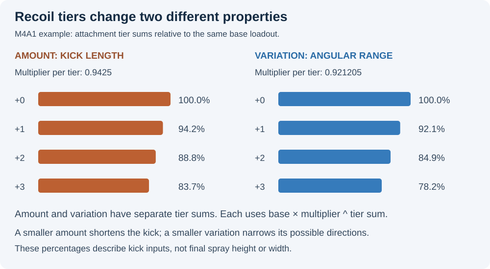
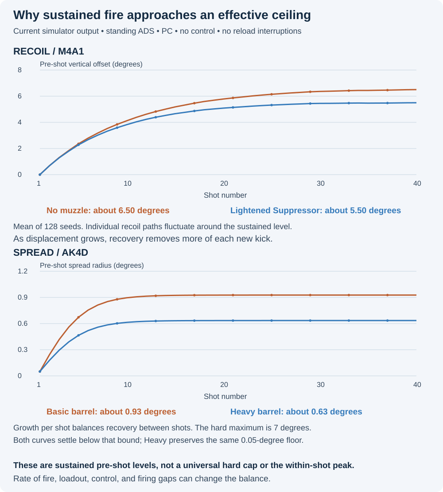
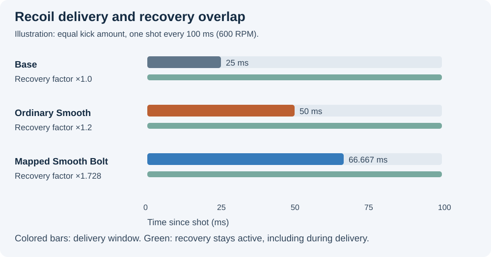
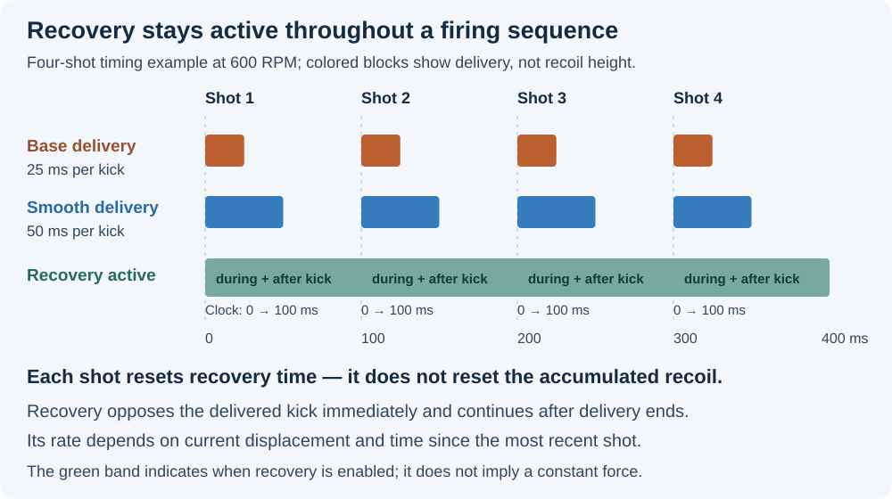
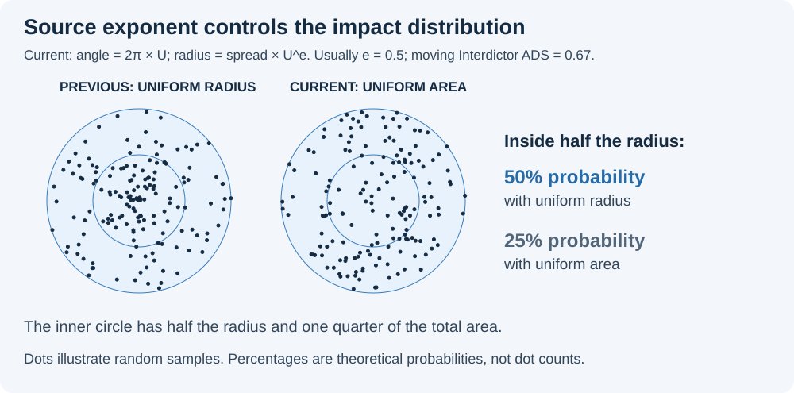

# Recoil and spread model

[Documentation index](README.md) · [Stat ladders](STAT_LADDERS.md) · [Model limitations](MODEL_LIMITATIONS.md)

The analyzer combines timed recoil delivery, simultaneous recovery, and separate
spread growth and recovery. This guide describes the implementation and how to
interpret its plots.

## The Model at a Glance

The renderer combines two separate calculations at each firing instant: the
**pre-shot recoil center** and the **pre-shot spread radius**. It samples an
impact around that center, then advances both states to the next shot. Recoil
is delivered over time while recovery acts; spread has its own growth, bounds,
and recovery parameters.


Both lanes are stepped per shot inside `genRecoilPts()` (recoil lane) and
`simulateSpread()` (spread lane); the impact sampling happens at render time in
`drawRecoilFixed()`. The RNG is seeded from the weapon ID (`whash`) so patterns are
deterministic for the same weapon, loadout, model settings and seed. Reroll changes
the reference spray; the ten scatter-cloud runs retain their fixed seeds.

## Sources and evidence boundaries

The current implementation is defined by [sim/core.js](../sim/core.js),
[sim/applyAttachments.js](../sim/applyAttachments.js), and the impact sampling in
[ui/app.js](../ui/app.js). Source inputs and policy are recorded in
[data/provenance/live-baseline.json](../data/provenance/live-baseline.json),
[data/weapons.json](../data/weapons.json), and the Frosty provenance files.

Frosty supplies the source inputs. Recovery equations, modifier composition, and
impact sampling remain model choices; see [model limitations](MODEL_LIMITATIONS.md).

Credits: Sym (weapon data and field conventions), Dr. Smiley Henry (spread
recovery reference), TheXclusiveAce (spray checks), SORROW (additional data),
and SheetOnMyFace (validation and recoil variation).

## Recoil amount and variation tiers

For a raw aim-state recoil group, the helpers calculate:

```text
amount    = group.amount * group.amountMult ^ group.amountExp
variation = group.dirVar * group.dirVarMult ^ group.dirVarExp
```

`applyAttachments()` resolves ADS amount from the weapon's effective `recoilV`
base times `RECOIL_MULT[weaponId] ^ sum(adsRecoilTierMod)`. It rounds that result
to three decimals. ADS variation uses the raw `dirVar` and
`dirVarMult ^ (dirVarExp + sum(adsRecoilVariationTierMod))`, also rounded to three
decimals. Thus a baked exponent must not be applied twice to an effective base.
Amount tiers include supported grip, muzzle, ammunition and ergonomics effects;
variation tiers include grip, muzzle and ergonomics effects.

The ADS selection helpers scale the selected group against the effective ADS
base, so these attachment outputs reach the recoil path. Hip recoil uses its own
resolved group: the attachment resolver adds hip amount/variation tiers to that
group's exponents. Platform scaling then changes amount, not variation.



## Recoil Path (`genRecoilPts`)

The first returned point is `(0, 0)` before its own kick. To advance to each
subsequent pre-shot point:
1. Select ADS or hipfire recoil inputs based on `aimState`.
2. Compute per-shot recoil amount, including attachment tier and platform scaling.
3. Sample direction variation uniformly across the full `[-recoilVar, +recoilVar]` range.
4. Subtract the compensation vector (recoil control), scaled by the compensation %.
5. Deliver that delta uniformly over the selected recoil duration.
6. Apply recovery during and after delivery before the next shot. Each shot resets
   the recovery clock; unfinished impulses continue. The selected aim state's
   muzzle recovery multiplier scales the weapon group's decay factor.

## Spread (`simulateSpread`)

- Starts at the stance/aim spread minimum (`spreadBounds`).
- Adds `spreadInc` per shot.
- Between shots, applies recovery using `spreadRecoveries(w)` — separate firing and
  not-firing parameter sets; post-burst gaps split the interval into a firing segment
  and a not-firing segment.
- Clamps to `[baseline, spreadMax]` for the current state.
- Shot positions are sampled **uniform over radius** (not uniform over area):
  `r = spreadRadius × rng()` — this is the current sampling convention and makes shot
  distributions visually center-weighted (half the shots land in the inner 25% of the area).

## Effective ceilings during sustained fire

Repeated shots need not produce unlimited growth. Recoil recovery becomes
stronger as displacement grows. Spread recovery removes part of each shot's
increase. With a fixed loadout and firing interval, each can approach a balance
where the next shot adds about as much as recovery removes.



The recoil curves average 128 seeds; individual paths still vary. Spread is
deterministic for the selected state and loadout. These 40-shot sequences omit
reloads to expose the sustained balance. A plateau is not a universal recoil cap,
a within-shot peak, or the spread hard maximum. Pauses, rate of fire, attachments,
and control settings change the result. The UI's `effectiveSpreadMax()` uses its
own 50-increase calculation, described below.

## Recoil recovery and shot timing

`genRecoilPts(w, seed, shots)` returns pre-shot angular offsets in degrees. The
first shot starts at `(0, 0)`. For each following point, the model adds a kick,
subtracts compensation, and recovers over the interval after the preceding shot.
With `direction = -group.dir` and a uniformly sampled angular deviation:

```text
x += sin(direction + deviation) * amount - sin(direction) * amount * control
y += cos(direction + deviation) * amount - cos(direction) * amount * control
```

Angles are converted to radians before the trigonometric functions. The delta
above is delivered uniformly over `group.duration` (normally 0.025 seconds).
Missing or zero duration uses an immediate impulse. Recovery acts at the same time,
independently on each axis, under this assumed continuous rate equation:

```text
d(axis)/dt = deliveryRate - sign(axis) *
             (abs(axis)^decExp + decOffset) * decFactor * t^decTimeExp
```

Recovery clamps at zero. `t` restarts at each shot. During delivery, steps are at
most 1 ms and split delivery around recovery. The time-power integral is exact;
for `decExp = 1`, each recovery step also uses the exact displacement solution.
Other displacement exponents use small numerical steps. Recovery continues after
delivery with the same clock age. Overlapping impulses retain their full input.
The selected recoil group supplies recovery parameters,
with legacy table/default fallbacks. `_adsRecoilDecayMult` or
`_hipRecoilDecayMult` scales the factor for the selected aim state.

Smooth recoil uses the selected source duration as an override and the selected
source recovery operand as a multiplier in both aim states. The duration
override precedes the existing ergonomics duration adjustment, then clamps at
zero. Hip Smooth behavior has not been checked against hip recordings.



Recovery is continuous, not constant in strength. Each shot resets the recovery
clock while preserving the accumulated recoil and any unfinished delivery.



### Duration and Smooth attachment selection

Base duration comes from `recoil.ads.duration` or `recoil.hip.duration` in the
selected weapon record. The current Frosty check covers all 63 supported weapons
and both aim states: all 126 values are **0.025 seconds**. This is a checked
dataset result; the simulator reads the selected record. A missing/zero duration
uses the immediate-impulse fallback.

The four Smooth source assets define two operand sets:

| Source modifier family | Duration override | Recovery factor |
|---|---:|---:|
| `GRM_SmoothRecoil_P10`, `GRM_SmoothRecoil_Compensator_P10` | 50 ms | 1.2 |
| `GRM_SmoothRecoilBolt_P10`, `GRM_SmoothRecoilBolt_Compensator_P10` | 66.667 ms | 1.728 |

The Bolt set applies only to these 17 mapped selections:

| Weapon | Muzzles using 66.667 ms and 1.728 |
|---|---|
| Interdictor | Lightened Suppressor, Long Suppressor |
| L115 | Lightened Suppressor, Long Suppressor, Compensated Brake |
| M2010 ESR | Lightened Suppressor, Long Suppressor, Compensated Brake |
| Mini Scout | Lightened Suppressor, Long Suppressor, Compensated Brake, Compensator |
| PSR | Lightened Suppressor, Long Suppressor, Compensated Brake |
| SV-98 | Lightened Suppressor, Compensated Brake |

Other mapped Smooth muzzles on these rifles, including their hybrid suppressors,
use the ordinary 50 ms/1.2 set. The resolver merges the selected muzzle's
`weaponOverrides[weaponId]` into its catalog record before applying recoil effects.
It does not select values by weapon class. Ergonomic duration additions follow
the muzzle override; for example, M16A4 Smooth plus Auto receiver gives 49.4 ms.

The [duration audit](../reference-data/provenance/frosty-recoil-duration-audit-2026-09-11.json)
checks 349 source-mapped Smooth selections and retains paths, GUIDs, raw operands,
and hashes. PP-19 Flash Comp keeps the 50 ms/1.2 catalog estimate: its captured
description supports Smooth recoil, but its retained selector trace does not
resolve the modifier. The Bolt set has no separate recording validation.

Retained `decNorm` and `shootingDecScale` do not add independent recovery branches.
See the [field review and validation](archive/RECOIL_MODEL_VALIDATION_2026-09-11.md) for
all omitted recoil fields, measured agreement, and the remaining error.

`shotIntervalAfter()` uses `60 / rpm`, or `60 / burstRpm` within a burst when
available. After the final shot in a burst, it uses the greater of the normal
interval and `60 / burstBurstsPerMinute - (burstRounds - 1) * normalInterval`.
This distinction feeds both recoil and spread recovery.

### VSSM Folding Stock

With Folding Stock selected, both ADS and hip recoil groups use decay factor
`76` and time exponent `1.24`; without it they retain `13.7` and `0.5555`. These
source values are applied in the equation above, while the 800 RPM conversion
and existing spread/variation effects remain active. The weapon base is unchanged.

A larger decay factor alone does not establish faster recovery: raising the time
exponent reduces `t^exponent` during sub-second intervals. Smooth recoil composes
with these stock values under the rules above.

## Spread floors, growth and recovery

`simulateSpread()` records each shot's spread **before** adding that shot's
increase. The first shot therefore uses the current stance minimum. Between
shots, recovery is integrated in steps no longer than 1/60 second:

```text
delta = max(spread - baseline, 0)
spread -= step * (coefficient * delta^exponent + offset)
spread = clamp(spread, baseline, maximum)
```

Ordinary shot intervals use firing recovery. A post-burst interval first uses
firing recovery for `min(60 / rpm, interval)`, then not-firing recovery for the
remaining time. Missing not-firing fields fall back to the final firing parameters.
No recovery after the last recorded shot is needed for `simulateSpread()`.
Retained `idleTime`, `idleCoef`, `idleExp`, `idleOffset`, `firstShotMul` and `distExp`
do not introduce an idle-state machine, first-shot multiplier or a source-driven
radial distribution in this implementation.

The stance and aim state select `adsStand`, `adsMove`, `hipStand` or `hipMove`.
Moving ADS starts with the weapon's stored `spread.adsMove[0]`. Attachment changes
shift from its index in the source-ordered seven-row `MOVING_ACC_TIERS` table,
clamped once after summing grip, laser, barrel and magazine effects. The resulting
minimum is written into `spread.adsMove[0]`; simulation and UI read that same bound.

Hip minima use all 18 source-ordered rows in `HIP_SPREAD_TABLE`. The effective
index is the weapon base (or explicit override) minus the sum of catalog hip
shifts. Both standing and moving minima come from that row; existing maximum
bounds are retained. Buckshot, 00 Buckshot and Flechette apply a source `+9`
index shift on the four shotguns. Slugs do not. Rows must not be sorted because
the shotgun shift crosses into a separate range. VSSM now uses source index 4
(1.804 degrees standing / 2.255 degrees moving), supported by the matched standing
HUD comparison. Its moving value follows the source row. See
[stat ladders and indexing](STAT_LADDERS.md).

`effectiveSpreadMax()` uses 50 shot increases and recovery intervals, including
recovery after its last increase, then returns the final clamped value rounded
to three decimals. It is a representative sustained-fire result, not a search
for the largest transient value or a proof of the mathematical steady state.
The shared display axis is 12 degrees.

## Heavy-type barrel source factors

Heavy, Heavy Extended and Cryogenic currently apply these changes in **ADS only**,
for both standing and moving. Hip growth and recovery retain their own inputs.

| Catalog field | Factor | Meaning |
|---|---:|---|
| `adsSpreadIncMult` | 0.666667 | Per-shot spread increase |
| `adsSpreadFiringDecCoefMult` | 1.837117 | Firing recovery coefficient |
| `adsSpreadFiringDecOffsetMult` | 0.666667 | Firing recovery offset |
| `adsSpreadNotFiringDecOffsetMult` | 0.666667 | Explicit not-firing recovery offset |

The recovery exponent and spread minima are unchanged. Missing not-firing
parameters still follow the fallback described above. Muzzle and
light recovery boosts scale the applicable firing offset separately.

The resolver preserves increment precision for simulation. Scaling the flat
recovery offset along with per-shot increase matters: reducing increase alone
can keep a weapon at minimum spread throughout a firing sequence. The coefficient
then changes the balance between growth and recovery above that minimum.

The [AK4D Basic/Heavy comparison](archive/AK4D_HEAVY_BARREL_RECORDING_ANALYSIS_2026-09-11.md)
supports the ADS reduction. Other weapons and Heavy Extended/Cryogenic use the
same source factors without separate recording validation. The idle operand
remains unused because the model has no idle transition.

## Recoil control and platform

Recoil control subtracts a fraction of the expected kick vector on each shot.
It does not cancel the sampled variation or spread. The single slider defaults to
0% and allows 0–125%; values above 100% overcompensate the expected vector. There
is no separate on/off toggle. Changing platform scales amount, not variation.

The console setting applies an amount multiplier of `0.89`; PC uses `1`.
This is the analyzer's platform model, not a separate simulation of controller
input, aim assist, camera shake or visual recoil. Visual recoil attachment tags
do not establish corresponding changes to the generated physical shot path.

## Impact sampling and target projection

The seeded Mulberry32 generators make results repeatable for the same weapon,
loadout, settings and seed. Impact sampling uses a uniform angle and a uniform
radius: `r = spread * rng()`. It is center-weighted, not uniform over disk area.
The chart bubbles show modeled angular spread envelopes.



Angle Plot remains angular. Soldier Target projects the result at the selected
distance and uses the available projectile model for vertical displacement.
[sim/ballistics.js](../sim/ballistics.js) provides flight time and trajectory;
[sim/target.js](../sim/target.js) handles geometry and hit classification.
Projectile assembly uses available precise/base velocity and global coefficients,
with supported ammo drag and source/donor fallback. The source-ID registry is not a
hard eligibility gate. If trajectory resolution fails, the current renderer uses
zero vertical displacement; this is a display fallback, not a measured no-drop result.
See [damage, ballistics and projection](DAMAGE_BALLISTICS.md).

Target hit and lethal-shot figures are approximate outcomes of the sampled
spray. Pellet loads suppress these figures because individual pellets are not
simulated. A circle drawn for shotgun spread is not a simulated pellet pattern.

## Verification and remaining limits

The current [attachment tests](../scripts/attachment-effects.test.mjs) cover
supported aim-state effects and ADS-only heavy barrels. The
[source-array tests](../scripts/source-arrays.test.mjs) cover exact source rows,
precision, shotgun shifts and clamping. The
[spread-scale test](../scripts/spread-bar-scale.test.mjs) checks that default and
single-attachment builds fit the display axis. These checks protect the
implementation; they do not independently validate its physical accuracy.

The main remaining boundaries are recoil recovery arithmetic, fitted attachment
recovery parameters, modifier activation/composition where evidence conflicts,
and target sampling approximations. Keep those distinctions when interpreting
the plots or promoting new datamined fields.
