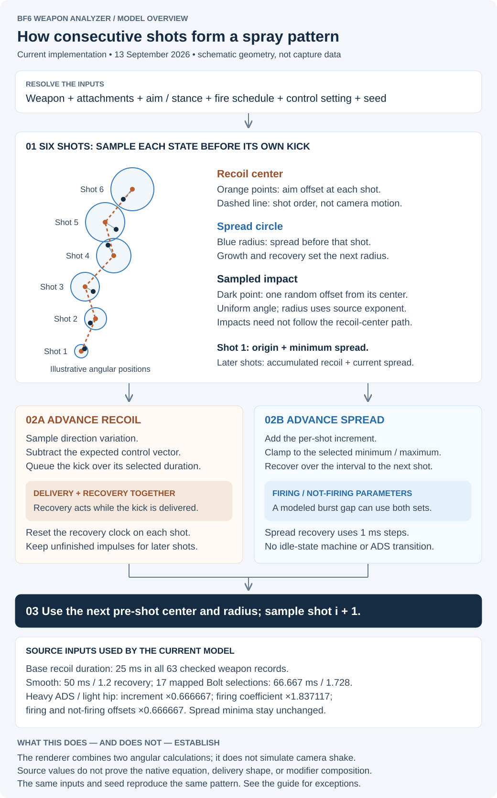
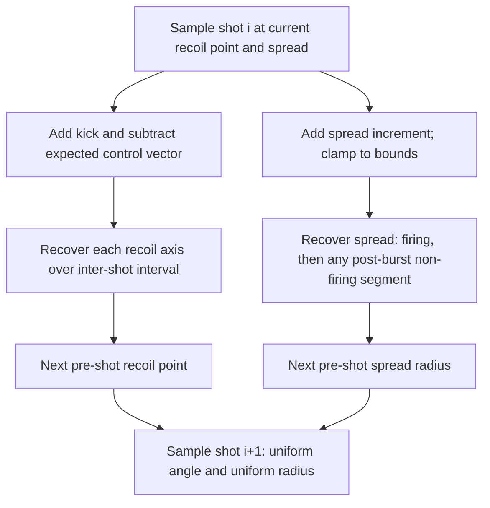

# Recoil and spread model

[Documentation index](README.md) · [Stat ladders](STAT_LADDERS.md) · [Model limitations](MODEL_LIMITATIONS.md)

This guide explains the current analyzer implementation, checked against the
code on 9 September 2026. Source literals, fitted behavior and rendering choices
have distinct evidence boundaries.

## The Model at a Glance

Every simulated shot is the sum of two independent mechanisms: a **recoil path** (where
the aim point has drifted to) and a **spread circle** (how large the random cone has grown).
The rendered spray pattern samples one impact per shot inside that shot's spread circle,
centered on that shot's recoil-path point.



Per-shot pipeline: shot 1 uses the origin and minimum spread. After sampling shot i,
the two lanes advance to the inputs for shot i+1:



Both lanes are stepped per shot inside `genRecoilPts()` (recoil lane) and
`simulateSpread()` (spread lane); the impact sampling happens at render time in
`drawRecoilFixed()`. The RNG is seeded from the weapon ID (`whash`) so patterns are
deterministic for the same weapon, loadout, model settings and seed. Reroll changes
the reference spray; the ten scatter-cloud runs retain their fixed seeds.

## Sources and evidence boundaries

The current implementation is defined by [sim/core.js](../sim/core.js),
[sim/applyAttachments.js](../sim/applyAttachments.js), and the impact sampling in
[ui/app.js](../ui/app.js). Source inputs and policy are recorded in
[data/provenance/live-baseline.json](../data/provenance/live-baseline.json),
[data/weapons.json](../data/weapons.json), and the Frosty provenance files.

The original guide credited Sym for weapon data and field conventions,
Dr. Smiley Henry for the spread recovery reference, TheXclusiveAce for spray
sanity checks, SORROW for additional data, and SheetOnMyFace for validation and
recoil variation findings. These are retained historical credits, not a claim
that every current formula has been independently confirmed in the game.

Source coefficients, screenshot agreement, fitted behavior and rendering choices
are distinct evidence. In particular, the recoil recovery arithmetic and some
attachment recovery effects remain estimates. A configuration export alone does
not prove modifier activation, operation order or native engine behavior.

## Recoil amount and variation tiers

For a raw aim-state recoil group, the helpers calculate:

```text
amount    = group.amount * group.amountMult ^ group.amountExp
variation = group.dirVar * group.dirVarMult ^ group.dirVarExp
```

`applyAttachments()` resolves ADS amount from the weapon's effective `recoilV`
base times `RECOIL_MULT[weaponId] ^ sum(adsRecoilTierMod)`. It rounds that result
to three decimals. ADS variation uses the raw `dirVar` and
`dirVarMult ^ (dirVarExp + sum(adsRecoilVariationTierMod))`, also rounded to three
decimals. Thus a baked exponent must not be applied twice to an effective base.
Amount tiers include supported grip, muzzle, ammunition and ergonomics effects;
variation tiers include grip, muzzle and ergonomics effects.

The ADS selection helpers scale the selected group against the effective ADS
base, so these attachment outputs reach the recoil path. Hip recoil uses its own
resolved group: the attachment resolver adds hip amount/variation tiers to that
group's exponents. Platform scaling then changes amount, not variation.

The former guide recorded M16A4 and M433 screenshot checks of variation tiers.
Those historical observations support the tier interpretation; they do not
validate the entire time-dependent recoil simulation.

## Recoil Path (`genRecoilPts`)

The first returned point is `(0, 0)` before its own kick. To advance to each
subsequent pre-shot point:
1. Select ADS or hipfire recoil inputs based on `aimState`.
2. Compute per-shot recoil amount, including attachment tier and platform scaling.
3. Sample direction variation uniformly across the full `[-recoilVar, +recoilVar]` range.
4. Add the horizontal and vertical delta to the running aim point.
5. Subtract the compensation vector (recoil control), scaled by the compensation %.
6. Apply inter-shot recoil decay toward zero before the next shot
   (`applyRecoilDecay`, using the weapon group's decay parameters and the
   muzzle's `_adsRecoilDecayMult` when aiming).

## Spread (`simulateSpread`)

- Starts at the stance/aim spread minimum (`spreadBounds`).
- Adds `spreadInc` per shot.
- Between shots, applies recovery using `spreadRecoveries(w)` — separate firing and
  not-firing parameter sets; post-burst gaps split the interval into a firing segment
  and a not-firing segment.
- Clamps to `[baseline, spreadMax]` for the current state.
- Shot positions are sampled **uniform over radius** (not uniform over area):
  `r = spreadRadius × rng()` — this is the current sampling convention and makes shot
  distributions visually center-weighted (half the shots land in the inner 25% of the area).

## Recoil recovery and shot timing

`genRecoilPts(w, seed, shots)` returns pre-shot angular offsets in degrees. The
first shot starts at `(0, 0)`. For each following point, the model adds a kick,
subtracts compensation, and recovers over the interval after the preceding shot.
With `direction = -group.dir` and a uniformly sampled angular deviation:

```text
x += sin(direction + deviation) * amount - sin(direction) * amount * control
y += cos(direction + deviation) * amount - cos(direction) * amount * control
```

Angles are converted to radians before the trigonometric functions. Recovery
steps each axis independently toward zero, with a maximum step of 1/60 second:

```text
t += step
recovery = (abs(axis)^decExp + decOffset) * decFactor * step * t^decTimeExp
```

The update cannot cross zero. `t` restarts for each inter-shot interval. The
selected recoil group supplies recovery parameters, with legacy table/default
fallbacks. `_adsRecoilDecayMult` scales the factor only in ADS. Recoil duration is
not used to construct a separate kick animation in this calculation. Retained
`decNorm` and `shootingDecScale` do not add independent recovery branches.

`shotIntervalAfter()` uses `60 / rpm`, or `60 / burstRpm` within a burst when
available. After the final shot in a burst, it uses the greater of the normal
interval and `60 / burstBurstsPerMinute - (burstRounds - 1) * normalInterval`.
This distinction feeds both recoil and spread recovery.

### VSSM Folding Stock

With Folding Stock selected, both ADS and hip recoil groups use decay factor
`76` and time exponent `1.24`; without it they retain `13.7` and `0.5555`. These
source values are applied in the equation above, while the 800 RPM conversion
and existing spread/variation effects remain active. The weapon base is unchanged.

A larger decay factor alone does not establish faster recovery: raising the time
exponent reduces `t^exponent` during sub-second intervals. Native timing remains
unverified, so this is a source-parameter application within the current model.
Smooth recoil remains at the estimated `1.1` ADS multiplier; duration modeling
is unchanged.

## Spread floors, growth and recovery

`simulateSpread()` records each shot's spread **before** adding that shot's
increase. The first shot therefore uses the current stance minimum. Between
shots, recovery is integrated in steps no longer than 1/60 second:

```text
delta = max(spread - baseline, 0)
spread -= step * (coefficient * delta^exponent + offset)
spread = clamp(spread, baseline, maximum)
```

Ordinary shot intervals use firing recovery. A post-burst interval first uses
firing recovery for `min(60 / rpm, interval)`, then not-firing recovery for the
remaining time. Missing not-firing fields fall back to the final firing parameters.
No recovery after the last recorded shot is needed for `simulateSpread()`.
Retained `idleTime`, `idleCoef`, `idleExp`, `idleOffset`, `firstShotMul` and `distExp`
do not introduce an idle-state machine, first-shot multiplier or a source-driven
radial distribution in this implementation.

The stance and aim state select `adsStand`, `adsMove`, `hipStand` or `hipMove`.
Moving ADS overrides the minimum with the source-ordered seven-row
`MOVING_ACC_TIERS` table. Its index is `DEFAULT_MOV_TIER + sum(modifiers)`, clamped
once after summing grip, laser, barrel and magazine effects.

Hip minima use all 18 source-ordered rows in `HIP_SPREAD_TABLE`. The effective
index is the weapon base (or explicit override) minus the sum of catalog hip
shifts. Both standing and moving minima come from that row; existing maximum
bounds are retained. Buckshot, 00 Buckshot and Flechette apply a source `+9`
index shift on the four shotguns. Slugs do not. Rows must not be sorted because
the shotgun shift crosses into a separate range. VSSM retains the documented
baseline override. See [stat ladders and indexing](STAT_LADDERS.md).

`effectiveSpreadMax()` uses 50 shot increases and recovery intervals, including
recovery after its last increase, then returns the final clamped value rounded
to three decimals. It is a representative sustained-fire result, not a search
for the largest transient value or a proof of the mathematical steady state.
The shared display axis is 12 degrees.

## Heavy-type barrel calibration

Heavy, Heavy Extended and Cryogenic currently apply these changes in **ADS only**,
for both standing and moving. Hip growth and recovery retain their own inputs.

| Catalog field | Factor | Meaning |
|---|---:|---|
| `adsSpreadIncMult` | 0.667 | Per-shot spread increase |
| `adsSpreadFiringDecCoefMult` | 1.71 | Firing recovery coefficient |
| `adsSpreadFiringDecOffsetMult` | 0.667 | Firing recovery offset |

The recovery exponent is unchanged. Not-firing parameters are not directly
scaled; a missing value still follows the fallback described above. Muzzle and
light recovery boosts scale the applicable firing offset separately.

These recovery factors were fitted against historical ADS-standing reference
curves, not established as exact native attachment literals. Scaling the flat
recovery offset along with per-shot increase matters: reducing increase alone
can keep a weapon at minimum spread throughout a firing sequence. The coefficient
then changes the balance between growth and recovery above that minimum.

The [original calibration discussion](https://github.com/raymdl/BF6-Weapon-Analyzer/blob/7907352cea3a3d2e339d9e66fec8b2c34c7a3d7c/CODE_DOCUMENTATION.md#heavy-type-barrel-spread-calibration)
retains the historical fit metrics, reference-curve details and source caveats.
Its all-aim-state extension, old field names and test inventory are historical;
they do not describe the current implementation. The current catalog still
marks the two recovery factors as assumed, under its legacy annotation keys.

## Recoil control and platform

Recoil control subtracts a fraction of the expected kick vector on each shot.
It does not cancel the sampled variation or spread. The single slider defaults to
0% and allows 0–125%; values above 100% overcompensate the expected vector. There
is no separate on/off toggle. Changing platform scales amount, not variation.

The console setting applies an amount multiplier of `0.89`; PC uses `1`.
This is the analyzer's platform model, not a separate simulation of controller
input, aim assist, camera shake or visual recoil. Visual recoil attachment tags
do not establish corresponding changes to the generated physical shot path.

## Impact sampling and target projection

The seeded Mulberry32 generators make results repeatable for the same weapon,
loadout, settings and seed. Impact sampling uses a uniform angle and a uniform
radius: `r = spread * rng()`. It is center-weighted, not uniform over disk area.
The chart bubbles show modeled angular spread envelopes; they are not evidence
that the game implements literal per-shot circles.

Angle Plot remains angular. Soldier Target projects the result at the selected
distance and uses the available projectile model for vertical displacement.
[sim/ballistics.js](../sim/ballistics.js) provides flight time and trajectory;
[sim/target.js](../sim/target.js) handles geometry and hit classification.
Projectile assembly uses available precise/base velocity and global coefficients,
with supported ammo drag and source/donor fallback. The source-ID registry is not a
hard eligibility gate. If trajectory resolution fails, the current renderer uses
zero vertical displacement; this is a display fallback, not a measured no-drop result.
See [damage, ballistics and projection](DAMAGE_BALLISTICS.md).

Target hit and lethal-shot figures are approximate outcomes of the sampled
spray. Pellet loads suppress these figures because individual pellets are not
simulated. A circle drawn for shotgun spread is not a simulated pellet pattern.

## Verification and remaining limits

The current [attachment tests](../scripts/attachment-effects.test.mjs) cover
supported aim-state effects and ADS-only heavy barrels. The
[source-array tests](../scripts/source-arrays.test.mjs) cover exact source rows,
precision, shotgun shifts and clamping. The
[spread-scale test](../scripts/spread-bar-scale.test.mjs) checks that default and
single-attachment builds fit the display axis. These checks protect the
implementation; they do not independently validate its physical accuracy.

The main remaining boundaries are recoil recovery arithmetic, fitted attachment
recovery parameters, modifier activation/composition where evidence conflicts,
and target sampling approximations. Keep those distinctions when interpreting
the plots or promoting new datamined fields.
