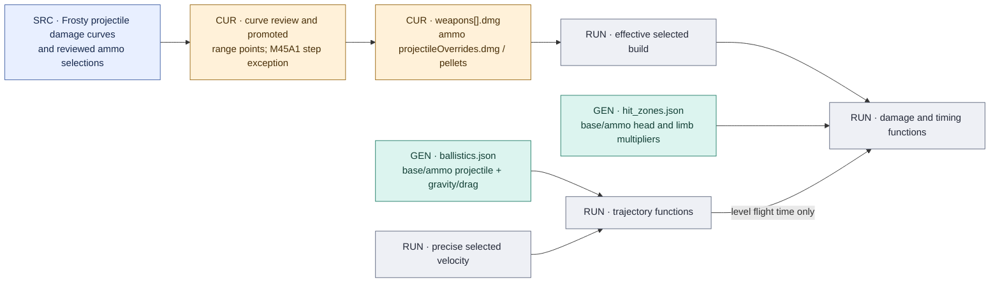
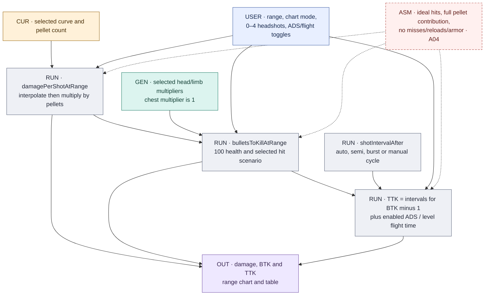
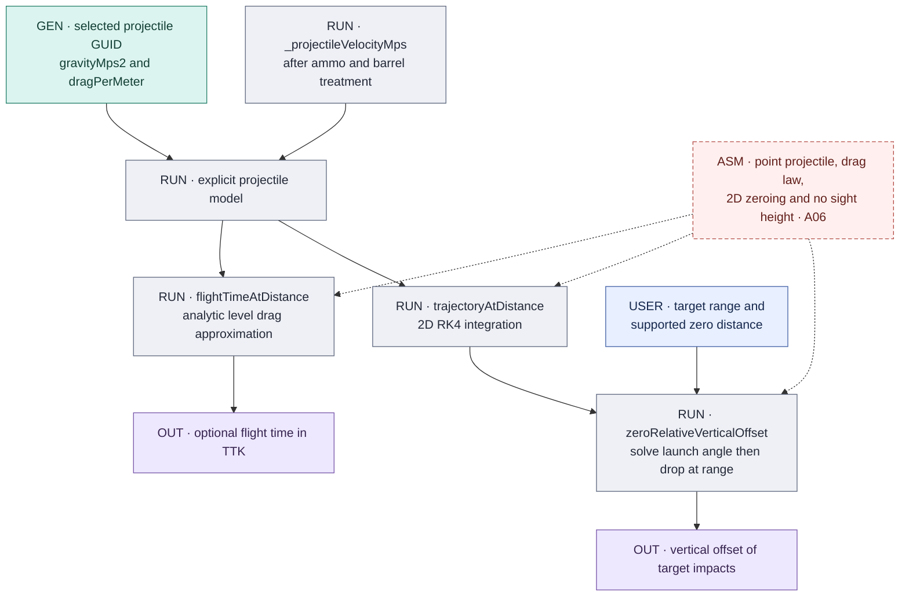

# Damage, hit zones and ballistics

[Atlas](README.md) · [Source generation](SOURCES.md#projectile-hit-zone-and-collateral-chain) · [Formula guide](../DAMAGE_BALLISTICS.md)

## Source curves and selected projectile

Current base curves are accepted Frosty curves. Their promotion/review is distinct
from the existing hit-zone and ballistics generators: do not infer an automatic
whole-weapon importer from a `damageSource` label. Selected ammo can replace the
curve and pellet count; eight retained override curves cover the four shotguns'
00-buck/slug alternatives. See [weapons.json](../../data/weapons.json),
[ammo.json](../../data/ammo.json), and the [curve review](../../reference-data/provenance/frosty-damage-curve-review-2026-09-13.json).

`dmg[]` keeps nondecreasing range order. Repeated ranges encode a discontinuity;
collapsing them into a unique-key map would change the model. Between distinct
ranges the code interpolates, and outside the range it uses the endpoint value.
Exact-boundary behavior is defined by [`damageAtRange`](../../sim/damage.js) and
its [tests](../../scripts/damage.test.mjs).

## Range outputs

[`resolveHitMultipliers`](../../sim/damage.js) requires the explicit selected
weapon/ammo entry. Base/null ammo uses the explicit base record. Current supported
selections do not use a generic head/limb fallback. These multipliers are generated
from protection/material lookup; the target view's drawn anatomical regions have
a separate approximate origin (A05/A10).

| Calculation | Inputs and interpretation |
|---|---|
| Damage | Selected per-projectile curve; `pellets` multiplies per-shot damage for the ordinary range calculations. All pellets are assumed to contribute to the chosen zone. |
| BTK | 100 health, a selected number of headshots, and chest/limb scenario. Remaining health is divided by the relevant body damage with an integer ceiling and small boundary tolerance. |
| Firing time | The first shot occurs at time zero. Sum the next `BTK - 1` shot intervals; avoid a universal `(BTK-1) × 60/rpm` shortcut for burst/pump sequences. |
| Burst/manual cycle | `rpm`, `burstRpm`, `burstRounds` and `burstBurstsPerMinute` establish within/between-group cadence. DB-12's two-round pump cycle uses that route; bolt/single-pump base RPM already represents the effective cycle. |
| Optional ADS | Add the selected build's ADS milliseconds when enabled. This models sequential delay; it does not simulate partial ADS during firing. |
| Optional travel | Add drag-aware level flight time using precise selected velocity and the explicit projectile coefficient. Gravity is handled separately in the target trajectory. |

`ui/app.js` samples these functions for the chart and table, formats outputs and
uses the vendored Chart.js renderer. It does not fetch a precomputed TTK table.
No miss sequence, magazine exhaustion/reload, armor, healing, reaction time,
network delay or target motion enters ideal TTK. These are model-scope decisions,
not missing source columns to fill with zeros.

## Flight time, drop and zeroing

The scalar time approximation is `distance / velocity` at zero drag and
`expm1(drag × distance) / (drag × velocity)` otherwise. Target trajectories use
`dp/dt = v` and `dv/dt = (0, gravity) - drag × |v| × v`, with a 1/500 s RK4 step
and a finite integration horizon. The zero solver searches a launch angle to
intersect the selected zero plane; the UI offers supported zero distances for
DMR/sniper categories. See [`sim/ballistics.js`](../../sim/ballistics.js).

Source-backed gravity and drag establish operands. They do not prove this
particular flight law, numerical scheme, zeroing method or neglected sight height
matches the native engine. The [register](REGISTER.md#missing-data-and-fallbacks)
also distinguishes unavailable flight-time results from the target display's
zero-offset fallback when a trajectory cannot be resolved.

## Change impact

A changed curve affects base damage, BTK/TTK, target hit damage, first-lethal
summaries and comparison/effect displays. A changed hit-zone/material join affects
HS/limb cards and both range and target damage. A changed velocity/drag/gravity
selection affects travel/drop; gravity does not enter the level-time formula.
Regenerate the hit-zone trace and ballistics together when selection identities
change, and run the focused [damage](../../scripts/damage.test.mjs) and
[ballistics](../../scripts/ballistics.test.mjs) tests in addition to cross-file checks.
