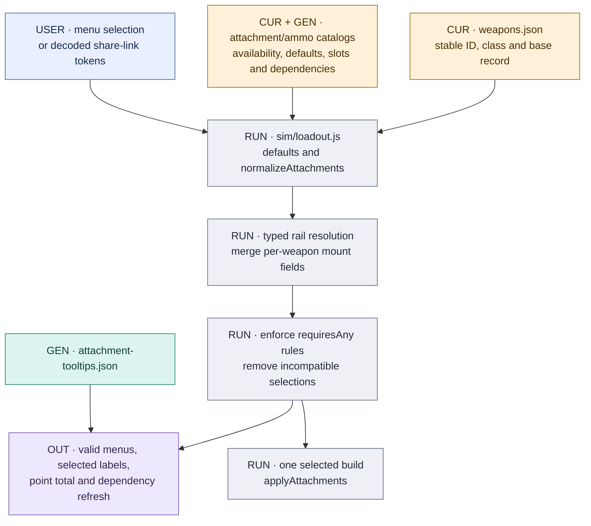
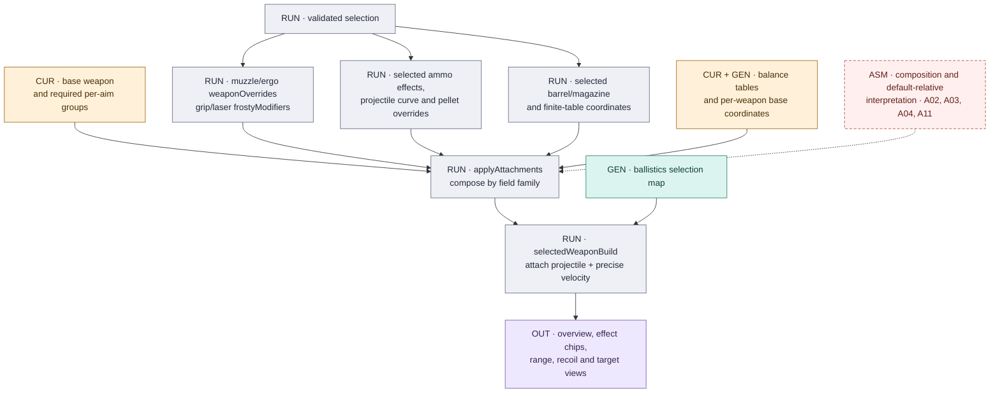
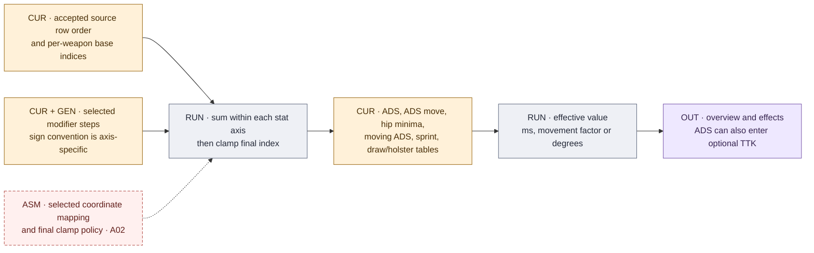
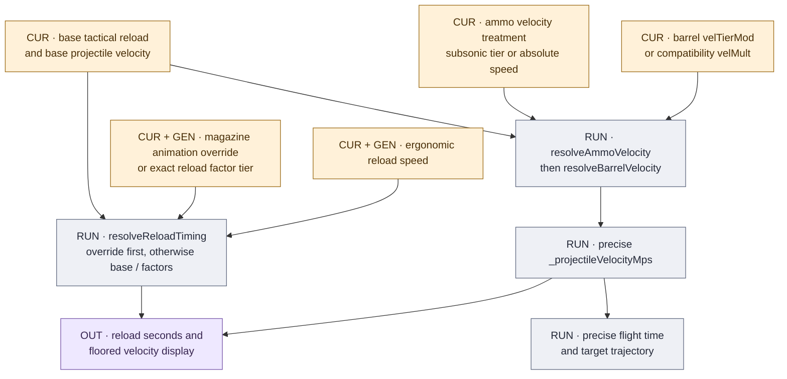
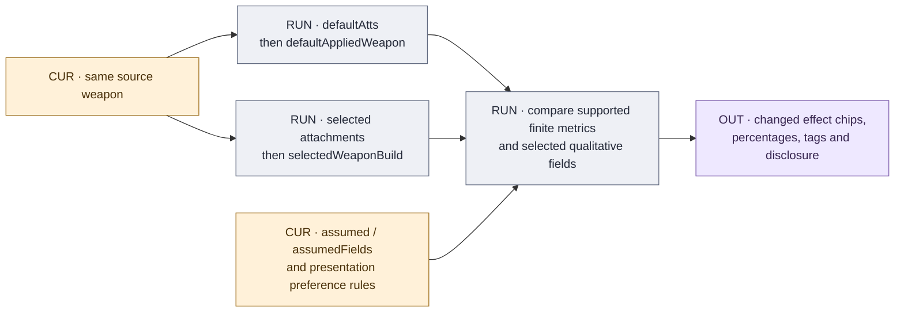

# Loadouts, ladders and overview

[Atlas](README.md) · [Attachment model](../ATTACHMENT_MODEL.md) · [Stat ladders](../STAT_LADDERS.md)

## Selection and metadata

`weapons.json` supplies IDs, display name, description, class and base fields.
`ui/app.js` uses these for the weapon list, filters, selected names and compare
labels. Frosty role tags in `weapon-role-tags.json` are not an input to those
filters. Ordered catalogs and per-weapon maps in `attachments.json` and `ammo.json`
supply available choices, defaults and points; tooltip text is a separate
selection-keyed dictionary. Generic sight categories influence choices, labels,
points and links, without an independent optical/camera model in the resolver.

## Valid loadout

Physical slots and dependency rules are generator-owned fields within an otherwise
mixed-maintenance catalog. Offered availability still requires reviewed site
identity/menu evidence. A source-only ability branch is not automatically exposed.

A shared slot stores `atts.rail = {type, id}` or `null`. An explicit rail value,
including empty, overrides consumed legacy category keys. Without an explicit
rail selection, legacy migration prioritizes laser, then light, then grip.
Dependencies are applied after selections are assembled, so menu choices, points,
effects and restored links agree. See [loadout.js](../../sim/loadout.js),
[attachments.js](../../sim/attachments.js) and [ui/loadout.js](../../ui/loadout.js).

Defaults represent the maintained factory/default configuration. Comparing to that
configuration does not require treating the weapon as an attachment-free specimen.

## From base record to effective build

This is a dependency map; exact field precedence is implemented in
[`applyAttachments.js`](../../sim/applyAttachments.js). The resolver returns a
build rather than mutating the source weapon. Major ordering rules are:

| Family | Composition boundary |
|---|---|
| Attachment specialization | Merge selected per-weapon fields over the shared catalog entry before applying effects. Barrel ADS uses the generated per-weapon WB route. |
| Recoil | Compose ADS/hip amount and variation steps separately. Muzzle duration override precedes ergonomic duration addition. Ergonomic recovery-time exponent override precedes the muzzle addition. |
| Spread | Start with per-aim dynamics; ADS ammo overrides precede ergonomic overrides. Heavy ADS factors and selected hip light/combo factors affect their named fields. Retain the applicable source bounds. |
| Ammo/projectile | Apply selected effect and damage/pellet overrides; select the explicit projectile separately. Ammo velocity treatment precedes barrel velocity treatment. |
| Handling | Compose each axis using its own signs/base coordinate, then clamp the final finite-table index. |
| Reload | Explicit magazine animation override precedes the ordinary base/tier route; ergonomic speed still applies. |

## Ladders and timing

The complete literal arrays and source records live in [Stat ladders](../STAT_LADDERS.md).
This table traces every active finite/geometric family to its role:

| Stored family | Transform / runtime role |
|---|---|
| `ADS_SPD_TIERS` (8 rows) | `defAds - magazine shift + grip tier + barrel tier` → ADS milliseconds. |
| `ADS_MOVE_TIERS` (12 rows) | ADS-movement base coordinate minus magazine/grip/ammo shifts → movement factor. Preserve repeated rows; 12 source rows. |
| `MOVING_ACC_TIERS` (7 rows) | Find the source moving-ADS minimum, add participating spread steps, clamp when that route resolves → moving ADS minimum. |
| `HIP_SPREAD_TABLE` (18 rows) | Base index/explicit override minus participating hip steps → standing/moving minimum columns. Preserve the other five source columns as retained data and keep source row order. |
| `DRAW_TIME_TABLES` | Sprint (12 rows), primary deploy/undeploy (12 each), sidearm deploy/undeploy (15 each). Base coordinate minus selected shifts; weapon metadata chooses the draw family. |
| `RECOIL_MULT[id]` and group amount/variation factors | Geometric amount/variation exponent composition, rather than a finite array lookup. |
| `RELOAD_SPEED_MULTIPLIERS` (3 rows) | Exact factors `1`, `1.13`, `1.277`; select a named tier and combine with ergonomic speed. |
| `VELOCITY_LADDER` | Scalar `0.8`, used in the supported geometric velocity treatments. |
| Damage/ammo `dmg[]` curves | Ordered range points, including repeated-range discontinuities; [damage guide](DAMAGE_BALLISTICS.md). |
| Catalog arrays and magazine key order | Positional share-link serialization, rather than a numeric stat ladder; [state contract](UI_PUBLISHING.md#state-and-exports). |

No generator automatically owns all of `balance_tables.json`. The collateral map
is generated; other table promotion and base-index decisions remain reviewed
maintenance. The array inventory also includes retained/reference arrays in
[Data reference](../DATA_REFERENCE.md).

For reload, an explicit `tacRldOverrideMs` is divided by ergonomic speed; the
magazine's ordinary tier is skipped on that route. Otherwise base tactical reload
is divided by the exact magazine factor and ergonomic factor. Retained
`weapon.reloadSpeed` is not multiplied in again. Empty-reload fields are not a
separate live combat-reload simulation; shell-fed tactical reload describes one
shell with the relevant start/end delays. See [reload exceptions](../../data/reload-exceptions.json).

For velocity, a present `velTierMod` takes precedence over `velMult`. Precise
velocity reaches physics; the overview displays a floored value. Explicitly
malformed and absent treatments do not all behave identically; see the
[fallback register](REGISTER.md#missing-data-and-fallbacks). Do not use a displayed
integer as the physics input when checking the chart.

## Overview output inventory

Both slots follow the same resolver. Comparison percentages are signed by the
raw direction of change; better/worse coloring uses the metric's preference rule.
The selected comparison slot and a weapon's own default build are separate baselines.
Presentation and metric construction live in [`ui/app.js`](../../ui/app.js).

| Visible statistic | Effective inputs and transform | Boundary |
|---|---|---|
| Base Damage | Selected first damage point and pellet interpretation. | Source curve and ammo override; panel is not a simulation of actual pellet hits. |
| HS / Limb Mult | Explicit `hit_zones` weapon/ammo selection. | [Generated material lookup](DAMAGE_BALLISTICS.md#range-outputs), not approximate target geometry. |
| Fire Rate | Selected `rpm`, fire mode and burst/manual-cycle fields. | Cadence semantics also drive BTK-to-TTK and recovery intervals. |
| Bullet Velocity | Ammo treatment → barrel treatment → floored display. | Physics uses `_projectileVelocityMps`. |
| Magazine Size | Selected magazine capacity or maintained base. | Displayed capacity does not force reloads in ideal TTK. |
| Tac Reload | Override or exact-factor route above. | Timing estimate; no reload event simulation. |
| Collateral Mult | Complete generated per-weapon/ammo map. | Display only; no penetration simulation. |
| ADS Time | ADS finite-table coordinate. | Optional additive TTK component. |
| Strafe Speed | ADS movement finite-table coordinate. | Movement factor, not a moving-target simulation. |
| Deploy Speed | Selected draw-table family and deploy coordinate. | Holster is resolved from the paired undeploy family; no weapon-switch event model. |
| Sprint Recovery | Sprint finite-table coordinate. | Display/effect; not a sprint trajectory. |
| Recoil Amount / Variation / Direction | Resolved ADS amount, variation and direction. | Contextual recoil controls/platform are traced separately in the recoil view. |
| Spread Inc/Shot | Resolved spread dynamics. | A per-shot input, distinct from a recovered pre-shot radius. |
| ADS Spread: standing/moving | Source bounds with applicable minimum-table effects. | Maximum fields and recovered display endpoints have separate roles. |
| Hipfire Spread: standing/moving | Selected hip-minimum table rows and source maxima. | Retained hashed columns do not imply additional simulated behavior. |
| 3D / 2D Spotting | Source factors multiplied against maintained 54 m / 150 m bases. | A11: bases/native composition remain assumptions; no detection simulation. |

## Default-relative effects

Effect chips cover changed handling, velocity/drag, magazine/reload, ADS amount and
variation, selected recoil recovery factor, spread increments, selected recovery
offsets, spread minima, spotting, headshot multiplier and collateral. Qualitative
tags additionally expose sway change, visual recoil, laser visibility and enemy
regeneration delay.

A recovery chip can summarize a selected factor/offset rather than the complete
nonlinear recovery equation. Sway is a relative muzzle/magazine amount factor;
regeneration is `5 s + selected ammo addition`; neither is a time-domain sway or
healing simulation. `assumed`/`assumedFields` disclose annotated data assumptions,
but their absence does not establish native formula validation. Read A02–A12 in
[the register](REGISTER.md#assumptions-and-interpretation) alongside those markers.
