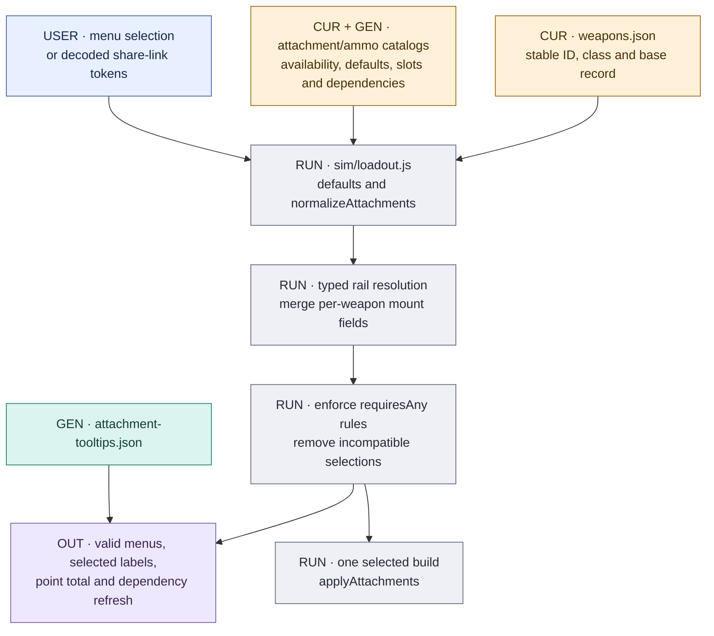
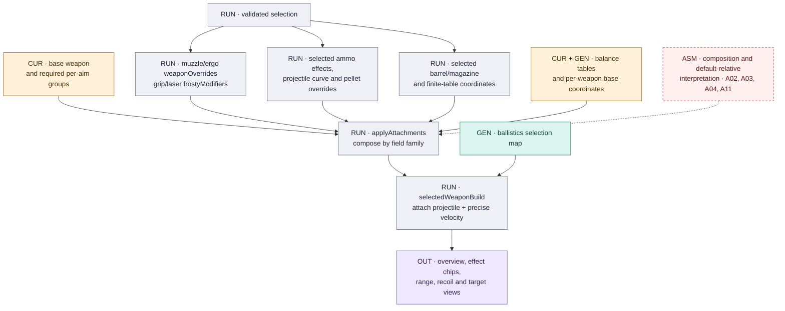
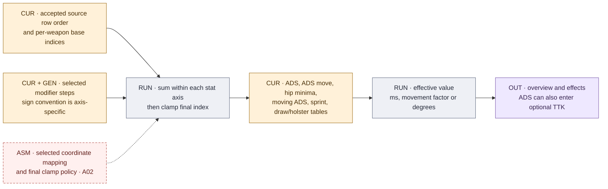
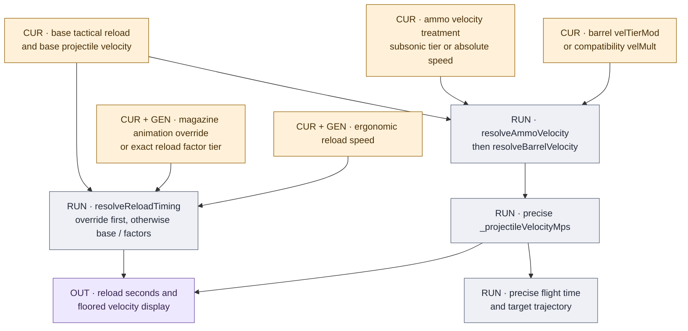
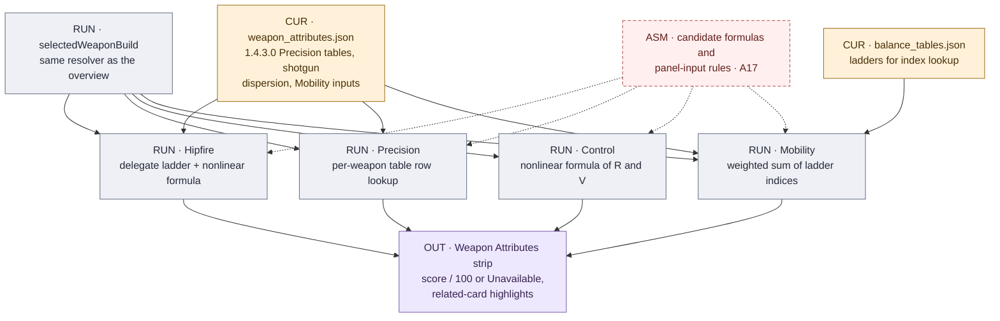
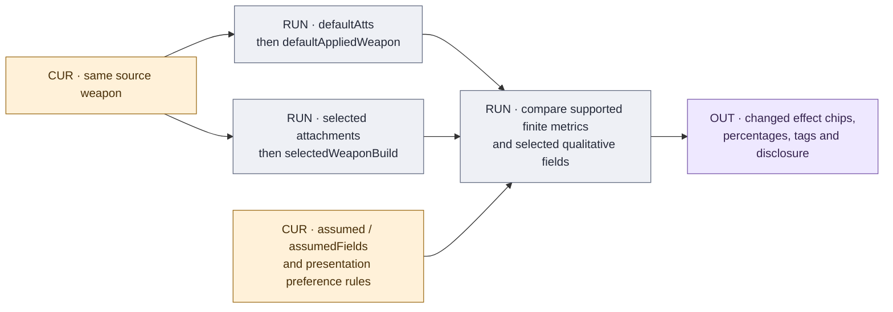

# Loadouts, ladders and overview

[Atlas](README.md) · [Attachment model](../ATTACHMENT_MODEL.md) · [Stat ladders](../STAT_LADDERS.md) · [Weapon Attributes model](../WEAPON_ATTRIBUTES_MODEL.md)

Checked against `b3e67bf` on 22 September 2026.

## Selection and metadata

`weapons.json` supplies IDs, display name, description, class and base fields.
`ui/app.js` uses these for the weapon list, filters, selected names and compare
labels. `weapon-role-tags.json` is not an input to those filters. Ordered catalogs
and per-weapon maps in `attachments.json` and `ammo.json` supply available
choices, defaults and points; tooltip text is a separate selection-keyed
dictionary. Generic sight categories drive choices, labels, points and links; the
resolver has no optical/camera model. The no-sight option is labelled
"Iron Sights (1.5x)" in [`sim/attachments.js`](../../sim/attachments.js).

## Valid loadout

```mermaid
flowchart TB
    W["CUR · weapons.json<br/>stable ID, class and base record"]:::cur
    C["CUR + GEN · attachment/ammo catalogs<br/>availability, defaults, slots and dependencies"]:::cur
    U["USER · menu selection<br/>or decoded share-link tokens"]:::src
    N["RUN · sim/loadout.js<br/>defaults and normalizeAttachments"]:::run
    R["RUN · typed rail resolution<br/>merge per-weapon mount fields"]:::run
    D["RUN · enforce requiresAny rules<br/>remove incompatible selections"]:::run
    V["OUT · valid menus, selected labels,<br/>point total and dependency refresh"]:::out
    B["RUN · one selected build<br/>applyAttachments"]:::run
    T["GEN · attachment-tooltips.json"]:::gen
    W --> N
    C --> N
    U --> N
    N --> R
    R --> D
    D --> V
    D --> B
    T --> V
    classDef src fill:#e8efff,stroke:#4463a6,color:#16284c
    classDef cur fill:#fff1d9,stroke:#9c6b17,color:#492f08
    classDef gen fill:#dcf4ef,stroke:#27806c,color:#123f35
    classDef run fill:#eef0f5,stroke:#616a80,color:#242938
    classDef out fill:#eee8ff,stroke:#7958aa,color:#36244f
```

Physical slots and dependency rules are generator-owned fields within an otherwise
mixed-maintenance catalog. Offered availability still requires reviewed site
identity/menu evidence. A source-only ability branch is not automatically exposed.

A shared slot stores `atts.rail = {type, id}` or `null`. An explicit rail value,
including empty, overrides consumed legacy category keys. Without an explicit
rail selection, legacy migration prioritizes laser, then light, then grip.
Dependencies are applied after selections are assembled, so menu choices, points,
effects and restored links agree. See [loadout.js](../../sim/loadout.js),
[attachments.js](../../sim/attachments.js) and [ui/loadout.js](../../ui/loadout.js).

Defaults represent the maintained factory/default configuration. Comparing to that
configuration does not require treating the weapon as an attachment-free specimen.

## From base record to effective build

```mermaid
flowchart TB
    W["CUR · base weapon<br/>and required per-aim groups"]:::cur
    S["RUN · validated selection"]:::run
    M["RUN · muzzle/ergo weaponOverrides<br/>grip/laser frostyModifiers"]:::run
    A["RUN · selected ammo effects,<br/>projectile curve and pellet overrides"]:::run
    H["RUN · selected barrel/magazine<br/>and finite-table coordinates"]:::run
    C["RUN · applyAttachments<br/>compose by field family"]:::run
    T["CUR + GEN · balance tables<br/>and per-weapon base coordinates"]:::cur
    P["GEN · ballistics selection map"]:::gen
    B["RUN · selectedWeaponBuild<br/>attach projectile + precise velocity"]:::run
    O["OUT · overview, effect chips,<br/>range, recoil and target views"]:::out
    X["ASM · composition and default-relative<br/>interpretation · A02, A03, A04, A11"]:::asm
    S --> M
    S --> A
    S --> H
    W --> C
    M --> C
    A --> C
    H --> C
    T --> C
    X -.-> C
    C --> B
    P --> B
    B --> O
    classDef cur fill:#fff1d9,stroke:#9c6b17,color:#492f08
    classDef gen fill:#dcf4ef,stroke:#27806c,color:#123f35
    classDef run fill:#eef0f5,stroke:#616a80,color:#242938
    classDef asm fill:#fff0ef,stroke:#b34c46,color:#621f1b,stroke-dasharray:5 3
    classDef out fill:#eee8ff,stroke:#7958aa,color:#36244f
```

This is a dependency map; exact field precedence is implemented in
[`applyAttachments.js`](../../sim/applyAttachments.js). The resolver returns a
build rather than mutating the source weapon. Major ordering rules are:

| Family | Composition boundary |
|---|---|
| Attachment specialization | Merge selected per-weapon fields over the shared catalog entry before applying effects. Barrel ADS uses the generated per-weapon WB route. |
| Recoil | Compose ADS/hip amount and variation steps separately. Muzzle duration override precedes ergonomic duration addition. Ergonomic recovery-time exponent override precedes the muzzle addition. |
| Spread | Start with per-aim dynamics; ADS ammo overrides precede ergonomic overrides. Heavy ADS factors and selected hip light/combo factors affect their named fields. Retain the applicable source bounds. |
| Ammo/projectile | Apply selected effect and damage/pellet overrides; select the explicit projectile separately. Ammo velocity treatment precedes barrel velocity treatment. |
| Handling | Compose each axis using its own signs/base coordinate, then clamp the final finite-table index. |
| Reload | Explicit magazine animation override precedes the ordinary base/tier route; ergonomic speed still applies. |

## Ladders and timing

```mermaid
flowchart LR
    S["CUR · accepted source row order<br/>and per-weapon base indices"]:::cur
    D["CUR + GEN · selected modifier steps<br/>sign convention is axis-specific"]:::cur
    I["RUN · sum within each stat axis<br/>then clamp final index"]:::run
    L["CUR · ADS, ADS move, hip minima,<br/>moving ADS, sprint, draw/holster tables"]:::cur
    V["RUN · effective value<br/>ms, movement factor or degrees"]:::run
    O["OUT · overview and effects<br/>ADS can also enter optional TTK"]:::out
    A["ASM · selected coordinate mapping<br/>and final clamp policy · A02"]:::asm
    S --> I
    D --> I
    A -.-> I
    I --> L
    L --> V
    V --> O
    classDef cur fill:#fff1d9,stroke:#9c6b17,color:#492f08
    classDef run fill:#eef0f5,stroke:#616a80,color:#242938
    classDef asm fill:#fff0ef,stroke:#b34c46,color:#621f1b,stroke-dasharray:5 3
    classDef out fill:#eee8ff,stroke:#7958aa,color:#36244f
```

The complete literal arrays and source records live in [Stat ladders](../STAT_LADDERS.md).
This table traces every active finite/geometric family to its role:

| Stored family | Transform / runtime role |
|---|---|
| `ADS_SPD_TIERS` (8 rows) | `defAds - magazine shift + grip tier + barrel tier` → ADS milliseconds. |
| `ADS_MOVE_TIERS` (12 rows) | ADS-movement base coordinate minus magazine/grip/ammo shifts → movement factor. Preserve repeated rows; 12 source rows. |
| `MOVING_ACC_TIERS` (7 rows) | Find the source moving-ADS minimum, add participating spread steps, clamp when that route resolves → moving ADS minimum. |
| `HIP_SPREAD_TABLE` (18 rows) | Base index/explicit override minus participating hip steps → standing/moving minimum columns. Preserve the other five source columns as retained data and keep source row order. |
| `DRAW_TIME_TABLES` | Sprint (12 rows), primary deploy/undeploy (12 each), sidearm deploy/undeploy (15 each). Base coordinate minus selected shifts; weapon metadata chooses the draw family. |
| `RECOIL_MULT[id]` and group amount/variation factors | Geometric amount/variation exponent composition, rather than a finite array lookup. |
| `RELOAD_SPEED_MULTIPLIERS` (3 rows) | Exact factors `1`, `1.13`, `1.277`; select a named tier and combine with ergonomic speed. |
| `VELOCITY_LADDER` | Scalar `0.8`, used in the supported geometric velocity treatments. |
| Damage/ammo `dmg[]` curves | Ordered range points, including repeated-range discontinuities; [damage guide](DAMAGE_BALLISTICS.md). |
| Catalog arrays and magazine key order | Positional share-link serialization, rather than a numeric stat ladder; [state contract](UI_PUBLISHING.md#state-and-exports). |

No generator automatically owns all of `balance_tables.json`. The collateral map
is generated; other table promotion and base-index decisions remain reviewed
maintenance. The array inventory also includes retained/reference arrays in
[Data reference](../DATA_REFERENCE.md).

```mermaid
flowchart TB
    W["CUR · base tactical reload<br/>and base projectile velocity"]:::cur
    M["CUR + GEN · magazine animation override<br/>or exact reload factor tier"]:::cur
    E["CUR + GEN · ergonomic reload speed"]:::cur
    R["RUN · resolveReloadTiming<br/>override first, otherwise base / factors"]:::run
    A["CUR · ammo velocity treatment<br/>subsonic tier or absolute speed"]:::cur
    B["CUR · barrel velTierMod<br/>or compatibility velMult"]:::cur
    V["RUN · resolveAmmoVelocity<br/>then resolveBarrelVelocity"]:::run
    P["RUN · precise _projectileVelocityMps"]:::run
    O["OUT · reload seconds and<br/>floored velocity display"]:::out
    F["RUN · precise flight time<br/>and target trajectory"]:::run
    W --> R
    M --> R
    E --> R
    W --> V
    A --> V
    B --> V
    V --> P
    R --> O
    P --> O
    P --> F
    classDef cur fill:#fff1d9,stroke:#9c6b17,color:#492f08
    classDef run fill:#eef0f5,stroke:#616a80,color:#242938
    classDef out fill:#eee8ff,stroke:#7958aa,color:#36244f
```

For reload, an explicit `tacRldOverrideMs` is divided by ergonomic speed; the
magazine's ordinary tier is skipped on that route. Otherwise base tactical reload
is divided by the exact magazine factor and ergonomic factor. Retained
`weapon.reloadSpeed` is not multiplied in again. Shell-fed tactical reload
describes one shell with its start/end delays. See [reload exceptions](../../data/reload-exceptions.json).

For velocity, a present `velTierMod` takes precedence over `velMult`. Precise
velocity reaches physics; the overview displays a floored value, so do not use
the displayed integer when checking a chart. Malformed and absent treatments
behave differently; see the [fallback register](REGISTER.md#missing-data-and-fallbacks).

## Overview output inventory

Both slots follow the same resolver. Comparison percentages are signed by the
raw direction of change; better/worse coloring uses the metric's preference rule.
The selected comparison slot and a weapon's own default build are separate baselines.
Presentation and metric construction live in [`ui/app.js`](../../ui/app.js). The
[Weapon Attributes](#weapon-attributes) strip sits above these cards.

| Visible statistic | Effective inputs and transform | Note |
|---|---|---|
| Base Damage | Selected first damage point and pellet interpretation. | Source curve or ammo override. |
| HS / Limb Mult | Explicit `hit_zones` weapon/ammo selection. | [Generated material lookup](DAMAGE_BALLISTICS.md#range-outputs), independent of target geometry. |
| Fire Rate | Selected `rpm`, fire mode and burst/manual-cycle fields. | Cadence also drives BTK-to-TTK and recovery intervals. |
| Bullet Velocity | Ammo treatment → barrel treatment → floored display. | Physics uses the unfloored `_projectileVelocityMps`. |
| Magazine Size | Selected magazine capacity or maintained base. | Ideal TTK ignores it (A04). |
| Tac Reload | Override or exact-factor route above. | |
| Collateral Mult | Complete generated per-weapon/ammo map. | Display only (A11). |
| ADS Time | ADS finite-table coordinate. | Optional additive TTK component. |
| Strafe Speed | ADS movement finite-table coordinate. | |
| Deploy Speed | Selected draw-table family and deploy coordinate. | Holster uses the paired undeploy family. |
| Sprint Recovery | Sprint finite-table coordinate. | |
| Recoil Amount / Variation / Direction | Resolved ADS amount, variation and direction. | Platform/control are applied only in the recoil view. |
| Spread Inc/Shot | Resolved spread dynamics. | Per-shot input, not a recovered radius. |
| ADS Spread: standing/moving | Source bounds with applicable minimum-table effects. | |
| Hipfire Spread: standing/moving | Selected hip-minimum table rows and source maxima. | |
| 3D / 2D Spotting | Source factors multiplied against maintained 54 m / 150 m bases. | Bases are assumptions (A11). |

## Weapon Attributes

```mermaid
flowchart TB
    B["RUN · selectedWeaponBuild<br/>same resolver as the overview"]:::run
    WA["CUR · weapon_attributes.json<br/>1.4.3.0 Precision tables, shotgun<br/>dispersion, Mobility inputs"]:::cur
    T["CUR · balance_tables.json<br/>ladders for index lookup"]:::cur
    H["RUN · Hipfire<br/>delegate ladder + nonlinear formula"]:::run
    P["RUN · Precision<br/>per-weapon table row lookup"]:::run
    C["RUN · Control<br/>nonlinear formula of R and V"]:::run
    M["RUN · Mobility<br/>weighted sum of ladder indices"]:::run
    O["OUT · Weapon Attributes strip<br/>score / 100 or Unavailable,<br/>related-card highlights"]:::out
    A["ASM · candidate formulas and<br/>panel-input rules · A17"]:::asm
    B --> H
    B --> P
    B --> C
    B --> M
    WA --> H
    WA --> P
    WA --> M
    T --> M
    H --> O
    P --> O
    C --> O
    M --> O
    A -.-> H
    A -.-> P
    A -.-> C
    A -.-> M
    classDef cur fill:#fff1d9,stroke:#9c6b17,color:#492f08
    classDef run fill:#eef0f5,stroke:#616a80,color:#242938
    classDef asm fill:#fff0ef,stroke:#b34c46,color:#621f1b,stroke-dasharray:5 3
    classDef out fill:#eee8ff,stroke:#7958aa,color:#36244f
```

The four game menu scores (Hipfire, Precision, Control, Mobility) are calculated
for both loadouts by [`sim/weapon-attributes.js`](../../sim/weapon-attributes.js)
and drawn by [`ui/weapon-attributes.js`](../../ui/weapon-attributes.js). The model
reads the resolved build, so attachment composition is shared with the overview.
Scores are menu values, not percentages of accuracy or speed.

| Attribute | Method | Main input |
|---|---|---|
| Hipfire | Delegate's own 18-row dispersion ladder (not the simulator's spread table) and a nonlinear formula, clamped at 100. | Resolved hip-spread index; shotgun dispersion angle; inferred `sqrt(1.2)` gate when hip spread per shot differs from base. |
| Precision | Per-weapon game lookup table; no fitted equation. | Recoil amount/variation tier sums, RPM, ADS spread increment, recoil duration and decrease. |
| Control | `96 / (1.1 × R × sin(v)/v + 0.75)^2.25 + 4`. | Unrounded ADS recoil amount `R` and variation `V`. |
| Mobility | `D + 4A + S + 2M + 4Z + 4C` over source-order indices. | Deploy, ADS animation, sprint, ADS move, moving-ADS indices, sprint-fire flag. |

Selection-specific input rules (burst-selector recoil not previewed, L115
suppressor hipfire, PP-19 Flash Comp smoothing, L115 animation index, KS Slim
Angled moving ADS) apply only inside this score model; the physical stat cards
keep the source modifiers. A missing or ambiguous Precision row, or an unmatched
Mobility index, returns Unavailable; nothing is interpolated. Evidence, open
questions and the full rules are in the [Weapon Attributes model](../WEAPON_ATTRIBUTES_MODEL.md).

## Default-relative effects

```mermaid
flowchart LR
    W["CUR · same source weapon"]:::cur
    D["RUN · defaultAtts<br/>then defaultAppliedWeapon"]:::run
    S["RUN · selected attachments<br/>then selectedWeaponBuild"]:::run
    C["RUN · compare supported finite metrics<br/>and selected qualitative fields"]:::run
    F["CUR · assumed / assumedFields<br/>and presentation preference rules"]:::cur
    O["OUT · changed effect chips,<br/>percentages, tags and disclosure"]:::out
    W --> D
    W --> S
    D --> C
    S --> C
    F --> C
    C --> O
    classDef cur fill:#fff1d9,stroke:#9c6b17,color:#492f08
    classDef run fill:#eef0f5,stroke:#616a80,color:#242938
    classDef out fill:#eee8ff,stroke:#7958aa,color:#36244f
```

Effect chips cover changed handling, velocity/drag, magazine/reload, ADS amount and
variation, selected recoil recovery factor, spread increments, selected recovery
offsets, spread minima, spotting, headshot multiplier and collateral. Qualitative
tags additionally expose sway change, visual recoil, laser visibility and enemy
regeneration delay.

A recovery chip summarizes a selected factor/offset, not the full nonlinear
recovery equation. Sway is a relative muzzle/magazine amount factor; regeneration
is `5 s + selected ammo addition` (A11). `assumed`/`assumedFields` markers flag
annotated data assumptions only; formula assumptions are in
[the register](REGISTER.md#assumptions-and-interpretation).
