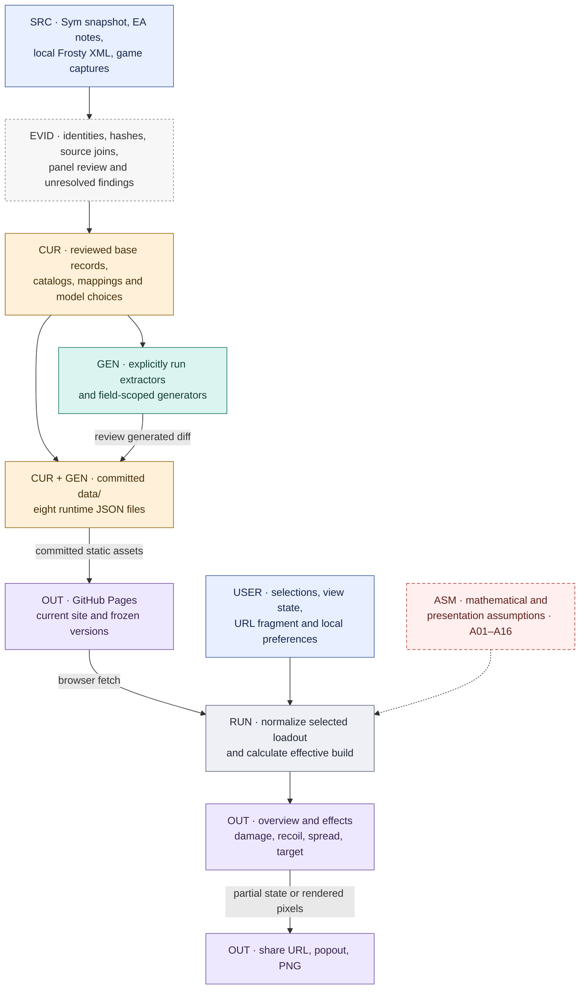

# Data-flow atlas

[HTML viewer](https://raymdl.github.io/BF6-Weapon-Analyzer/docs/data-flow/) · [Documentation index](../README.md) · [Data sources](../DATA_SOURCES.md) · [Maintenance](../../MAINTENANCE.md)

Data sources, import scripts, calculations, assumptions, and publishing for the
current site.

**Reviewed commit:** [`d037503`](https://github.com/raymdl/BF6-Weapon-Analyzer/tree/d037503e1159ab8eb6533e292de5ed33206f0f30)
(15 September 2026, America/New_York). Counts and behavior refer to this commit.
Formula details are in the linked guides.

## System overview

The browser consumes committed files. Extraction and review happen before
publication; the browser does not contact Frosty, Sym, a screenshot collection,
or an application database. Source operands and the simulator's interpretation
of those operands have separate evidence requirements.

## Diagram legend

| Label | Meaning | Important distinction |
|---|---|---|
| **SRC** | External/configuration input, or explicitly labeled user input. | A source label identifies origin; it does not certify activation or native arithmetic. |
| **CUR** | Human-maintained or human-approved records, joins, defaults, policies, assets. | A file can contain both curated fields and generated fields. |
| **GEN** | Data written by a named offline extractor/generator. | Generation is reproducible only with its required inputs and reviewed mappings. |
| **RUN** | Values computed in the browser or a reusable simulation module. | These are conditional model results, rather than independently measured game values. |
| **ASM** | Modeling approximation, empirical fit, fallback, or presentation policy. | IDs link to the [assumption register](REGISTER.md#assumptions-and-interpretation). |
| **EVID** | Provenance, review records, diagnostics, or retained research. | Evidence is not automatically an application input. |
| **OUT** | A published file, visible result, or export. | A published repository file may never be fetched by the application. |

Solid arrows show data or control dependencies. Dashed arrows show supporting
evidence or assumptions. Labels remain readable without color. Captions specify
whether a diagram shows evaluation order or dependencies. **CUR + GEN** identifies
files containing both hand-maintained and generated fields.

## Sections

| Topic | Guide |
|---|---|
| Source files, review steps, and generators | [Sources, ingestion and promotion](SOURCES.md) |
| Menus, defaults, mounts, attachments, ladders, and statistics | [Loadouts and overview](LOADOUTS.md) |
| Damage curves, ammo, hit zones, timing, drag, and trajectories | [Damage and ballistics](DAMAGE_BALLISTICS.md) |
| Recoil paths, spread growth, shot sampling, and scatter | [Recoil and spread](RECOIL_SPREAD.md) |
| Target projection and hit/damage calculations | [Target view](TARGET.md) |
| Startup, caches, sharing, capture, validation, and publishing | [UI, state and publication](UI_PUBLISHING.md) |
| Field maintenance, assumptions, and change dependencies | [Ownership and assumption register](REGISTER.md) |

## Site features

| Feature | Documentation |
|---|---|
| Weapon list, classes, labels and descriptions | [Selection and metadata](LOADOUTS.md#selection-and-metadata) |
| Attachment/ammo/magazine choices, rails, dependencies and points | [Valid loadout](LOADOUTS.md#valid-loadout) |
| Tooltips and text-versus-mechanics boundary | [Text pipeline](SOURCES.md#text-and-capture-review) |
| All overview statistics and comparison percentages | [Overview output inventory](LOADOUTS.md#overview-output-inventory) |
| Attachment-effect chips and assumption markers | [Default-relative effects](LOADOUTS.md#default-relative-effects) |
| Damage/BTK/TTK charts, table and headshot scenarios | [Range outputs](DAMAGE_BALLISTICS.md#range-outputs) |
| ADS, sprint, draw/holster, movement, hip spread and recoil ladders | [Ladders and timing](LOADOUTS.md#ladders-and-timing) |
| Recoil path, spray, spread circles, connected envelope, ten-run scatter and contextual bars | [Recoil/spread outputs](RECOIL_SPREAD.md#outputs-and-sampling) |
| Target distance, zeroing, aim, magnification, hit regions and impact statistics | [Target view](TARGET.md) |
| Compare mode, collapsed panels, data errors, responsive rendering | [Runtime startup](UI_PUBLISHING.md#runtime-startup) |
| Share link, legacy links, local preferences, popout and PNG | [State and exports](UI_PUBLISHING.md#state-and-exports) |
| Header/version links, root site, frozen versions and research visibility | [Publication](UI_PUBLISHING.md#publication-and-validation) |
| Reference-only weapon roles, game composite-stat research and legacy fields | [Non-executed material](REGISTER.md#retained-and-non-executed-material) |

The reviewed dataset contains **63 weapons, 328 supported weapon/ammo selections,
64 projectile records, and eight startup JSON files**. Multiple selections can
share a projectile. Some fetched files contain legacy fields unused by the
current equations.

## Maintenance

When a field changes, update its [ownership register](REGISTER.md) row, diagram,
and formula/source guide. Update the review commit after rechecking the
documentation. Keep historical input hashes with their original records.

GitHub renders the Mermaid diagrams directly. Code and evidence links are
relative to this repository. Use the review commit above to inspect the versions
used for this documentation.

[index.html](index.html) is a self-contained HTML export with embedded diagrams,
section navigation, and zoom/pan controls. GitHub Pages serves it at the HTML viewer
link above. It is a static snapshot; regenerate it when the Markdown changes.
