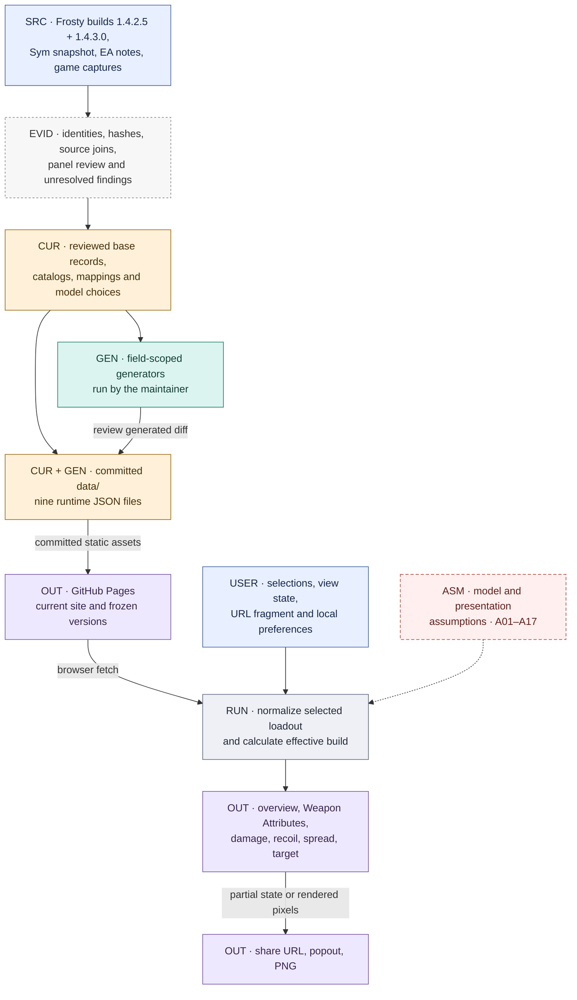

# Data-flow atlas

[HTML viewer](https://raymdl.github.io/BF6-Weapon-Analyzer/docs/data-flow/) · [GitHub repo](https://github.com/raymdl/BF6-Weapon-Analyzer) · [Documentation index](../README.md) · [Data sources](../DATA_SOURCES.md) · [Maintenance](../../MAINTENANCE.md)

A map of the BF6 Weapon Analyzer: where each value comes from, which script or
person maintains it, how the browser calculates results, and which parts are
model assumptions. It is written first as a maintainer's reference. Section and
assumption IDs (for example "A07", "LOADOUTS › Ladders and timing") point at an
exact part of the system.

New to the project? Read [How much to trust each result](#how-much-to-trust-each-result),
[Known differences from the game](#known-differences-from-the-game) and the
[Glossary](#glossary) first.

**Checked against:** [`b3e67bf`](https://github.com/raymdl/BF6-Weapon-Analyzer/tree/b3e67bf)
on 22 September 2026. Each page states the commit it was last checked against.

## How much to trust each result

The game's own code is not public. The site reads the game's data files and
then calculates results with its own model. Each result on the site therefore
has one of these evidence levels:

| Level | Meaning |
|---|---|
| **Source value** | A number read directly from game data (Frosty, Sym). |
| **Model** | Our calculation that uses source values. The game may calculate differently. |
| **Panel-checked** | Our result matches in-game menu panels for the builds that were captured. |
| **Recording-checked** | Our result matches in-game video recordings for the tested weapon and state. |
| **Estimate** | A reasonable approximation with little direct game evidence. |

| Result on the site | Level | Main limit |
|---|---|---|
| Damage and damage drop-off | Source value | — |
| Headshot / limb multipliers | Source value, panel-checked | File structure is inferred (A05). |
| Fire rate, magazine size | Source value | — |
| ADS time, strafe speed, deploy, sprint recovery, spread minima | Model on source tables, panel-checked | Composition of several attachments at the table limits is less tested (A02). |
| Reload time, bullet velocity | Model on source values | Some magazine and ammo routes are not recorded in game (A03). |
| Bullets to kill, time to kill | Model on source values | Ideal case: every shot hits, no armor, no reload (A04). |
| Bullet drop and flight time | Model on source values | Not recording-checked (A06). |
| Weapon Attributes (Hipfire, Precision, Control, Mobility) | Model, panel-checked | Matches all captured panels; some formulas are inferred (A17). |
| Recoil pattern | Model, partly recording-checked | The timing and recovery shape of recoil are inferred (A07); console and control settings (A08). |
| Spread growth, spray and scatter | Model, partly recording-checked | Checked for M39 hipfire and AK4D Heavy barrel only (A09). |
| Target hits and hit zones | Estimate | Uses a drawn soldier, not the game's hitbox (A10). |
| Spotting, collateral, regeneration, sway | Source value on assumed bases | Shown as values only; not simulated (A11). |

The [assumption register](REGISTER.md#assumptions-and-interpretation) gives each
limit in full.

## Known differences from the game

Two kinds of difference exist:

- **Game errors.** Sometimes the game does not do what its own attachment text
  says (for example, PP-19 20 Rnd fast gives no reload bonus). The site follows
  what the game does, not the text. The [attachment bug list](../ATTACHMENT_BUGS.md#status-overview)
  gives each case and the value the site uses.
- **Site differences.** Two cases are known where the site does not match the
  game: PP-19 Flash Comp recoil smoothing and L115 Standard Suppressor hipfire
  (bugs 6 and 12). Burst recoil during firing is an open question (bug 14). The
  [model limitations](../MODEL_LIMITATIONS.md) list other behavior that the
  site does not simulate.

## System overview

```mermaid
flowchart TB
    S["SRC · Frosty builds 1.4.2.5 + 1.4.3.0,<br/>Sym snapshot, EA notes, game captures"]:::src
    E["EVID · identities, hashes, source joins,<br/>panel review and unresolved findings"]:::ev
    C["CUR · reviewed base records,<br/>catalogs, mappings and model choices"]:::cur
    G["GEN · field-scoped generators<br/>run by the maintainer"]:::gen
    D["CUR + GEN · committed data/<br/>nine runtime JSON files"]:::cur
    M["ASM · model and presentation<br/>assumptions · A01–A17"]:::asm
    R["RUN · normalize selected loadout<br/>and calculate effective build"]:::run
    V["OUT · overview, Weapon Attributes,<br/>damage, recoil, spread, target"]:::out
    P["OUT · GitHub Pages<br/>current site and frozen versions"]:::out
    U["USER · selections, view state,<br/>URL fragment and local preferences"]:::src
    S --> E
    E --> C
    C --> G
    C --> D
    G -->|review generated diff| D
    D -->|committed static assets| P
    P -->|browser fetch| R
    U --> R
    M -.-> R
    R --> V
    V -->|partial state or rendered pixels| X["OUT · share URL, popout, PNG"]:::out
    classDef src fill:#e8efff,stroke:#4463a6,color:#16284c
    classDef cur fill:#fff1d9,stroke:#9c6b17,color:#492f08
    classDef gen fill:#dcf4ef,stroke:#27806c,color:#123f35
    classDef run fill:#eef0f5,stroke:#616a80,color:#242938
    classDef asm fill:#fff0ef,stroke:#b34c46,color:#621f1b,stroke-dasharray:5 3
    classDef out fill:#eee8ff,stroke:#7958aa,color:#36244f
    classDef ev fill:#f7f7f7,stroke:#858585,color:#333333,stroke-dasharray:3 3
```

The browser reads only committed files. Extraction, generation and review happen
before a commit; the site never contacts Frosty, Sym or a capture collection.

## Diagram legend

| Label | Meaning |
|---|---|
| **SRC** | External input (game data, notes, captures) or user input. |
| **CUR** | Human-maintained or human-approved records, joins, defaults and policies. |
| **GEN** | Written by a named generator script. |
| **CUR + GEN** | One file that holds both hand-maintained and generated fields. |
| **RUN** | Calculated in the browser or in a `sim/` module. |
| **ASM** | Model approximation, fit, fallback or presentation policy. IDs link to the [assumption register](REGISTER.md#assumptions-and-interpretation). |
| **EVID** | Provenance, review records and retained research. Not an application input. |
| **OUT** | A published file, visible result or export. |

Solid arrows are data or control dependencies. Dashed arrows are supporting
evidence or assumptions.

## Sections

| Topic | Guide |
|---|---|
| Source files, builds, review steps, generators and game updates | [Sources, ingestion and promotion](SOURCES.md) |
| Menus, defaults, mounts, attachments, ladders, statistics and Weapon Attributes | [Loadouts and overview](LOADOUTS.md) |
| Damage curves, ammo, hit zones, timing, drag and trajectories | [Damage and ballistics](DAMAGE_BALLISTICS.md) |
| Recoil paths, spread growth, shot sampling and scatter | [Recoil and spread](RECOIL_SPREAD.md) |
| Target projection and hit/damage calculations | [Target view](TARGET.md) |
| Startup, caches, sharing, capture, validation and publishing | [UI, state and publication](UI_PUBLISHING.md) |
| Field ownership, assumptions and change dependencies | [Ownership and assumption register](REGISTER.md) |

## Site features

| Feature | Documentation |
|---|---|
| Weapon list, classes, labels and descriptions | [Selection and metadata](LOADOUTS.md#selection-and-metadata) |
| Attachment/ammo/magazine choices, rails, dependencies and points | [Valid loadout](LOADOUTS.md#valid-loadout) |
| Tooltips and text-versus-mechanics boundary | [Text pipeline](SOURCES.md#text-and-capture-review) |
| Overview statistics and comparison percentages | [Overview output inventory](LOADOUTS.md#overview-output-inventory) |
| Weapon Attributes strip (Hipfire, Precision, Control, Mobility) | [Weapon Attributes](LOADOUTS.md#weapon-attributes) |
| Attachment-effect chips and assumption markers | [Default-relative effects](LOADOUTS.md#default-relative-effects) |
| Damage/BTK/TTK charts, table and headshot scenarios | [Range outputs](DAMAGE_BALLISTICS.md#range-outputs) |
| ADS, sprint, draw/holster, movement, hip spread and recoil ladders | [Ladders and timing](LOADOUTS.md#ladders-and-timing) |
| Recoil path, spray, spread circles, envelope, ten-run scatter and contextual bars | [Recoil/spread outputs](RECOIL_SPREAD.md#outputs-and-sampling) |
| Target distance, zeroing, aim, magnification, hit regions and impact statistics | [Target view](TARGET.md) |
| Compare mode, collapsed panels, data errors, responsive rendering | [Runtime startup](UI_PUBLISHING.md#runtime-startup) |
| Share link, legacy links, local preferences, popout and PNG | [State and exports](UI_PUBLISHING.md#state-and-exports) |
| Header/version links, root site, frozen versions and research visibility | [Publication](UI_PUBLISHING.md#publication-and-validation) |
| Reference-only weapon roles and legacy fields | [Non-executed material](REGISTER.md#retained-and-non-executed-material) |

## Dataset size

As of 22 September 2026 the data contains **63 weapons, 328 weapon/ammo
selections and 64 projectile records**. Several selections share one projectile.
The site loads **nine** JSON files at startup. [`ship-surface.json`](../../ship-surface.json)
(`runtimeData`) is the authoritative list; `validate-ship-surface.mjs` checks it.
Other counts in these pages are also dated illustrations; the linked data or
report is authoritative.

## Glossary

| Term | Meaning |
|---|---|
| **ADS** | Aim down sights. |
| **Hipfire** | Firing without aiming down sights. |
| **BTK / TTK** | Bullets to kill / time to kill a 100-health target. |
| **Frosty** | Frosty Editor, a community tool that exports Battlefield game data. Our main data source. |
| **Build (game data)** | One version of the game's data files, for example 1.4.3.0. We keep one snapshot per build. |
| **EBX / XML export** | The game's data assets (EBX) and Frosty's text export of them (XML). |
| **Sym** | sym.gg, a community site whose weapon data was the site's first baseline. |
| **Panel** | The in-game attachment menu that shows stats and Weapon Attributes bars. |
| **Recording** | An in-game video used to measure recoil or spread. |
| **WB / GS** | Game data branches: WB holds weapon and projectile configuration; GS holds recoil and spread configuration. |
| **Per-aim group** | The separate recoil and spread values the game keeps for ADS and for hipfire. |
| **Ladder / finite table** | A fixed list of values (for example ADS times). Attachments move a weapon up or down the list. |
| **Tier / step** | One position on a ladder, or one multiplication by a recoil factor. |
| **Recoil amount / variation** | How far each shot kicks, and how much its direction changes at random. |
| **Spread** | The random cone around the aim point in which bullets land. |
| **Collateral multiplier** | The game's multiplier for damage through objects; shown, not simulated. |
| **Weapon Attributes** | The game's four menu scores: Hipfire, Precision, Control and Mobility. |
| **Generator** | A repository script that writes selected data fields from a Frosty export. |
| **Provenance** | The record of where a value came from and how it was checked. |

## Maintenance

When a field changes, update its [register](REGISTER.md) row, the affected
diagram and the formula/source guide. Then update the "Checked against" line on
each page you rechecked.

GitHub renders the Mermaid diagrams directly. The [HTML viewer](index.html) reads
these Markdown files at page load and draws them in the browser, so it has no
build step and is current as soon as the Markdown is published. It needs a
network connection (it loads Mermaid and a Markdown parser from cdn.jsdelivr.net)
and does not work from a local `file://` path; use the Markdown on GitHub instead.
