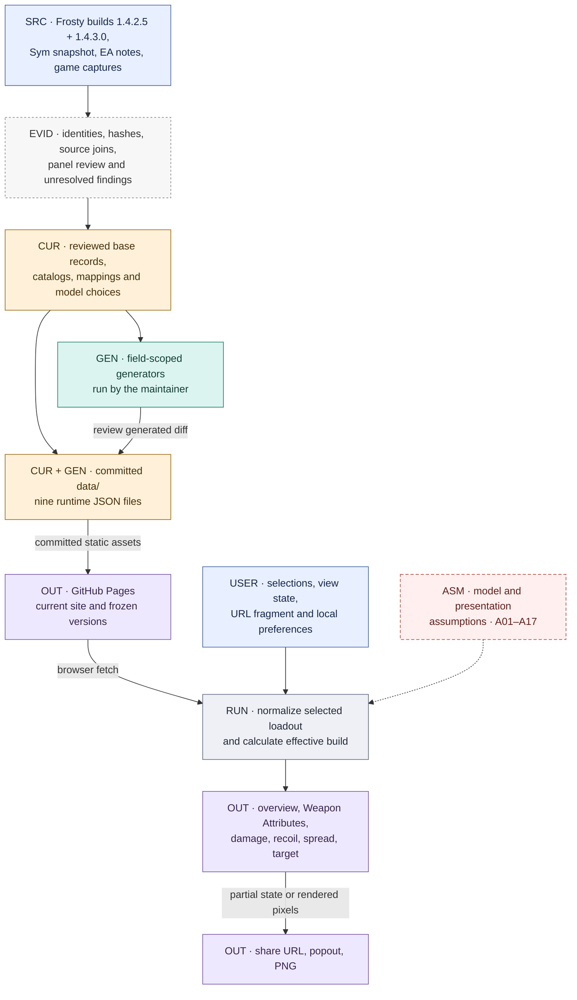

# Data-flow atlas

[HTML viewer](https://raymdl.github.io/BF6-Weapon-Analyzer/docs/data-flow/) · [Documentation index](../README.md) · [Data sources](../DATA_SOURCES.md) · [Maintenance](../../MAINTENANCE.md)

A maintainer's map of the site: where each value comes from, which script or
person maintains it, how the browser calculates results, and which parts are
model assumptions. Use the section and assumption IDs (for example "A07",
"LOADOUTS › Ladders and timing") to point at an exact part of the system when
you ask for a change.

**Checked against:** [`785984e`](https://github.com/raymdl/BF6-Weapon-Analyzer/tree/785984e)
on 22 September 2026. Each page states the commit it was last checked against.

## System overview

```mermaid
flowchart TB
    S["SRC · Frosty builds 1.4.2.5 + 1.4.3.0,<br/>Sym snapshot, EA notes, game captures"]:::src
    E["EVID · identities, hashes, source joins,<br/>panel review and unresolved findings"]:::ev
    C["CUR · reviewed base records,<br/>catalogs, mappings and model choices"]:::cur
    G["GEN · field-scoped generators<br/>run by the maintainer"]:::gen
    D["CUR + GEN · committed data/<br/>nine runtime JSON files"]:::cur
    M["ASM · model and presentation<br/>assumptions · A01–A17"]:::asm
    R["RUN · normalize selected loadout<br/>and calculate effective build"]:::run
    V["OUT · overview, Weapon Attributes,<br/>damage, recoil, spread, target"]:::out
    P["OUT · GitHub Pages<br/>current site and frozen versions"]:::out
    U["USER · selections, view state,<br/>URL fragment and local preferences"]:::src
    S --> E
    E --> C
    C --> G
    C --> D
    G -->|review generated diff| D
    D -->|committed static assets| P
    P -->|browser fetch| R
    U --> R
    M -.-> R
    R --> V
    V -->|partial state or rendered pixels| X["OUT · share URL, popout, PNG"]:::out
    classDef src fill:#e8efff,stroke:#4463a6,color:#16284c
    classDef cur fill:#fff1d9,stroke:#9c6b17,color:#492f08
    classDef gen fill:#dcf4ef,stroke:#27806c,color:#123f35
    classDef run fill:#eef0f5,stroke:#616a80,color:#242938
    classDef asm fill:#fff0ef,stroke:#b34c46,color:#621f1b,stroke-dasharray:5 3
    classDef out fill:#eee8ff,stroke:#7958aa,color:#36244f
    classDef ev fill:#f7f7f7,stroke:#858585,color:#333333,stroke-dasharray:3 3
```

The browser reads only committed files. Extraction, generation and review happen
before a commit; the site never contacts Frosty, Sym or a capture collection.

## Diagram legend

| Label | Meaning |
|---|---|
| **SRC** | External input (game data, notes, captures) or user input. |
| **CUR** | Human-maintained or human-approved records, joins, defaults and policies. |
| **GEN** | Written by a named generator script. |
| **CUR + GEN** | One file that holds both hand-maintained and generated fields. |
| **RUN** | Calculated in the browser or in a `sim/` module. |
| **ASM** | Model approximation, fit, fallback or presentation policy. IDs link to the [assumption register](REGISTER.md#assumptions-and-interpretation). |
| **EVID** | Provenance, review records and retained research. Not an application input. |
| **OUT** | A published file, visible result or export. |

Solid arrows are data or control dependencies. Dashed arrows are supporting
evidence or assumptions.

## Evidence levels

The pages use these words with one meaning each. The register gives the details
for each assumption; the other pages do not repeat them.

| Term | Meaning |
|---|---|
| **Source value** | A number read from game data (Frosty, Sym). It does not show how the game uses the number. |
| **Model** | Our equation or procedure that uses source values. The game's own code is not available. |
| **Panel-checked** | Our result matches in-game menu panels for the captured builds. |
| **Recording-checked** | Our result matches in-game recordings for the tested weapon and state. |

## Sections

| Topic | Guide |
|---|---|
| Source files, builds, review steps, generators and game updates | [Sources, ingestion and promotion](SOURCES.md) |
| Menus, defaults, mounts, attachments, ladders, statistics and Weapon Attributes | [Loadouts and overview](LOADOUTS.md) |
| Damage curves, ammo, hit zones, timing, drag and trajectories | [Damage and ballistics](DAMAGE_BALLISTICS.md) |
| Recoil paths, spread growth, shot sampling and scatter | [Recoil and spread](RECOIL_SPREAD.md) |
| Target projection and hit/damage calculations | [Target view](TARGET.md) |
| Startup, caches, sharing, capture, validation and publishing | [UI, state and publication](UI_PUBLISHING.md) |
| Field ownership, assumptions and change dependencies | [Ownership and assumption register](REGISTER.md) |

## Site features

| Feature | Documentation |
|---|---|
| Weapon list, classes, labels and descriptions | [Selection and metadata](LOADOUTS.md#selection-and-metadata) |
| Attachment/ammo/magazine choices, rails, dependencies and points | [Valid loadout](LOADOUTS.md#valid-loadout) |
| Tooltips and text-versus-mechanics boundary | [Text pipeline](SOURCES.md#text-and-capture-review) |
| Overview statistics and comparison percentages | [Overview output inventory](LOADOUTS.md#overview-output-inventory) |
| Weapon Attributes strip (Hipfire, Precision, Control, Mobility) | [Weapon Attributes](LOADOUTS.md#weapon-attributes) |
| Attachment-effect chips and assumption markers | [Default-relative effects](LOADOUTS.md#default-relative-effects) |
| Damage/BTK/TTK charts, table and headshot scenarios | [Range outputs](DAMAGE_BALLISTICS.md#range-outputs) |
| ADS, sprint, draw/holster, movement, hip spread and recoil ladders | [Ladders and timing](LOADOUTS.md#ladders-and-timing) |
| Recoil path, spray, spread circles, envelope, ten-run scatter and contextual bars | [Recoil/spread outputs](RECOIL_SPREAD.md#outputs-and-sampling) |
| Target distance, zeroing, aim, magnification, hit regions and impact statistics | [Target view](TARGET.md) |
| Compare mode, collapsed panels, data errors, responsive rendering | [Runtime startup](UI_PUBLISHING.md#runtime-startup) |
| Share link, legacy links, local preferences, popout and PNG | [State and exports](UI_PUBLISHING.md#state-and-exports) |
| Header/version links, root site, frozen versions and research visibility | [Publication](UI_PUBLISHING.md#publication-and-validation) |
| Reference-only weapon roles and legacy fields | [Non-executed material](REGISTER.md#retained-and-non-executed-material) |

## Dataset size

As of 22 September 2026 the data contains **63 weapons, 328 weapon/ammo
selections and 64 projectile records**. Several selections share one projectile.
The site loads **nine** JSON files at startup. [`ship-surface.json`](../../ship-surface.json)
(`runtimeData`) is the authoritative list; `validate-ship-surface.mjs` checks it.
Other counts in these pages are also dated illustrations; the linked data or
report is authoritative.

## Maintenance

When a field changes, update its [register](REGISTER.md) row, the affected
diagram and the formula/source guide. Then update the "Checked against" line on
each page you rechecked.

GitHub renders the Mermaid diagrams directly. The [HTML viewer](index.html) reads
these Markdown files at page load and draws them in the browser, so it has no
build step and is current as soon as the Markdown is published. It needs a
network connection (it loads Mermaid and a Markdown parser from cdn.jsdelivr.net)
and does not work from a local `file://` path; use the Markdown on GitHub instead.
