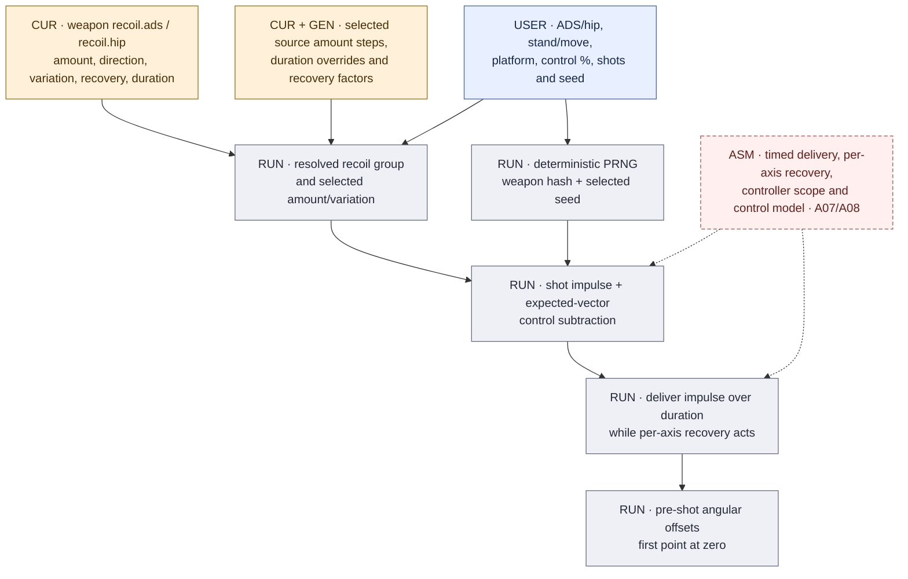
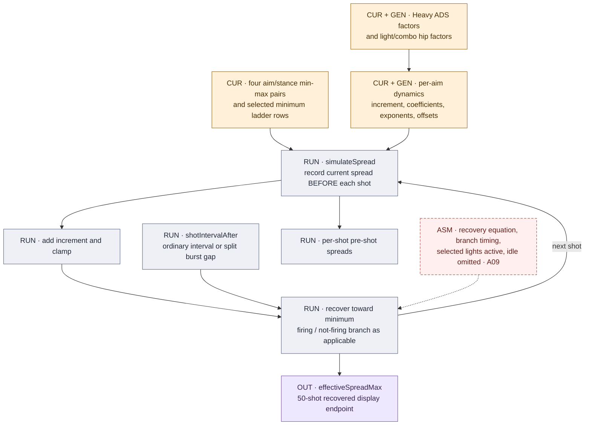
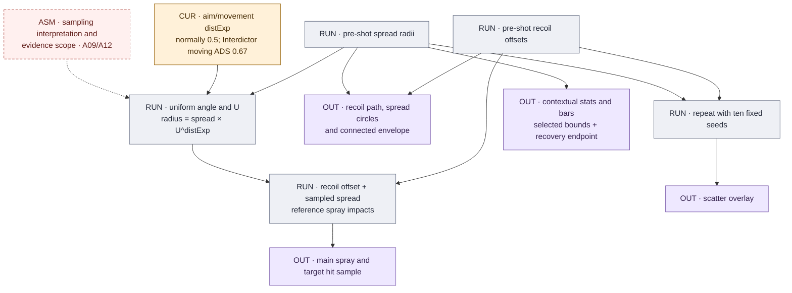

# Recoil, spread and sampled patterns

[Atlas](README.md) · [Recoil/spread formulas](../RECOIL_SPREAD_MODEL.md) · [Assumptions](REGISTER.md#assumptions-and-interpretation)

## Per-aim recoil path

[`sim/core.js`](../../sim/core.js) selects the explicit ADS/hip group and consumes
amount/variation factors, exponents, direction and recovery fields. The attachment
resolver supplies field-scoped modifications. The `recoil_decay.json` maps are
still fetched at startup but are retained legacy data, not current recovery
fallbacks.

At the audited baseline all 126 base aim-state durations are 25 ms. Ordinary
Smooth selections use 50 ms and a 1.2 recovery factor; 17 mapped Bolt-type pairs
use 66.667 ms and 1.728, plus their recovery-time exponent adjustment. Ergonomic
duration addition is applied after the muzzle override. The PP-19 Flash Comp
selector gap remains an explicit evidence limit. Source durations and factors
are documented in the [duration audit](../../reference-data/provenance/frosty-recoil-duration-audit-2026-09-11.json).

`genRecoilPts` seeds `mulberry32` from weapon hash and seed, samples direction
variation, and subtracts a fraction of the expected recoil vector for the chosen
control percentage. The random component remains. Delivery and recovery overlap;
unfinished impulses can continue across a subsequent shot, and recovery age
resets per shot. Integration uses at most 1 ms steps around impulse delivery.
This interpretation of native operands remains a model assumption (A07).

The console option applies the source `0.8836` amount factor through a shared
platform model. Its application across every selectable weapon and the control
percentage abstraction are explicit modeling choices (A08). These controls belong
to contextual recoil displays; they should not be mistaken for globally rewritten
base source values.

## Spread growth and inter-shot recovery

All four `[min, max]` pairs are required: standing/moving for ADS/hipfire. Selected
finite-table changes replace applicable minima while preserving the source maximum.
`simulateSpread` records the spread **before** incrementing for that shot, then
recovers during the interval. The first sample therefore uses the settled minimum.

Ordinary shot intervals use firing recovery. An extended burst gap can split into
firing recovery over its firing interval and not-firing recovery over the remaining
gap. The bounded nonlinear equation uses spread above the selected minimum,
coefficient/exponent/offset and at most 1 ms steps. It is not simply a constant
spread decrement on every weapon.

Heavy-type barrels use source ADS factors: increment `0.666667`, firing coefficient
`1.837117`, firing and not-firing offsets `0.666667`. Light/combination selections
apply the corresponding source hipfire factors. Lights are modeled as active;
separately selected light and combo factors multiply. The AK4D Heavy recording
supports the checked behavior but does not independently test every weapon and
state. See [AK4D evidence](../archive/AK4D_HEAVY_BARREL_RECORDING_ANALYSIS_2026-09-11.md).

The effective maximum shown by contextual statistics is a **50-shot simulated,
recovered endpoint**, rounded for display. It is not a proof of the infinite-run
limit or an assertion that every sampled shot uses that radius. Idle fields and
`firstShotMul` remain retained without a separately executed idle/first-shot state
machine.

## Outputs and sampling

Both the main spray and scatter use `sampleSpreadRadius`; a uniform angle plus
`U ** 0.5` gives a uniform-area disk. The retained M39 settled-hipfire capture
analysis supports that interpretation for its tested context. It does not
establish all moving/ADS states or the native implementation. Interdictor's
moving-ADS source exponent is `0.67`.

| View/layer | Dependency and meaning |
|---|---|
| Recoil path | Pre-shot angular recoil sequence without random spread offsets. |
| Main spray | One reproducible reference seed; add a sampled spread offset to each recoil point. Reroll changes this sample. |
| Spread circles | Selected pre-shot radius centered on the corresponding recoil point. |
| Connected envelope | Geometric connection of spread bounds; it is not a fitted probability contour. |
| Scatter | Ten fixed seeded runs; independent of the main spray reroll. It provides repeated examples, not a computed confidence interval. |
| Contextual statistics and bars | Aim/stance-specific amount, variation, bounds, increment and recovered endpoint. Bar normalization uses UI scale constants, not extra source parameters. |
| Target impacts | The main reference spray projected into metres/centimetres. Target statistics do not pool the scatter overlay or count the envelope as shots. |

`ui/app.js` caches pattern/sequence results using their relevant inputs. Layer
visibility, pan/zoom and canvas scaling affect drawing, not the underlying
selected build. Target statistics can still use the reference spray when its
visual layer is hidden. Seeds and layer choices are not encoded in ordinary share
links; see [state and exports](UI_PUBLISHING.md#state-and-exports).

## Source fields without independent execution

`decNorm`, `shootingDecScale`, spread `idleTime/idleCoef/idleExp/idleOffset`,
`firstShotMul`, and the light's idle-recovery operand are retained source material.
Their presence in JSON does not imply native norm, shooting/idle state or first-shot
behavior has been implemented. The [register](REGISTER.md#retained-and-non-executed-material)
separates those from active fields and from explicit fallbacks such as the 25 ms
recoil-duration fallback still present in code.
