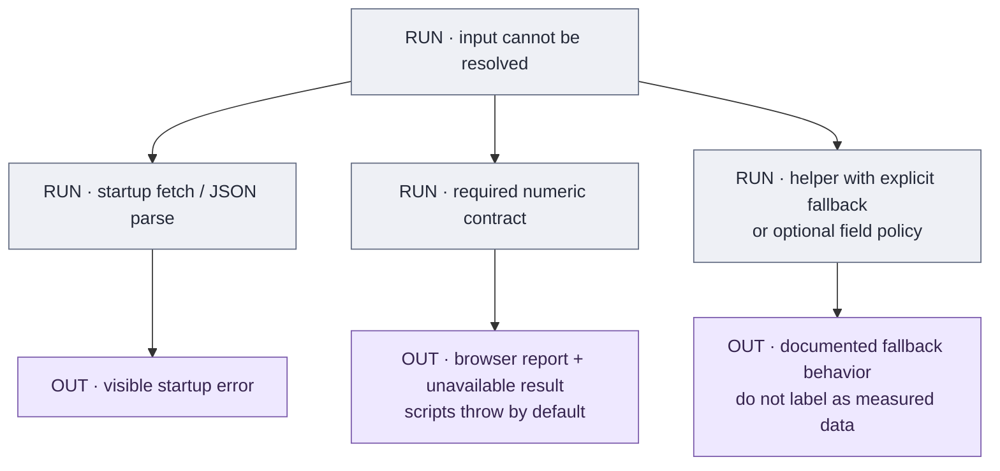

# Ownership, assumptions and change-impact register

[Atlas](README.md) · [Source pipeline](SOURCES.md) · [Model limitations](../MODEL_LIMITATIONS.md)

This register lists maintenance responsibilities and assumptions by field family.
Some individual values have incomplete provenance. Source origin, file maintenance,
and model validation are recorded separately. See the [overview](README.md) for the
review commit and dataset counts.

## Ownership by file and field family

| File / field family | Maintenance and authority | Writer / use / boundary |
|---|---|---|
| `weapons.json`: roster, IDs, class, base scalars | **CUR**, mixed-source field-level promotion. | Reviewed edits from accepted Sym/Frosty/panel evidence. No single complete production importer owns the file. Consumed by UI and resolver. |
| `weapons.json`: `name`, `description` | **CUR**, reviewed Frosty localization promotion. | Candidate description extractor supports review; weapon buttons/names/tooltips use promoted text. |
| `weapons[].dmg`, `damageSource` | **CUR**, accepted Frosty curves and reviewed discontinuities. | [Curve review](../../reference-data/provenance/frosty-damage-curve-review-2026-09-13.json); range and target damage. The native arithmetic still requires validation. |
| `weapons[].recoil.ads/hip`, `spread`, `spreadDyn` | **CUR**, reviewed source literals and retained operands. | Resolver and `core.js`; some fields are retained without separate execution. Timed delivery/recovery and sampling are model choices. |
| `attachments.json`: catalogs, IDs, order, points, offered availability/defaults | **CUR**, source/panel/menu review. | Loadout menus, points and share codec. Catalog order and magazine key order are compatibility-sensitive. Source branches alone do not establish an offered choice. |
| `BARRELS[].adsTimeTierModByWeapon` | **GEN**, current XML + curated identities/routes. | `frosty-barrel-ads.py`; effective ADS coordinate. Other barrel fields retain their own maintenance history. |
| Grip/laser `frostyModifiers`, scoped magazine handling/base coordinates | **GEN**, current XML + reviewed mappings. | `frosty-attachment-handling.py`; per-weapon composition. Whole catalogs are not owned by the generator. |
| Muzzle sniper amount-step `weaponOverrides` | **GEN**, current XML + weapon/muzzle joins. | `frosty-sniper-brakes.py`; per-aim amount changes. |
| Linear Comp/burst source overrides | **GEN** when `--apply` is used, reviewed identity/type evidence. | `frosty-assumption-review.py`; source amount/variation/duration fields, without proving native timing/recovery arithmetic. |
| `WEAPON_ATTS.slots`, `.dependencies` | **GEN**, active source roots and equipment prerequisites. | `frosty-attachment-compatibility.py`; menu filtering, selection normalization, points/effects/link restoration. |
| Remaining muzzle/barrel/light/ergo/modifier fields | **CUR**, separately reviewed source promotion or retained fits. | `applyAttachments.js`; inspect per-field evidence/annotations rather than assigning one confidence to the entire catalog. |
| Magazines: capacity, defaults, reload overrides and exceptions | **CUR + scoped GEN**, identity/panel/animation review. | Runtime values reside in `attachments.json`; `reload-exceptions.json` is a maintenance register. Some generated handling fields share these records. |
| `ammo.json`: ordered catalog, points, availability, effects | **CUR**, reviewed ammo identity/source/menu evidence. | Resolver/loadout/share modules; no whole-file generator implied. |
| `WEAPON_AMMO.projectileOverrides` and `.velocityTreatments` | **CUR**, source curves/pellets and reviewed velocity treatments. | Selected damage and precise speed. Ammo effect descriptions are not numerical inputs. |
| `balance_tables.json`: finite arrays, base maps and geometric factors | **CUR**, reviewed source row order, decoded fields and policy. | `applyAttachments.js` / `core.js`; preserve precision, repeated rows and axis signs. Research extractors produce review input, not automatic ownership of all tables. |
| `balance_tables.json`: `COLLATERAL_MULT_OVERRIDE` | **GEN**, retained compiled trace + reviewed clamp. | `frosty-collateral.py`; complete selected lookup, display only. |
| `ballistics.json` | **GEN**, current XML and checked hit-zone attachment trace. | `frosty-ballistics.py`; selected GUID/gravity/drag. Precise velocity is assembled at runtime. |
| `hit_zones.json` | **GEN**, current graph/raw grids/type descriptors and reviewed material interpretation. | `frosty-hit-zones.py`; selected head/limb multipliers for range and target damage. |
| `attachment-tooltips.json` | **GEN**, localization/linked descriptors + curated panel approvals. | `frosty-attachment-tooltips.py`; UI text only, no mechanical overrides. |
| `recoil_decay.json` | **CUR, legacy retained**. | Still one of eight startup fetches. Current equations use explicit per-aim weapon groups instead of these fallback maps. |
| `weapon-role-tags.json` | **Reference**, source-derived tags with reviewed panel conflict resolution. | Not fetched by the UI; do not infer that classes/filters use these tags. |
| `data/provenance/live-baseline.json` | **CUR**, high-level acceptance/source record. | Maintenance only; field provenance carries the more specific authority. |
| `reference-data/provenance/*` | **Mixed CUR/GEN evidence**. | Identity audits, snapshots, hashes, generated traces and reviews. Some are required offline generator inputs; none are startup JSON. |
| Attachment screenshot-review JSON | **CUR**, canonical human review. | `build-workbook.py` derives the workbook. Raw screenshots may be local-only; workbook is not a source-of-truth runtime table. |
| `sim/*.js`, `ui/app.js` model/presentation constants | **CUR implementation**. | Native interpretation, composition, ideal-combat scope, target geometry, chart/bar scales and state/capture policies. |
| Soldier PNG, page labels/version and static artwork | **CUR assets/presentation**. | Lazy target alpha mask or static page display; no verified native hitbox extraction pipeline established. |
| Selected builds, recoil/spread sequences, trajectories, chart samples | **RUN derived**. | Computed/cached in the browser; not hand-maintained data files. |
| Share links, local preferences, PNG | **USER + RUN output**. | Partial state serialization or current-view pixels; no complete persistent model database. |

[Data reference](../DATA_REFERENCE.md) defines the field contracts and complete
array inventory. [Source generation](SOURCES.md) identifies the scripts and their
write/check behavior. Some generators write only selected fields in a shared JSON file; others
produce an entire file.

## Assumptions and interpretation

The diagrams refer to the IDs below. They cover unverified game behavior, model
limits, and presentation choices. A source coefficient may be exact while the
formula using it remains approximate.

| ID | Where the decision lives | Assumption / boundary | Affected output and evidence boundary |
|---|---|---|---|
| **A01** | `data/provenance`, field provenance and reviewed joins | Mixed-source baseline; export labels, payload hashes and approved identity mappings have narrower meaning than “all fields verified on this build.” | All outputs. Current source labels must be read with individual promotion records and capture context. |
| **A02** | `sim/applyAttachments.js`, `balance_tables.json`, generated mapping inputs | Interpret source coordinates per axis; compose selected steps with explicit signs; clamp final finite-table index. WB/GS alternative routes are not indiscriminately added. | ADS, movement, hip minima, draw/sprint and attachment effects. Literal source tables do not independently prove every native composition route. |
| **A03** | `sim/applyAttachments.js`, per-mag reload exceptions | Animation override versus base/factor route, factory-default normalization, ammo/barrel velocity treatment. Retained fits/unsupported selector mappings require explicit disclosure. | Reload, velocity, default-relative effects, and downstream travel. Panel rounding alone does not supply exact internal values. |
| **A04** | `sim/damage.js`, TTK orchestration in `ui/app.js` | 100 health; ideal head/body scenarios; all selected pellets contribute to one zone; first shot at time zero; no misses, armor, reload, healing or reaction/network delay; additive ADS/travel. | Damage/BTK/TTK. Ideal range output is conditional on this combat scenario. |
| **A05** | `frosty-hit-zones.py`, grid evidence | Stripped material-grid semantics are inferred/corroborated using reproduced head/limb values. Source material/protection lookup is independent of drawn target regions. | Multipliers, damage bands and target damage. Native hitbox shape remains unverified. |
| **A06** | `sim/ballistics.js` | Analytic level drag time, 2D point-projectile RK4 law, finite horizon and zero-angle solve with no sight-height model. | Optional travel TTK and target vertical offset. Source gravity/drag does not prove the selected integrator/law. |
| **A07** | `sim/core.js`, selected recoil override records | Uniform timed impulse delivery overlapping per-axis recovery, recovery age reset per shot, nonlinear decrement and overlap handling. PP-19 Flash Comp retains a selection-mapping gap. | Recoil path/spray and target patterns. Source amount/duration/recovery operands have stronger evidence than native operation/order. |
| **A08** | `sim/core.js`, platform/control UI | Shared console amount factor `0.8836`; controller scope and expected-vector subtraction for 0–125% recoil control. | Contextual recoil, spray and target impacts. Random variation remains; source binding coverage and universal UI application are distinct. |
| **A09** | `sim/core.js`, Heavy/light modifier fields | Pre-shot spread sequence, recovery equation and burst-gap branches; source-exponent radial sampling; selected lights always active; idle/first-shot state not separately executed. | Spread growth, sampled spray/scatter and target accuracy. M39 settled hipfire and AK4D Heavy checks support specific tested contexts, not every native state. |
| **A10** | `sim/target.js`, `assets/soldier-target.png` | Project artwork, 180 cm height, alpha silhouette and hand-maintained anatomical partitions/aim metadata; stationary target. | Hit/miss, zone counts and first-lethal damage. Multi-pellet target statistics are suppressed; no individual pellet geometry. |
| **A11** | `applyAttachments.js`, collateral generator and retained global trace | Spotting factors on 54/150 m bases; regen `5 s + ammo addition`; sway as relative selected amount factors; collateral final index clamp confirmed by operator. | Overview/effect metadata. No detection, healing, camera sway or penetration event simulation. |
| **A12** | `ui/app.js`, `ui/target-stats.js`, `sim/core.js` | Fifty-shot recovered spread endpoint, bar normalization constants, ten fixed scatter samples, display rounding, 75-damage assist styling and comparison preference rules. | Presentation summaries. These are not native composite-stat formulas or inferred statistical confidence intervals. |
| **A13** | `sim/share-state.js`, `ui/capture.js` | Partial URL state, positional tokens, local display preferences and standardized bitmap capture. | A restored link may not reproduce a rerolled seed/layer setup; PNG records visible pixels, not full state. |
| **A14** | `sim/required-data.js`, specific resolver/UI helpers | Required-data failures and legacy/presentation fallbacks are field-specific. Some helpers retain a fallback rather than failing closed. | See the explicit behavior table below; missing data must not be described globally as zero, default, or startup-fatal. |
| **A15** | `.github/workflows/validate-data.yml`, `ship-surface.json`, hosting settings | Consistency tests are not game measurements; declared ship surface is not an exclusion/privacy filter; observed Pages and validation runs are separate. | Publication and assurance. Passing CI does not establish source remeasurement or a guaranteed deployment gate. |
| **A16** | `weapons.json`, modifier records and legacy maps | Retain source fields whose independent behavior is not yet modeled, without silently inventing their native meaning. | Some JSON operands are not used by the simulator. |

Replacing an estimated field with a source value removes that field's estimate.
Formula assumptions such as A07/A09 still apply. The UI's
`assumed`/`assumedFields` markers identify only annotated data assumptions.
See [Model limitations](../MODEL_LIMITATIONS.md) and
[Attachment bugs and mismatches](../ATTACHMENT_BUGS.md) for examples and open issues.

## Missing data and fallbacks

| Condition / exact owner | Current behavior | Interpretation |
|---|---|---|
| Any of the eight startup fetches fails/parsing rejects (`ui/app.js`) | Initialization rejects and a load error/reload action appears. | Even `recoil_decay.json` remains a loading dependency. |
| Required numeric field is invalid (`sim/required-data.js`) | Scripts/tests throw by default; the browser reports and leaves affected results unavailable. | This is separate from network initialization failure. |
| Required hit-zone selection/multiplier missing (`sim/damage.js`) | Required-data error; no generic head/limb multiplier substitution. | Explicit current selection coverage is expected. |
| Projectile selection missing (`ui/app.js`) | No generic global projectile replacement; flight result can be unavailable. | The target drawing helper has a narrower fallback below. |
| Target vertical offset cannot be computed (`targetVerticalOffsetMeters`, `ui/app.js`) | Returns zero offset for a missing model/non-finite result. | A display fallback, not a validated flat trajectory. |
| Recoil duration missing or resolved zero (`genRecoilPts`, `sim/core.js`) | The `... || 0.025` expression supplies 25 ms. Current base records explicitly contain 25 ms. | Distinguish present audited source values from the still-existing fallback. |
| Absent/unrecognized ammo velocity treatment (`resolveAmmoVelocity`) | Retains base velocity on the unsupported treatment route. | Not all malformed ammo metadata fails closed. |
| Present but invalid barrel `velTierMod` (`resolveBarrelVelocity`) | Invalid result; do not fall through to the old multiplier. A missing tier can use compatibility `velMult`. | Field presence controls precedence. |
| Missing ADS time in optional TTK (`ui/app.js`) | The additive expression uses `_adsTimeMs ?? 0`. | A malformed build may omit this component; not evidence of zero ADS time. |
| Missing collateral override (`applyAttachments.js`) | Legacy class/default route remains in code. Current supported selections have full generated coverage. | The fallback is not the source of current 63/328 values. |
| Target image unavailable (`sim/target.js`) | Hit classification is unavailable. | Do not substitute an invisible native hitbox. |
| Invalid/old share tokens (`sim/share-state.js`) | Ignore invalid choices, restore supported defaults and normalize dependencies/legacy rails. | Compatibility policy rather than source-data correction. |

These behaviors were checked at the review commit.

## Retained and non-executed material

| Material | Retained purpose / active boundary |
|---|---|
| Recoil `decNorm`, `shootingDecScale` | No independently executed native norm or shooting-state behavior. |
| Spread idle fields and `firstShotMul`; light idle offset factor | Retained source operands; no separate idle/first-shot state machine. |
| Five hashed columns in each hip-spread row | Source table fidelity; only named standing/moving minimum columns feed the selected minimum lookup. |
| Legacy `RECOIL_DEC`, `RECOIL_DEC_TEXP`, `RECOIL_DEC_EXP` | Fetched/context-retained; not current per-aim recovery fallbacks. |
| Weapon `emptyRld`, retained `reloadSpeed` | Not an additional empty-reload event model or an extra tactical speed multiplier. |
| Sway/visual-recoil/visibility/collateral/regen metadata | Relative values or qualitative tags; no independent camera, detection, penetration or healing simulation. |
| Weapon role tags | Reference-only localization/role evidence; not a browser roster/filter input. |
| Game Hipfire/Precision/Control/Mobility composite-stat research | Candidate formulas and source tables in research documents; not the site's independent live composite-rating engine. |
| Provenance/reload registers, screenshot workbook, working/archive docs | Maintenance/evidence. Some provenance is an offline generator input, but none is a startup fetch. |
| Frozen version directories | Independent historical products; no root-model fallback imports. |

## Change-impact checklist

| Changed input | Review together |
|---|---|
| Weapon/ammo identity or offered selection | Menus/defaults, dependencies, points, tooltips, share tokens, hit-zone trace, ballistics selections, collateral map and cross-file coverage. |
| Catalog or magazine ordering | Existing compact links and their tests, even if no numeric field changes. |
| Source table/base coordinate or handling modifier | All participating default/composed loadouts, final clamping, overview/effect values and optional ADS TTK. |
| Curve, pellets or material multiplier | Base damage, range chart/table, BTK/TTK, target zone damage and first-lethal summaries. |
| Velocity, drag or gravity | Precise versus displayed velocity, TTK travel, target drop/zeroing and projectile cache inputs. |
| Recoil duration/amount/recovery or fire cadence | Pre-shot path, overlapping impulses, burst recovery gaps, scatter and target impacts. |
| Spread bound/dynamics/exponent or light state | First-shot minimum, growth/recovery, fifty-shot endpoint, spray/scatter consistency and matched recordings. |
| Target PNG/height/partitions | Physical aim/projection, alpha hit mask, zone counts and damage; weapon-only range outputs should remain unchanged. |
| Text-only description | Tooltip mapping/coverage and unresolved pointer evidence. Do not convert a text claim into an effect without a mechanics review. |
| Publish manifest/workflow/version label | Actual hosted files, runtime fetch list, archives, CI scope and any real enforcement settings. |

For a change, preserve the source inputs or their availability boundary, inspect
the generator-owned diff, run the [documented checks](../../MAINTENANCE.md), and
update the affected atlas page plus the existing formula/source guide. Empirical
claims require matched game evidence in addition to code consistency tests.
