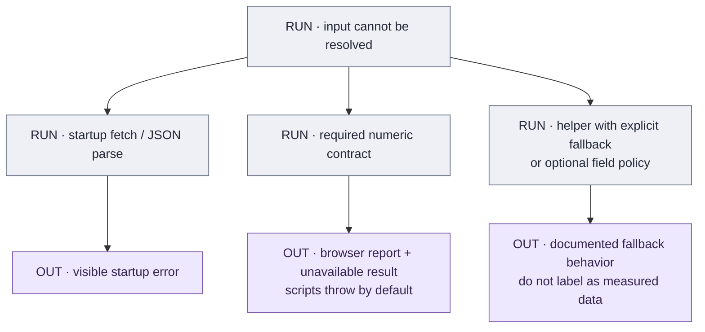

# Ownership, assumptions and change-impact register

[Atlas](README.md) · [Source pipeline](SOURCES.md) · [Model limitations](../MODEL_LIMITATIONS.md)

Checked against `b3e67bf` on 22 September 2026.

This register lists who maintains each field family, every model assumption,
and what to review when an input changes. The other atlas pages refer to the
assumption IDs here instead of repeating the limits.

## Ownership by file and field family

| File / field family | Maintenance and authority | Writer / use / boundary |
|---|---|---|
| `weapons.json`: roster, IDs, class, base scalars | **CUR**, mixed-source field-level promotion. | Reviewed edits from accepted Sym/Frosty/panel evidence. No single importer owns the file. Consumed by UI and resolver. |
| `weapons.json`: `name`, `description` | **CUR**, reviewed Frosty localization promotion. | Candidate description extractor supports review. |
| `weapons[].dmg`, `damageSource` | **CUR**, accepted Frosty curves and reviewed discontinuities. | [Curve review](../../reference-data/provenance/frosty-damage-curve-review-2026-09-13.json); range and target damage. |
| `weapons[].recoil.ads/hip`, `spread`, `spreadDyn` | **CUR**, reviewed source literals and retained operands. | Resolver and `core.js`; some fields are stored but not executed (see below). |
| `attachments.json`: catalogs, IDs, order, points, offered availability/defaults | **CUR**, source/panel/menu review. | Loadout menus, points and share codec. Catalog order and magazine key order are compatibility-sensitive. |
| `BARRELS[].adsTimeTierModByWeapon` | **GEN**, current XML + curated identities/routes. | `frosty-barrel-ads.py`; effective ADS coordinate. |
| Grip/laser `frostyModifiers`, scoped magazine handling/base coordinates | **GEN**, current XML + reviewed mappings. | `frosty-attachment-handling.py`; per-weapon composition. |
| Muzzle sniper amount-step `weaponOverrides` | **GEN**, current XML + weapon/muzzle joins. | `frosty-sniper-brakes.py`; per-aim amount changes. |
| Linear Comp/burst source overrides | **GEN** in apply mode, reviewed identity/type evidence. | `frosty-assumption-review.py`; source amount/variation/duration fields. |
| `WEAPON_ATTS.slots`, `.dependencies` | **GEN**, active source roots and equipment prerequisites. | `frosty-attachment-compatibility.py`; menu filtering, normalization, points/effects/link restoration. |
| Remaining muzzle/barrel/light/ergo/modifier fields | **CUR**, separately reviewed source promotion or retained fits. | `applyAttachments.js`; check per-field evidence and annotations. |
| Magazines: capacity, defaults, reload overrides and exceptions | **CUR + scoped GEN**, identity/panel/animation review. | Runtime values in `attachments.json`; `reload-exceptions.json` is a maintenance register. |
| `ammo.json`: ordered catalog, points, availability, effects | **CUR**, reviewed ammo identity/source/menu evidence. | Resolver/loadout/share modules. |
| `WEAPON_AMMO.projectileOverrides` and `.velocityTreatments` | **CUR**, source curves/pellets and reviewed velocity treatments. | Selected damage and precise speed. |
| `balance_tables.json`: finite arrays, base maps and geometric factors | **CUR**, reviewed source row order, decoded fields and policy. | `applyAttachments.js` / `core.js`; preserve precision, repeated rows and axis signs. |
| `balance_tables.json`: `COLLATERAL_MULT_OVERRIDE` | **GEN**, retained compiled trace + reviewed clamp. | `frosty-collateral.py`; display only. |
| `ballistics.json` | **GEN**, current XML and checked hit-zone attachment trace. | `frosty-ballistics.py`; selected GUID/gravity/drag. |
| `hit_zones.json` | **GEN**, current graph/raw grids/type descriptors and reviewed material interpretation. | `frosty-hit-zones.py`; head/limb multipliers for range and target damage. |
| `attachment-tooltips.json` | **GEN**, localization/linked descriptors + curated panel approvals. | `frosty-attachment-tooltips.py`; UI text only. |
| `weapon_attributes.json` | **CUR**, assembled from dated 1.4.3.0 Precision, shotgun and Mobility traces (named in its `provenance` field). | `sim/weapon-attributes.js`; Weapon Attributes scores only. No production generator. |
| `recoil_decay.json` | **CUR, legacy retained**. | Still a startup fetch. Current equations use explicit per-aim weapon groups instead. |
| `weapon-role-tags.json` | **Reference**, source-derived tags with reviewed panel conflict resolution. | Not fetched by the UI. |
| `data/provenance/live-baseline.json` | **CUR**, high-level acceptance/source record (1.4.2.5 baseline, 1.4.3.0 changes). | Maintenance only; field provenance is more specific. |
| `reference-data/provenance/*` | **Mixed CUR/GEN evidence**. | Identity audits, snapshots, hashes, generated traces and reviews. Some are offline generator inputs; none are startup JSON. |
| Attachment screenshot-review JSON | **CUR**, canonical human review. | `build-workbook.py` derives the workbook. Not a runtime table. |
| `sim/*.js`, `ui/*.js` model/presentation constants | **CUR implementation**. | Composition, ideal-combat scope, target geometry, attribute formulas, chart/bar scales and state/capture policies. |
| Soldier PNG, page labels/version and static artwork | **CUR assets/presentation**. | Lazy target alpha mask or static page display. |
| Selected builds, recoil/spread sequences, trajectories, chart samples, attribute scores | **RUN derived**. | Computed/cached in the browser. |
| Share links, local preferences, PNG | **USER + RUN output**. | Partial state serialization or current-view pixels. |

[Data reference](../DATA_REFERENCE.md) defines the field contracts and complete
array inventory. [Source generation](SOURCES.md) identifies the scripts.

## Assumptions and interpretation

A source coefficient can be exact while the formula that uses it is approximate.
Replacing an estimated field with a source value removes that field's estimate,
but formula assumptions such as A07/A09 still apply.

| ID | Where the decision lives | Assumption | Affected output |
|---|---|---|---|
| **A01** | `data/provenance`, field provenance and reviewed joins | Mixed-source baseline: 1.4.2.5 export plus reviewed 1.4.3.0 changes, Sym base fields and panel evidence. A source label does not mean every field was re-verified on that build. | All outputs. |
| **A02** | `sim/applyAttachments.js`, `balance_tables.json`, generated mapping inputs | Interpret source coordinates per axis; compose selected steps with explicit signs; clamp the final finite-table index. WB/GS alternative routes are not added together. | ADS, movement, hip minima, draw/sprint, attachment effects, Mobility. |
| **A03** | `sim/applyAttachments.js`, per-mag reload exceptions | Animation override versus base/factor route, factory-default normalization, ammo/barrel velocity treatment. | Reload, velocity, default-relative effects, travel. |
| **A04** | `sim/damage.js`, TTK orchestration in `ui/app.js` | 100 health; ideal head/body scenarios; all pellets hit one zone; first shot at time zero; no misses, armor, reload, healing, reaction or network delay; additive ADS/travel. | Damage/BTK/TTK. |
| **A05** | `frosty-hit-zones.py`, grid evidence | Stripped material-grid semantics are inferred and corroborated by reproduced head/limb panel values. | Multipliers, damage bands, target damage. |
| **A06** | `sim/ballistics.js` | Analytic level drag time, 2D point-projectile RK4 law, finite horizon, zero-angle solve with no sight height. | Optional travel TTK, target vertical offset. |
| **A07** | `sim/core.js`, selected recoil override records | Uniform timed impulse delivery overlapping per-axis recovery, recovery age reset per shot, nonlinear decrement and overlap handling. PP-19 Flash Comp keeps a selection-mapping gap. | Recoil path/spray, target patterns. |
| **A08** | `sim/core.js`, platform/control UI | Shared console amount factor `0.8836`; controller scope; expected-vector subtraction for 0–125% recoil control. | Contextual recoil, spray, target impacts. |
| **A09** | `sim/core.js`, Heavy/light modifier fields | Pre-shot spread sequence, recovery equation and burst-gap branches; source-exponent radial sampling; selected lights always active; no idle/first-shot state. | Spread growth, spray/scatter, target accuracy. |
| **A10** | `sim/target.js`, `assets/soldier-target.png` | Project artwork, 180 cm height, alpha silhouette, hand-drawn anatomical partitions; stationary target; no native hitbox. | Hit/miss, zone counts, first-lethal damage. Multi-pellet target statistics suppressed. |
| **A11** | `applyAttachments.js`, collateral generator and retained global trace | Spotting factors on 54/150 m bases; regen `5 s + ammo addition`; sway as relative amount factors; collateral final index clamp confirmed by operator. | Overview/effect metadata; no detection, healing, sway or penetration simulation. |
| **A12** | `ui/app.js`, `ui/target-stats.js`, `sim/core.js` | Fifty-shot recovered spread endpoint, bar normalization constants, ten fixed scatter seeds, display rounding, 75-damage assist styling, comparison preference rules. | Presentation summaries. |
| **A13** | `sim/share-state.js`, `ui/capture.js` | Partial URL state, positional tokens, local display preferences, standardized bitmap capture. | Restored links omit seeds/layers; PNG has pixels, not state. |
| **A14** | `sim/required-data.js`, specific resolver/UI helpers | Required-data failures and fallbacks are field-specific; some helpers keep a fallback instead of failing. | See [missing data](#missing-data-and-fallbacks). |
| **A15** | `.github/workflows/validate-data.yml`, `ship-surface.json`, hosting settings | Consistency tests are not game measurements; ship surface is not a privacy filter; Pages deployment does not wait for validation. | Publication and assurance. |
| **A16** | `weapons.json`, modifier records and legacy maps | Keep source fields whose behavior is not modeled, without inventing their meaning. | Some JSON operands are unused. |
| **A17** | `sim/weapon-attributes.js`, `weapon_attributes.json` | Candidate Hipfire/Control/Mobility formulas decoded from game delegates; Precision table-row selection rules and tolerances; inferred Hipfire `sqrt(1.2)` gate; selection-specific panel-input rules (burst preview, L115, PP-19, KS Slim Angled). | Weapon Attributes strip only; physical cards keep source modifiers. |

The UI's `assumed`/`assumedFields` markers identify only annotated data
assumptions. See [Model limitations](../MODEL_LIMITATIONS.md) and
[Attachment bugs and mismatches](../ATTACHMENT_BUGS.md) for open issues.

### Improvement view

Impact is a maintainer judgment of how much a wrong assumption would change
results a user sees (22 September 2026). "Evidence that would narrow it" names
the kind of evidence to collect; [What would justify an update](../MODEL_LIMITATIONS.md#what-would-justify-an-update)
gives the recording standard.

| ID | Impact | Evidence that would narrow it | Status / links |
|---|---|---|---|
| **A01** | Medium | Re-extract remaining 1.4.2.5-sourced fields from the current build with per-field provenance. | 1.4.3.0 changes reviewed; unchanged fields keep 1.4.2.5 provenance. [Source comparison](../../reference-data/provenance/frosty-1.4.3.0-source-comparison-2026-09-15.json) |
| **A02** | Medium | Panel captures of stacked builds that reach table bounds on each axis. | Mobility panel matches support index composition for captured builds. [Stat ladders](../STAT_LADDERS.md) |
| **A03** | Low–medium | Reload recordings per magazine route; velocity panel captures for subsonic/barrel combinations. | [Reload exceptions](../../data/reload-exceptions.json) |
| **A04** | High (headline TTK) | Scope decision, not a data gap. Change only by adding options (misses, armor, reload). | Intentional. |
| **A05** | Medium | In-game hit tests per zone and ammo; a decoded grid schema. | Corroborated by panel HS/limb values. |
| **A06** | Low (medium for long-range snipers) | Recorded drop and flight time at long range. | No recording yet. |
| **A07** | High (recoil view) | Frame-accurate recordings per recoil family, including burst and smoothed muzzles. | Open: [PP-19 Flash Comp](../ATTACHMENT_BUGS.md#6-pp-19-flash-comp), [burst firing](../ATTACHMENT_BUGS.md#14b-do-burst-recoil-modifiers-apply-during-firing-open-grt-bc-tests). |
| **A08** | Medium | Console recordings; controller recordings at set control percentages. | Source factor known; application scope assumed. |
| **A09** | High (spread, scatter, target) | Moving and ADS scatter captures; tap-fire first-shot recordings. | Recording-checked: M39 settled hipfire, AK4D Heavy. |
| **A10** | Medium | Native hitbox extraction or systematic in-game hit tests. | Artwork-based. |
| **A11** | Low (display only) | Detection, healing and penetration tests. | |
| **A12** | Low | UI decision; no game evidence applies. | |
| **A13** | Low | None; policy. | [Codec contract](../ARCHITECTURE.md#url-compatibility-contract) |
| **A14** | Low (current data has full coverage) | None; code policy. | |
| **A15** | Low | Repository setting if a gated deployment is wanted. | |
| **A16** | Medium (tap fire, idle recovery) | Idle and first-shot recordings. | Fields stored, not executed. |
| **A17** | Medium (four headline scores) | Panel captures of extreme combined builds, zero-variation Control, other burst weapons equipped. | [Weapon Attributes model › Evidence](../WEAPON_ATTRIBUTES_MODEL.md#evidence-and-confidence), [open questions](../frosty/OPEN_QUESTIONS.md#weapon-attributes-follow-up). |

## Missing data and fallbacks

```mermaid
flowchart TB
    I["RUN · input cannot be resolved"]:::run
    F["RUN · startup fetch / JSON parse"]:::run
    N["RUN · required numeric contract"]:::run
    P["RUN · helper with explicit fallback<br/>or optional field policy"]:::run
    E["OUT · visible startup error"]:::out
    B["OUT · browser report + unavailable result<br/>scripts throw by default"]:::out
    D["OUT · documented fallback behavior<br/>do not label as measured data"]:::out
    I --> F
    I --> N
    I --> P
    F --> E
    N --> B
    P --> D
    classDef run fill:#eef0f5,stroke:#616a80,color:#242938
    classDef out fill:#eee8ff,stroke:#7958aa,color:#36244f
```

| Condition / exact owner | Current behavior | Interpretation |
|---|---|---|
| Any startup fetch fails or does not parse (`ui/app.js`) | Initialization rejects and a load error/reload action appears. | Even `recoil_decay.json` is a loading dependency. |
| Required numeric field is invalid (`sim/required-data.js`) | Scripts/tests throw by default; the browser reports and leaves affected results unavailable. | Separate from network failure. |
| Required hit-zone selection/multiplier missing (`sim/damage.js`) | Required-data error; no generic multiplier. | |
| Projectile selection missing (`ui/app.js`) | No generic projectile; flight result can be unavailable. | |
| Target vertical offset cannot be computed (`targetVerticalOffsetMeters`, `ui/app.js`) | Returns zero offset. | Display fallback, not a flat trajectory. |
| Recoil duration missing or zero (`genRecoilPts`, `sim/core.js`) | `... || 0.025` supplies 25 ms. All base records contain 25 ms explicitly. | |
| Absent/unrecognized ammo velocity treatment (`resolveAmmoVelocity`) | Keeps base velocity. | Does not fail closed. |
| Present but invalid barrel `velTierMod` (`resolveBarrelVelocity`) | Invalid result; no fall-through to `velMult`. A missing tier can use `velMult`. | Field presence controls precedence. |
| Missing ADS time in optional TTK (`ui/app.js`) | `_adsTimeMs ?? 0`. | Not evidence of zero ADS time. |
| Missing collateral override (`applyAttachments.js`) | Legacy class/default route remains in code. | All current selections have generated values. |
| No Precision row, ambiguous row, unmatched Mobility index or missing recoil multiplier (`sim/weapon-attributes.js`) | That score shows Unavailable. | No interpolation or default. |
| Target image unavailable (`sim/target.js`) | Hit classification is unavailable. | |
| Invalid/old share tokens (`sim/share-state.js`) | Ignore invalid choices, restore defaults, normalize dependencies/legacy rails. | Compatibility policy. |

## Retained and non-executed material

| Material | Retained purpose / active boundary |
|---|---|
| Recoil `decNorm`, `shootingDecScale` | No native norm or shooting-state behavior executed. |
| Spread idle fields and `firstShotMul`; light idle offset factor | No idle/first-shot state machine. |
| Five hashed columns in each hip-spread row | Source fidelity; only standing/moving minimum columns are read. |
| Legacy `RECOIL_DEC`, `RECOIL_DEC_TEXP`, `RECOIL_DEC_EXP` | Fetched; not current recovery fallbacks. |
| Weapon `emptyRld`, retained `reloadSpeed` | No empty-reload model; not an extra speed multiplier. |
| Sway/visual-recoil/visibility/collateral/regen metadata | Relative values or qualitative tags only. |
| Weapon role tags | Reference only; not a roster/filter input. |
| Weapon Attributes research checkers (`frosty-composite-check.mjs`, `frosty-precision-check.mjs`) and `composite-*` evidence | Offline comparison with captured panels; the runtime model is `sim/weapon-attributes.js`. |
| Rate of Fire, Headshot and Collateral attribute delegates | Identified in game data; not modeled as attribute scores. |
| Provenance/reload registers, screenshot workbook, working/archive docs | Maintenance/evidence; none is a startup fetch. |
| Frozen version directories | Independent historical products; no fallback imports. |

## Change-impact checklist

| Changed input | Review together |
|---|---|
| Weapon/ammo identity or offered selection | Menus/defaults, dependencies, points, tooltips, share tokens, hit-zone trace, ballistics selections, collateral map, cross-file coverage. |
| Catalog or magazine ordering | Existing compact links and their tests. |
| Source table/base coordinate or handling modifier | All default/composed loadouts, final clamping, overview/effect values, optional ADS TTK, Mobility and Hipfire scores. |
| Curve, pellets or material multiplier | Base damage, range chart/table, BTK/TTK, target zone damage, first-lethal summaries. |
| Velocity, drag or gravity | Precise versus displayed velocity, TTK travel, target drop/zeroing, projectile cache inputs. |
| Recoil duration/amount/recovery or fire cadence | Pre-shot path, overlapping impulses, burst gaps, scatter, target impacts, Precision and Control scores. |
| Spread bound/dynamics/exponent or light state | First-shot minimum, growth/recovery, fifty-shot endpoint, spray/scatter, recordings, Hipfire/Precision/Mobility scores. |
| `weapon_attributes.json` or attribute formulas | Weapon Attributes regression tests (`scripts/weapon-attributes.test.mjs`) and research checkers against current panels. |
| Target PNG/height/partitions | Aim/projection, alpha hit mask, zone counts and damage; weapon-only outputs should not change. |
| Text-only description | Tooltip mapping/coverage and unresolved pointer evidence. |
| New game build | [Game update flow](SOURCES.md#when-the-game-updates), labels in header/footer and `live-baseline.json`. |
| Publish manifest/workflow/version label | Hosted files, runtime fetch list, archives, CI scope. |

For a change, keep the source inputs, inspect the generator-owned diff, run the
[documented checks](../../MAINTENANCE.md), and update the affected atlas page
and formula/source guide. Empirical claims need matched game evidence as well as
code consistency tests.
