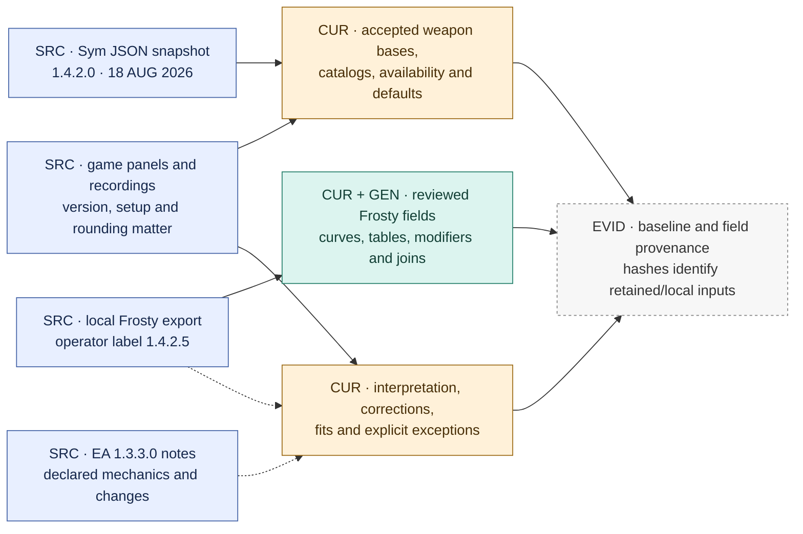
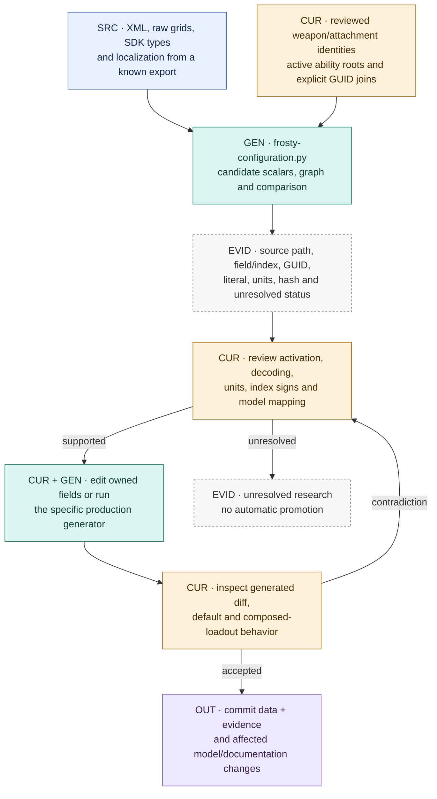
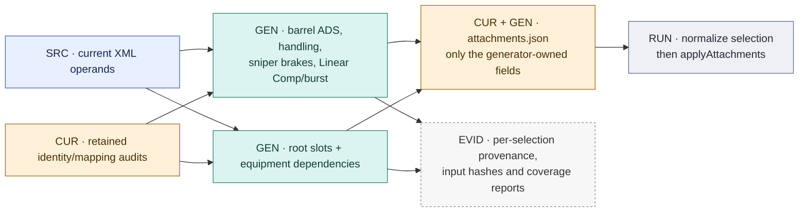
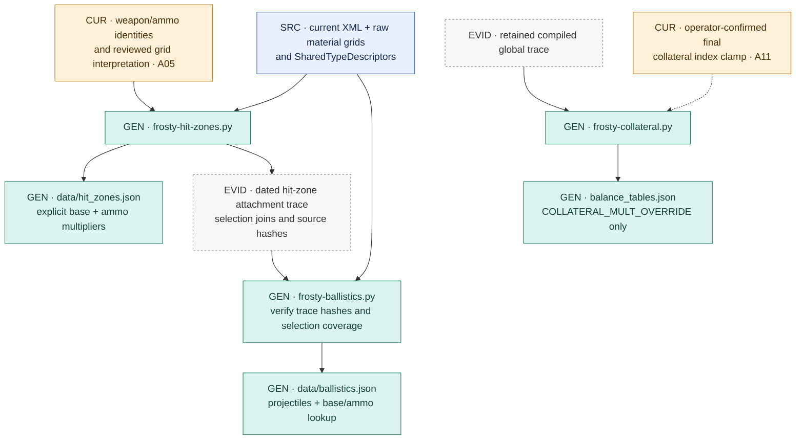
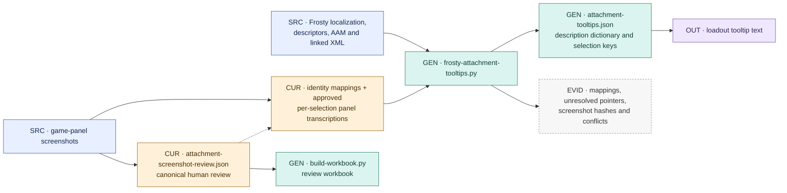

# Sources, ingestion and promotion

[Atlas](README.md) · [Ownership register](REGISTER.md) · [Source policy](../DATA_SOURCES.md)

## Source authority is field-specific

| Input | Accepted role at this baseline | Boundary to preserve |
|---|---|---|
| [Sym baseline record](../../data/provenance/live-baseline.json) and [retained snapshot evidence](../../reference-data/provenance/sym-1.4.2.0-interdictor.json) | Historical foundation for base weapon fields. Recorded data version **1.4.2.0**, version date **18 August 2026**. | September 9 verification hashed a user-supplied full payload against the recorded September 6 snapshot. It did not establish a new HTTP retrieval. The retained file holds an extract and full-payload hash, not the complete payload. |
| [EA notes source record](../../data/provenance/live-baseline.json) | Declared behavior and explicit changes for 1.3.3.0. | Notes do not establish all internal operands or unmentioned behavior. |
| [Local Frosty exports](../DATA_SOURCES.md#local-frosty-export-location) | Current source authority for accepted projectile damage, per-aim groups, arrays, generated handling, selected projectile/hit-zone data, and many modifiers. | `1.4.2.5` is the export's operator-supplied build label. Linked configuration and native activation/arithmetic remain separate claims. |
| [Attachment capture audit](../../reference-data/attachment-audit/README.md), [recording history](../archive/BF6_RECOIL_SPREAD_RECORDING_HISTORY_2026-09-11.md) | Menu identity, displayed defaults, point costs, composition checks, descriptions and empirical model checks. | Rounded panels, exact selections and tested state constrain the inference. Raw capture collections can be local-only. |

**Current damage authority:** `weapons[].damageSource` names Frosty projectile
curves for every weapon. Most former Sym damage curves matched and kept their
values; the M45A1 keeps the reviewed 75 m discontinuity. The [damage review](../../reference-data/provenance/frosty-damage-curve-review-2026-09-13.json)
records that transition. A high-level source label does not mean every live field
was imported afresh or validated by the same method. See A01 in the [register](REGISTER.md#assumptions-and-interpretation).

## From local exports to an accepted change

The semantic configuration entry is
`Common/GameSetup/Tweakables/GameRemixer/GRX_Weapons.xml`. WB branches supply
weapon/projectile configuration; GS branches supply recoil/spread configuration.
Follow selected ability roots, selectors, progression and explicit references.
An adjacent asset name or a matching number is insufficient to establish identity.

[`frosty-configuration.py`](../../scripts/frosty-configuration.py) writes candidate
reports under `--out`, including `configuration-comparison.json`,
`attachment-selection-graph.json`, `base-projectile-configuration.json` and source
hashes. Its summary marks the output `runtimeReady: false`; it does not write live
JSON. Unknown hashed fields and unproven primitive decoding remain unresolved.
[`frosty-sdk-metadata.ps1`](../../scripts/frosty-sdk-metadata.ps1) and
[`research-attachment-modifiers.py`](../../scripts/research-attachment-modifiers.py)
are supporting research tools.

Production generators below can write live files in a maintainer's working tree.
Review must therefore cover the resulting diff before committing; generation is
not a second independent approval. A generated number can still depend on a
curated join, an operator decision, or an assumed downstream equation.

## Field-scoped production generators

| Generator | Required inputs and joins | Owned output and invocation behavior |
|---|---|---|
| [frosty-barrel-ads.py](../../scripts/frosty-barrel-ads.py) | Current XML; reviewed barrel route/weapon identities. | `BARRELS[].adsTimeTierModByWeapon` and `frosty-barrel-ads-generated.json`. `--check` compares; ordinary invocation writes. 233 unique selections. The selected WB route is not added to a separate GS route. |
| [frosty-attachment-handling.py](../../scripts/frosty-attachment-handling.py) | Current XML plus reviewed full-pass, identity and handling follow-up mappings. | Grip/laser per-weapon `frostyModifiers`, magazine fields, and scoped base-coordinate updates in `attachments.json`; generated handling report. `--check` compares, `--review` produces review output, ordinary invocation applies owned fields. 1,487 selections at the audit baseline. |
| [frosty-sniper-brakes.py](../../scripts/frosty-sniper-brakes.py) | Current XML and reviewed weapon/muzzle identity joins. | Muzzle `weaponOverrides` for source amount steps; `frosty-sniper-brakes-generated.json`. `--check` compares; ordinary invocation writes. 16 pairs. |
| [frosty-assumption-review.py](../../scripts/frosty-assumption-review.py) | Current XML, retained identity audits, SDK type evidence and nested fire-mode selectors. | Linear Comp/burst source fields and report. Ordinary invocation writes the report; **`--apply`** changes live attachments; `--check` compares. Source-field assumptions can be retired without proving the native simulation formula. |
| [frosty-attachment-compatibility.py](../../scripts/frosty-attachment-compatibility.py) | Root-listed active ability branches, equipment dependency IDs, reviewed site choices. | `WEAPON_ATTS.slots`, `dependencies`, compatibility evidence. `--check` compares; ordinary invocation writes. 1,391 offered mount choices; 22 offered rules on four weapons. Another 263 secondary-sight entries remain outside offered/mapped rules. |

Retained audits supply identities and joins to these generators; current XML
supplies their numerical operands. Whole catalogs, offered availability, display
ordering and all other fields are not regenerated by that fact. Exact commands
and the current local-root convention are in [Maintenance](../../MAINTENANCE.md#regenerate-attachment-modifiers).

## Projectile, hit-zone and collateral chain

[`frosty-hit-zones.py`](../../scripts/frosty-hit-zones.py) selects protection index
and projectile material through the attachment graph, then reads the raw material
grids. Raw export tooling is [frosty-raw-assets.ps1](../../scripts/frosty-raw-assets.ps1).
Stripped grid names mean the head/limb interpretation rests on cross-checks against
panel values; this is distinct from recovering native collision geometry.

[`frosty-ballistics.py`](../../scripts/frosty-ballistics.py) uses the **current
hit-zone attachment trace** to resolve projectile GUIDs, validates its source
hashes, and reads gravity/drag from current XML. It does not use a generic global
projectile as a substitute for an unsupported selection. Both generated datasets
cover 63 weapons and 328 ammo choices; 64 unique projectile records are shared.

[`frosty-collateral.py`](../../scripts/frosty-collateral.py) reads the retained
[`frosty-global-compiled-trace-2026-09-13.json`](../../reference-data/provenance/frosty-global-compiled-trace-2026-09-13.json),
not fresh XML. It applies base plus shifts, clamps once to source rows 0–9 under
the reviewed policy, and writes the complete per-weapon/ammo collateral map. A new
export requires reviewing/refreshed trace inputs as well as rerunning the tool.

## Text and capture review

[`frosty-attachment-tooltips.py`](../../scripts/frosty-attachment-tooltips.py)
creates descriptions and `byWeapon[weapon][slot][attachment]` lookups. Approved
`screenshot:` keys preserve an explicit selection-specific transcription; they
do not silently resolve other weapons' missing localization pointers. At this
baseline the retained coverage report records **2,966 mapped non-optic selections**:
2,948 linked descriptions and 18 approved panel transcriptions; 45 descriptions
remain missing/conflicting. Iron Sights adds 63 selections. See the [current
mapping audit](../frosty/UI_TEXT.md#current-site-mapping).

Weapon name/description promotion is separately reviewed; the extraction helper
[`frosty-descriptions.py`](../../scripts/frosty-descriptions.py) produces candidate
metadata. `data/weapon-role-tags.json` remains reference-only. Text provenance is
independent of mechanical-effect provenance: a tooltip does not apply an effect.

The canonical [attachment-screenshot-review.json](../../reference-data/attachment-audit/attachment-screenshot-review.json)
is human-maintained. [`build-workbook.py`](../../reference-data/attachment-audit/build-workbook.py)
derives a workbook from it. Neither the workbook nor raw screenshots are fetched
by the site; their conclusions enter only through reviewed promoted fields.

## Reproducibility boundary

A checkout can run the application and product checks. Full source regeneration
also requires the matching local XML, raw grids, SDK/type descriptors, localization
and sometimes local screenshots. Input hashes identify these materials but do
not make missing bytes available. Generated field coverage and source-file
coverage should be rechecked on every new export; preserving a successful old
report is insufficient to certify a newly supplied source tree.
