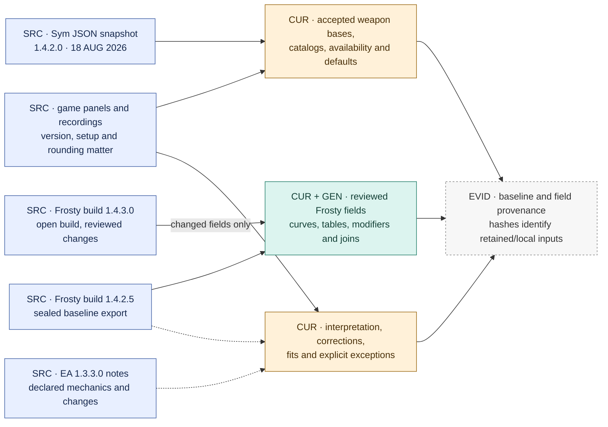
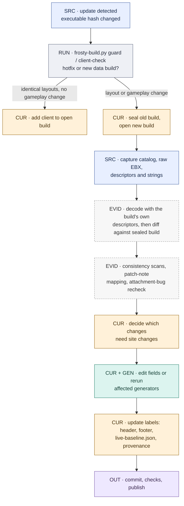
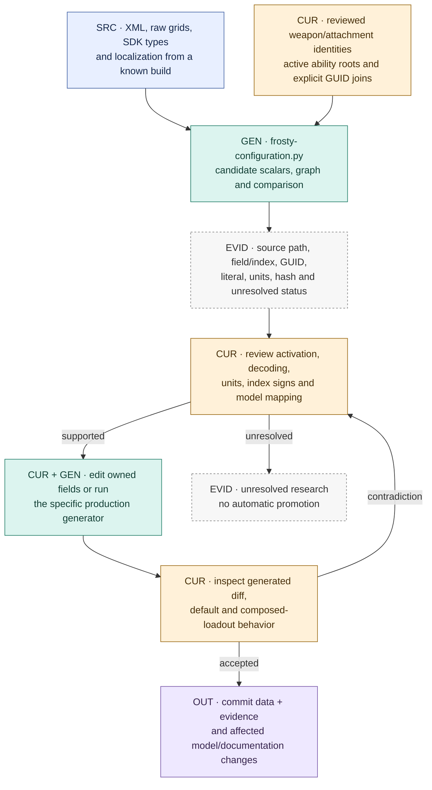
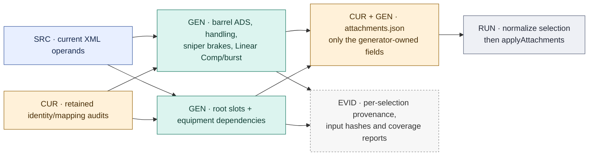
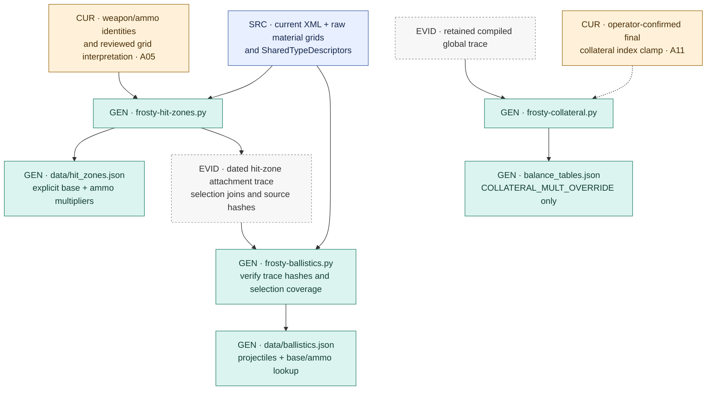
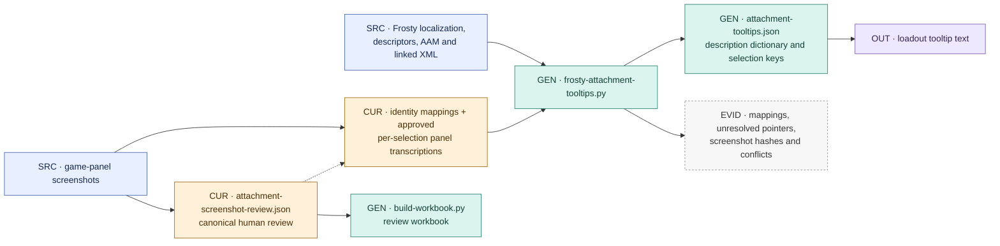

# Sources, ingestion and promotion

[Atlas](README.md) · [Ownership register](REGISTER.md) · [Source policy](../DATA_SOURCES.md) · [Game update guide](../GAME_UPDATE_GUIDE.md)

Checked against `b3e67bf` on 22 September 2026.

## Source authority is field-specific

```mermaid
flowchart LR
    SY["SRC · Sym JSON snapshot<br/>1.4.2.0 · 18 AUG 2026"]:::src
    EA["SRC · EA 1.3.3.0 notes<br/>declared mechanics and changes"]:::src
    FX["SRC · Frosty build 1.4.2.5<br/>sealed baseline export"]:::src
    F3["SRC · Frosty build 1.4.3.0<br/>open build, reviewed changes"]:::src
    GP["SRC · game panels and recordings<br/>version, setup and rounding matter"]:::src
    WB["CUR · accepted weapon bases,<br/>catalogs, availability and defaults"]:::cur
    FL["CUR + GEN · reviewed Frosty fields<br/>curves, tables, modifiers and joins"]:::gen
    MP["CUR · interpretation, corrections,<br/>fits and explicit exceptions"]:::cur
    EV["EVID · baseline and field provenance<br/>hashes identify retained/local inputs"]:::ev
    SY --> WB
    FX --> FL
    F3 -->|changed fields only| FL
    GP --> WB
    GP --> MP
    EA -.-> MP
    FX -.-> MP
    WB --> EV
    FL --> EV
    MP --> EV
    classDef src fill:#e8efff,stroke:#4463a6,color:#16284c
    classDef cur fill:#fff1d9,stroke:#9c6b17,color:#492f08
    classDef gen fill:#dcf4ef,stroke:#27806c,color:#123f35
    classDef ev fill:#f7f7f7,stroke:#858585,color:#333333,stroke-dasharray:3 3
```

| Input | Role | Limit |
|---|---|---|
| [Sym baseline record](../../data/provenance/live-baseline.json) and [retained snapshot evidence](../../reference-data/provenance/sym-1.4.2.0-interdictor.json) | Historical foundation for base weapon fields. Data version **1.4.2.0**, dated **18 August 2026**. | The retained file holds an extract and a full-payload hash, not the complete payload. |
| [EA notes](../../data/provenance/live-baseline.json) | Declared behavior and explicit changes for 1.3.3.0. | Notes do not give internal operands or unmentioned behavior. |
| Frosty build **1.4.2.5** ([local export](../DATA_SOURCES.md#local-frosty-export-location)) | Source for accepted projectile damage, per-aim groups, arrays, generated handling, projectile/hit-zone data and many modifiers. | Build label is operator-supplied. Build is now sealed (read-only). |
| Frosty build **1.4.3.0** ([source comparison](../../reference-data/provenance/frosty-1.4.3.0-source-comparison-2026-09-15.json)) | Reviewed changes only: Interdictor damage curve, hit-zone material and iron-sight cost; VSSM velocity and recoil; Weapon Attributes Precision tables. Includes the 16 September hotfix client. | Fields that did not change keep their 1.4.2.5 provenance. The site header shows v1.4.3.0. |
| [Attachment capture audit](../../reference-data/attachment-audit/README.md), [recording history](../archive/BF6_RECOIL_SPREAD_RECORDING_HISTORY_2026-09-11.md) | Menu identity, displayed defaults, point costs, descriptions, Weapon Attributes panels and empirical model checks. | July/August captures need the correction ledgers before comparison. Raw captures can be local-only. |

**Damage source:** `weapons[].damageSource` names Frosty projectile curves for
every weapon. The M45A1 keeps the reviewed 75 m discontinuity. See the
[damage review](../../reference-data/provenance/frosty-damage-curve-review-2026-09-13.json).

## Build snapshots

Each Frosty data build is kept as `BF6 Datamining\builds\<build>\` (`xml\`,
`capture\`, `reports\`) with `BUILD.json` and a SHA-256 `MANIFEST.tsv`.
[`frosty-build.py`](../../scripts/frosty-build.py) records new exports, refuses
changes to existing files, seals old builds and guards against exporting from the
wrong installed client.

| Build | State (22 September 2026) | Clients |
|---|---|---|
| 1.4.2.5 | `sealed` | Baseline export. |
| 1.4.3.0 | `open` | Release and 16 September hotfix (identical type layouts). |

A hotfix joins the open build only when the type layouts are identical and no
gameplay asset changed. Otherwise the open build is sealed and a new build starts.
Details: [Game update guide › Build snapshots](../GAME_UPDATE_GUIDE.md#build-snapshots).

## When the game updates

```mermaid
flowchart TB
    G0["SRC · update detected<br/>executable hash changed"]:::src
    GU["RUN · frosty-build.py guard / client-check<br/>hotfix or new data build?"]:::run
    HF["CUR · add client to open build"]:::cur
    NB["CUR · seal old build,<br/>open new build"]:::cur
    CAP["SRC · capture catalog, raw EBX,<br/>descriptors and strings"]:::src
    DIF["EVID · decode with the build's own<br/>descriptors, then diff against sealed build"]:::ev
    SCN["EVID · consistency scans, patch-note<br/>mapping, attachment-bug recheck"]:::ev
    DEC["CUR · decide which changes<br/>need site changes"]:::cur
    APP["CUR + GEN · edit fields or rerun<br/>affected generators"]:::gen
    LAB["CUR · update labels: header, footer,<br/>live-baseline.json, provenance"]:::cur
    OUT["OUT · commit, checks, publish"]:::out
    G0 --> GU
    GU -->|identical layouts, no gameplay change| HF
    GU -->|layout or gameplay change| NB
    NB --> CAP
    CAP --> DIF
    DIF --> SCN
    SCN --> DEC
    DEC --> APP
    APP --> LAB
    LAB --> OUT
    classDef src fill:#e8efff,stroke:#4463a6,color:#16284c
    classDef cur fill:#fff1d9,stroke:#9c6b17,color:#492f08
    classDef gen fill:#dcf4ef,stroke:#27806c,color:#123f35
    classDef run fill:#eef0f5,stroke:#616a80,color:#242938
    classDef out fill:#eee8ff,stroke:#7958aa,color:#36244f
    classDef ev fill:#f7f7f7,stroke:#858585,color:#333333,stroke-dasharray:3 3
```

The steps follow stages 0–9 of the [Game update guide](../GAME_UPDATE_GUIDE.md).
The 1.4.3.0 run is the worked example
([update plan](../archive/FROSTY_1.4.3.0_UPDATE_PLAN.md)).

## From local exports to an accepted change

```mermaid
flowchart TB
    XML["SRC · XML, raw grids, SDK types<br/>and localization from a known build"]:::src
    JOIN["CUR · reviewed weapon/attachment identities<br/>active ability roots and explicit GUID joins"]:::cur
    TRACE["GEN · frosty-configuration.py<br/>candidate scalars, graph and comparison"]:::gen
    AUDIT["EVID · source path, field/index, GUID,<br/>literal, units, hash and unresolved status"]:::ev
    CHOICE["CUR · review activation, decoding,<br/>units, index signs and model mapping"]:::cur
    WRITE["CUR + GEN · edit owned fields or run<br/>the specific production generator"]:::gen
    DIFF["CUR · inspect generated diff,<br/>default and composed-loadout behavior"]:::cur
    COMMIT["OUT · commit data + evidence<br/>and affected model/documentation changes"]:::out
    DEFER["EVID · unresolved research<br/>no automatic promotion"]:::ev
    XML --> TRACE
    JOIN --> TRACE
    TRACE --> AUDIT
    AUDIT --> CHOICE
    CHOICE -->|supported| WRITE
    CHOICE -->|unresolved| DEFER
    WRITE --> DIFF
    DIFF -->|accepted| COMMIT
    DIFF -->|contradiction| CHOICE
    classDef src fill:#e8efff,stroke:#4463a6,color:#16284c
    classDef cur fill:#fff1d9,stroke:#9c6b17,color:#492f08
    classDef gen fill:#dcf4ef,stroke:#27806c,color:#123f35
    classDef out fill:#eee8ff,stroke:#7958aa,color:#36244f
    classDef ev fill:#f7f7f7,stroke:#858585,color:#333333,stroke-dasharray:3 3
```

The semantic configuration entry is
`Common/GameSetup/Tweakables/GameRemixer/GRX_Weapons.xml`. WB branches supply
weapon/projectile configuration; GS branches supply recoil/spread configuration.
Follow selected ability roots, selectors, progression and explicit references.
An adjacent asset name or a matching number does not establish identity.

[`frosty-configuration.py`](../../scripts/frosty-configuration.py) writes candidate
reports (`configuration-comparison.json`, `attachment-selection-graph.json`,
`base-projectile-configuration.json`, source hashes). It marks its output
`runtimeReady: false` and never writes live JSON.
[`frosty-sdk-metadata.ps1`](../../scripts/frosty-sdk-metadata.ps1) and
[`research-attachment-modifiers.py`](../../scripts/research-attachment-modifiers.py)
are supporting research tools.

Production generators write live files in the working tree. Review the resulting
diff before committing; running a generator is not a second approval.

## Field-scoped production generators

```mermaid
flowchart LR
    X["SRC · current XML operands"]:::src
    I["CUR · retained identity/mapping audits"]:::cur
    A["GEN · barrel ADS, handling,<br/>sniper brakes, Linear Comp/burst"]:::gen
    C["GEN · root slots + equipment dependencies"]:::gen
    F["CUR + GEN · attachments.json<br/>only the generator-owned fields"]:::cur
    E["EVID · per-selection provenance,<br/>input hashes and coverage reports"]:::ev
    X --> A
    X --> C
    I --> A
    I --> C
    A --> F
    C --> F
    A --> E
    C --> E
    F --> R["RUN · normalize selection<br/>then applyAttachments"]:::run
    classDef src fill:#e8efff,stroke:#4463a6,color:#16284c
    classDef cur fill:#fff1d9,stroke:#9c6b17,color:#492f08
    classDef gen fill:#dcf4ef,stroke:#27806c,color:#123f35
    classDef run fill:#eef0f5,stroke:#616a80,color:#242938
    classDef ev fill:#f7f7f7,stroke:#858585,color:#333333,stroke-dasharray:3 3
```

Commands and flags for every generator are in
[Maintenance](../../MAINTENANCE.md#regenerate-attachment-modifiers). Counts below
come from each generator's committed report (reports dated 13–14 September 2026).

| Generator | Inputs and joins | Owned output |
|---|---|---|
| [frosty-barrel-ads.py](../../scripts/frosty-barrel-ads.py) | Current XML; reviewed barrel route/weapon identities. | `BARRELS[].adsTimeTierModByWeapon`; `frosty-barrel-ads-generated.json`. 233 selections. The WB route is not added to a separate GS route. |
| [frosty-attachment-handling.py](../../scripts/frosty-attachment-handling.py) | Current XML plus reviewed identity and handling follow-up mappings. | Grip/laser per-weapon `frostyModifiers`, magazine fields and scoped base coordinates; handling report. 1,487 selections. |
| [frosty-sniper-brakes.py](../../scripts/frosty-sniper-brakes.py) | Current XML and weapon/muzzle identity joins. | Muzzle `weaponOverrides` for source amount steps; `frosty-sniper-brakes-generated.json`. 16 pairs. |
| [frosty-assumption-review.py](../../scripts/frosty-assumption-review.py) | Current XML, identity audits, SDK type evidence and nested fire-mode selectors. | Linear Comp/burst source fields and report. Changes live attachments only in apply mode. |
| [frosty-attachment-compatibility.py](../../scripts/frosty-attachment-compatibility.py) | Root-listed ability branches, equipment dependency IDs, reviewed site choices. | `WEAPON_ATTS.slots`, `dependencies`, compatibility evidence. 1,391 mount choices; 22 rules on four weapons; 263 secondary-sight entries outside the mapped rules. |

Identity audits supply the joins; current XML supplies the numbers. Whole
catalogs, offered availability and display order are not regenerated.

## Projectile, hit-zone and collateral chain

```mermaid
flowchart TB
    X["SRC · current XML + raw material grids<br/>and SharedTypeDescriptors"]:::src
    ID["CUR · weapon/ammo identities<br/>and reviewed grid interpretation · A05"]:::cur
    H["GEN · frosty-hit-zones.py"]:::gen
    HD["GEN · data/hit_zones.json<br/>explicit base + ammo multipliers"]:::gen
    HT["EVID · dated hit-zone attachment trace<br/>selection joins and source hashes"]:::ev
    B["GEN · frosty-ballistics.py<br/>verify trace hashes and selection coverage"]:::gen
    BD["GEN · data/ballistics.json<br/>projectiles + base/ammo lookup"]:::gen
    CT["EVID · retained compiled global trace"]:::ev
    CP["CUR · operator-confirmed final<br/>collateral index clamp · A11"]:::cur
    CG["GEN · frosty-collateral.py"]:::gen
    CD["GEN · balance_tables.json<br/>COLLATERAL_MULT_OVERRIDE only"]:::gen
    X --> H
    ID --> H
    H --> HD
    H --> HT
    HT --> B
    X --> B
    B --> BD
    CT --> CG
    CP -.-> CG
    CG --> CD
    classDef src fill:#e8efff,stroke:#4463a6,color:#16284c
    classDef cur fill:#fff1d9,stroke:#9c6b17,color:#492f08
    classDef gen fill:#dcf4ef,stroke:#27806c,color:#123f35
    classDef ev fill:#f7f7f7,stroke:#858585,color:#333333,stroke-dasharray:3 3
```

[`frosty-hit-zones.py`](../../scripts/frosty-hit-zones.py) selects protection index
and projectile material through the attachment graph, then reads the raw material
grids ([frosty-raw-assets.ps1](../../scripts/frosty-raw-assets.ps1) exports them).
Grid names are stripped, so the head/limb interpretation rests on cross-checks
against panel values (A05).

[`frosty-ballistics.py`](../../scripts/frosty-ballistics.py) uses the current
hit-zone trace to resolve projectile GUIDs, checks its source hashes and reads
gravity/drag from current XML. It never substitutes a generic projectile. Both
generated files cover all weapon/ammo selections.

[`frosty-collateral.py`](../../scripts/frosty-collateral.py) reads the retained
[global compiled trace](../../reference-data/provenance/frosty-global-compiled-trace-2026-09-13.json),
not fresh XML. It applies base plus shifts, clamps once to source rows 0–9 and
writes the complete per-weapon/ammo map. A new build needs a refreshed trace as
well as a rerun.

## Weapon Attributes inputs

`data/weapon_attributes.json` holds the 1.4.3.0 Precision lookup tables (one per
weapon), the shotgun dispersion angles and the traced Mobility inputs. It is
assembled from three reference files named in its `provenance` field:
[Precision tables](../../reference-data/provenance/frosty-precision-tables-1.4.3.0-2026-09-21.json),
[shotgun hipfire trace](../../reference-data/provenance/composite-shotgun-hipfire-2026-09-21.json)
and [Mobility source trace](../../reference-data/provenance/composite-mobility-source-trace-2026-09-21.json).
No production generator writes it. The research checkers
[`frosty-composite-check.mjs`](../../scripts/frosty-composite-check.mjs) and
[`frosty-precision-check.mjs`](../../scripts/frosty-precision-check.mjs) compare
the model with captured panels. The calculation is in
[Loadouts › Weapon Attributes](LOADOUTS.md#weapon-attributes).

## Text and capture review

```mermaid
flowchart LR
    L["SRC · Frosty localization,<br/>descriptors, AAM and linked XML"]:::src
    S["SRC · game-panel screenshots"]:::src
    M["CUR · identity mappings + approved<br/>per-selection panel transcriptions"]:::cur
    T["GEN · frosty-attachment-tooltips.py"]:::gen
    J["GEN · attachment-tooltips.json<br/>description dictionary and selection keys"]:::gen
    V["OUT · loadout tooltip text"]:::out
    Q["CUR · attachment-screenshot-review.json<br/>canonical human review"]:::cur
    W["GEN · build-workbook.py<br/>review workbook"]:::gen
    E["EVID · mappings, unresolved pointers,<br/>screenshot hashes and conflicts"]:::ev
    L --> T
    S --> M
    M --> T
    T --> J
    T --> E
    J --> V
    S --> Q
    Q --> W
    Q -.-> M
    classDef src fill:#e8efff,stroke:#4463a6,color:#16284c
    classDef cur fill:#fff1d9,stroke:#9c6b17,color:#492f08
    classDef gen fill:#dcf4ef,stroke:#27806c,color:#123f35
    classDef out fill:#eee8ff,stroke:#7958aa,color:#36244f
    classDef ev fill:#f7f7f7,stroke:#858585,color:#333333,stroke-dasharray:3 3
```

[`frosty-attachment-tooltips.py`](../../scripts/frosty-attachment-tooltips.py)
creates descriptions and `byWeapon[weapon][slot][attachment]` lookups. Approved
`screenshot:` keys hold one selection-specific transcription; they do not fill
other weapons' missing text. As of 22 September 2026 the tooltip file covers
2,966 of 3,011 non-optic selections (2,948 Frosty text, 18 approved panel
transcriptions; 45 deferred), plus Iron Sights on all 63 weapons. See the
[current mapping audit](../frosty/UI_TEXT.md#current-site-mapping).

Weapon names and descriptions are promoted separately;
[`frosty-descriptions.py`](../../scripts/frosty-descriptions.py) produces
candidates. `data/weapon-role-tags.json` is reference-only. A tooltip never
applies an effect.

The [attachment-screenshot-review.json](../../reference-data/attachment-audit/attachment-screenshot-review.json)
is the canonical human review, and [`build-workbook.py`](../../reference-data/attachment-audit/build-workbook.py)
derives a workbook from it. Screenshot correction ledgers (for example the 439
corrections of 17 September 2026) change the recorded observed values in this
review, not runtime data. The site fetches neither the workbook nor the screenshots.

## Reproducibility boundary

A checkout can run the site and product checks. Full regeneration also needs
the matching local build snapshot (XML, raw grids, SDK/type descriptors,
localization) and sometimes local screenshots. Hashes identify those files but
do not supply them. Recheck generated coverage on every new build; an old
passing report does not certify a new source tree.
