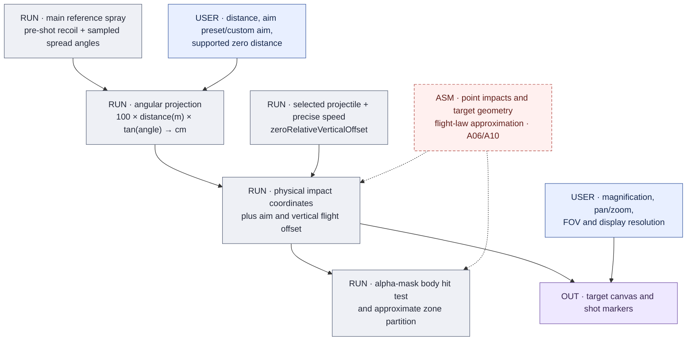
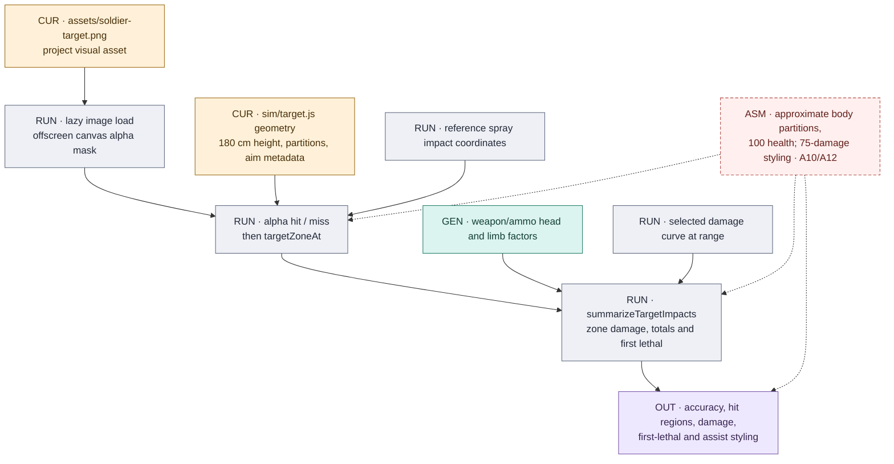

# Target projection and impact results

[Atlas](README.md) · [Recoil and spread](RECOIL_SPREAD.md) · [Damage and ballistics](DAMAGE_BALLISTICS.md)

## Angular pattern to physical impact

The physical position is derived before viewport scaling. Distance changes the
physical spread on the target; aim changes its offset; the selected projectile
model contributes drop/zeroing. Magnification, FOV, display resolution and plot
pan/zoom control the view of those coordinates. They do not make the underlying
projectile more accurate.

`ui/app.js` assembles the projectile from the generated weapon/ammo map and the
build's precise velocity, then calls [`sim/ballistics.js`](../../sim/ballistics.js).
A missing/non-finite target flight result currently yields zero vertical offset
in the display helper. That is a fallback drawing behavior, not evidence of a
flat real-world trajectory; unavailable TTK travel has a different path. See
[missing data](REGISTER.md#missing-data-and-fallbacks).

## Image, zone classification and summaries

[`sim/target.js`](../../sim/target.js) treats the image as a project-maintained
visual asset and uses its alpha mask for silhouette hits. The code assumes a
180 cm soldier and supplies hand-maintained head/chest/torso/limb partitions and
aim offsets. No reproducible extraction of a native collision mesh is established
by this asset or those constants. The root `soldier-target-original.png` is a
reference asset, not the lazily fetched runtime target.

The image loads only when target view is needed, including entry through a shared
link or popout. Without the image, hit classification is disabled. The generated
head/limb damage multipliers are applied **after** the geometric zone decision;
source-backed multipliers do not validate the drawn zone boundaries.

| Result | Computed from | Interpretation limit |
|---|---|---|
| Hit count and accuracy | Reference spray zones versus misses. | One sampled finite sequence; not an expected hit probability. |
| Head, chest, stomach, arm and leg breakdown | Approximate zone partitions and generated selected multipliers. | Chest uses 1; non-head peripheral/lower zones use the selected limb factor. |
| Per-hit / total damage | Selected damage at range multiplied by the classified zone factor. | Totals can include later hits after a first lethal result. |
| First lethal shot / hit counts | Cumulative damage against 100 health. | No armor, healing, target movement or suppression response. |
| Critical-assist styling | Maintained 75-damage presentation threshold. | UI policy; it does not implement or validate game reward logic. |
| Multi-pellet ammo | Detailed target damage statistics are suppressed when `pellets > 1`. | Individual pellet paths are not generated. A single-projectile slug is not excluded by that condition. |

Presentation is in [`ui/target-stats.js`](../../ui/target-stats.js) and the target
orchestration in [`ui/app.js`](../../ui/app.js). The main reference spray is the
statistics input even if the user also draws the ten-run scatter layer. Overlay
visibility should not be used to infer which points were counted.

## What a target change affects

Replacing the target PNG can change silhouette hit tests. Changing the geometry
constants can change aim placement, body/zone decisions, accuracy and damage
summaries while leaving the weapon's damage and recoil inputs unchanged. Changing
only viewport magnification should leave physical impacts and hit summaries
unchanged. This distinction is useful when reviewing screenshot differences and
when deciding whether to rerun model tests, target tests or manual rendering checks.
