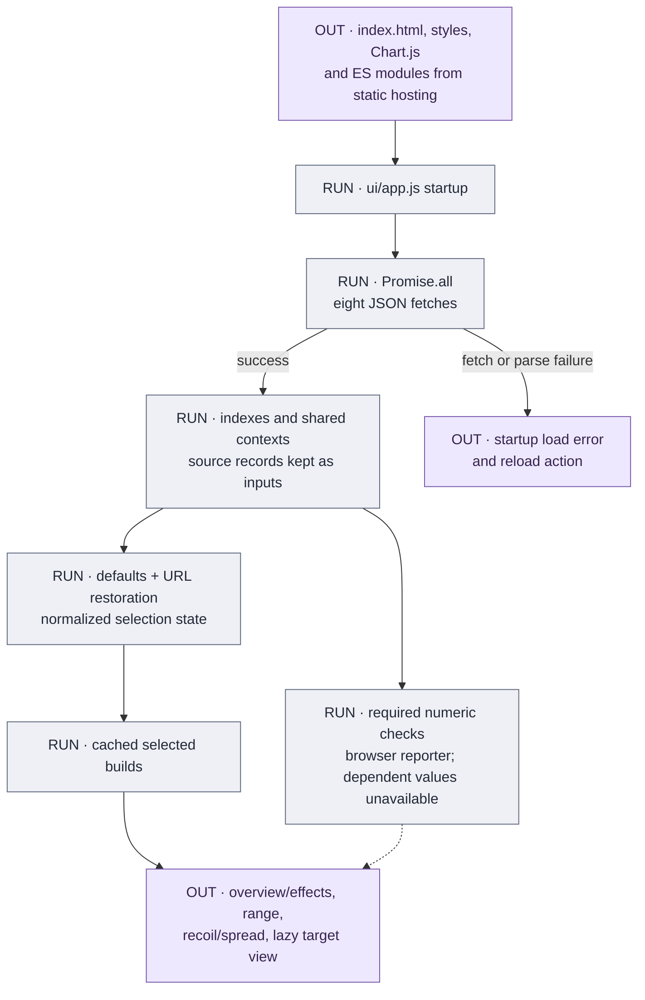
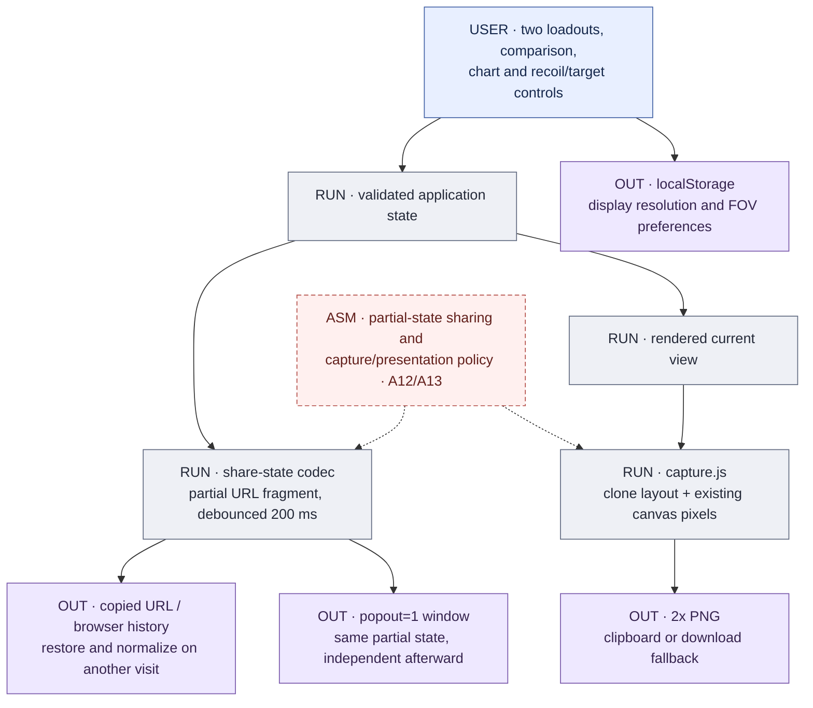
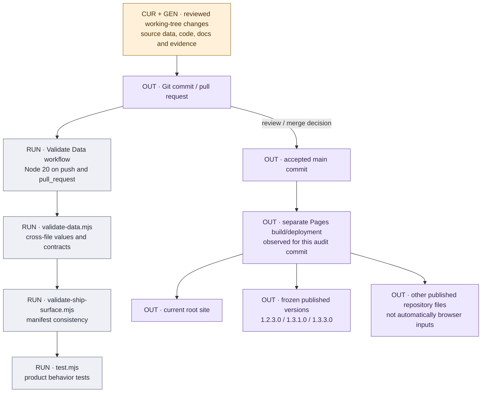

# Runtime UI, state, exports and publication

[Atlas](README.md) · [Architecture](../ARCHITECTURE.md) · [Tests](../TESTS.md)

## Runtime startup

[`ui/app.js`](../../ui/app.js) fetches these eight files, all beneath `data/`:

| Fetch | Runtime purpose |
|---|---|
| `weapons.json` | Roster, descriptions and base inputs. |
| `attachments.json` | Catalogs, availability/defaults, compatibility, modifiers and magazines. |
| `ammo.json` | Ammo choices, effects, velocity treatments and curve/pellet overrides. |
| `balance_tables.json` | Finite tables, factors, base maps and collateral map. |
| `ballistics.json` | Explicit weapon/ammo projectile selection and gravity/drag. |
| `hit_zones.json` | Explicit base/ammo head and limb multipliers. |
| `attachment-tooltips.json` | Text dictionary and selection-to-description lookup. |
| `recoil_decay.json` | Legacy maps retained in startup/context; current per-aim recoil groups supply active recovery inputs. |

All eight requests must load/parse for startup to complete, including the legacy
map file. Required numeric validation is a separate mechanism:
[`sim/required-data.js`](../../sim/required-data.js) throws by default in scripts,
while the browser installs [`ui/data-errors.js`](../../ui/data-errors.js) to report
deduplicated errors and keep affected numeric results unavailable. Do not collapse
these two error routes into a claim that every malformed number aborts startup,
or that every missing field has a zero/default fallback.

Contexts inject shared tables and current aim/stance/platform/control behavior.
A reusable simulation call must initialize/reset those contexts deliberately.
Selected builds, default builds, patterns, spread sequences and trajectories use
input-sensitive caches. Hidden panels skip detailed rendering; pan/zoom redraws
are scheduled with animation frames, and canvas backing dimensions account for
device-pixel ratio. Caching is an execution detail, not an additional source of
weapon measurements.

## State and exports

The codec is [`sim/share-state.js`](../../sim/share-state.js). It uses
`URLSearchParams` in the fragment and `history.replaceState`, validates IDs and
availability, and normalizes shared mounts and dependencies. The link does not
write a build into a server-side database.

| State family | What persists |
|---|---|
| Loadout and comparison | Primary/secondary weapon IDs and attachment tokens, comparison enabled. |
| Chart | Damage/BTK/TTK mode, selected headshot count, ADS/travel toggles. |
| Recoil | Aim, standing/moving, platform, control percentage and shot count. |
| Target | Target view, distance, zeroing and aim preset/custom coordinates. |
| Layout | Collapsed panel keys. |
| **Not encoded in the ordinary URL** | Seeds, visible layers, pan/zoom/magnification, custom spread-circle selections, target stats tab, display resolution and FOV. |
| Local preferences | Display resolution and FOV use local storage; they do not travel with a shared link. |

Compact attachment tokens use **zero-based decimal catalog positions**. Magazine
tokens use `Object.keys(mags)` insertion order. Reordering catalog entries or
magazine keys changes old link meaning even when IDs and numerical values stay
unchanged. UI-only sorting can remain independent. Legacy dash-separated IDs still
restore, and legacy shared slots migrate to typed rails. New target links include
distance; old target links without it restore 30 m while the new-view default is
20 m. See the [codec contract](../ARCHITECTURE.md#url-compatibility-contract) and
[share-state tests](../../scripts/share-state.test.mjs).

PNG capture is a different export path. [`ui/capture.js`](../../ui/capture.js)
clones the rendered main column/header, snapshots current canvas bitmaps, removes
interactive controls, lays out an independent iframe at 1280 CSS pixels, and
serializes through SVG `foreignObject` to a 2x PNG. Overview is temporarily expanded
and restored in `finally`; other collapsed sections stay collapsed. Existing
charts are captured rather than independently resimulated at capture size.
Clipboard failure falls back to download; rendering failure has its own error
state. A PNG preserves visible pixels, not the complete editable model state.

## Publication and validation

The checked-in [Validate Data workflow](../../.github/workflows/validate-data.yml)
runs the three commands shown. The observed main-commit runs were separate:
[validation](https://github.com/raymdl/BF6-Weapon-Analyzer/actions/runs/35041480015)
and [Pages build/deployment](https://github.com/raymdl/BF6-Weapon-Analyzer/actions/runs/35041479395).
Both succeeded for the audit commit. This observation does **not** establish an
enforced deployment dependency on validation. The graph therefore does not draw
“tests passed” as a guaranteed Pages gate. Future repository settings/workflows
may change that relationship.

[`ship-surface.json`](../../ship-surface.json) declares runtime paths, the exact
eight JSON dependencies and the three published historical roots. Its validator
checks the declared surface. The manifest does not itself exclude reference files
from deployment or make them private. The audited Pages artifact includes research
and documentation files that the browser never fetches. Do not store secrets or
assume material is private merely because it is outside `runtimeData`.

The root application has no application bundler or data-ingestion job at startup.
GitHub Pages can still perform a hosting/Markdown build: that is separate from
compiling the weapon model or regenerating source data. Each historical version
is a self-contained published snapshot; the current root does not import those
versions as fallback data.

## Presentation and research boundaries

The header's displayed version and historical navigation are maintained in the
page. They identify the represented product/source context, not independent
measurement of every field on that build. Static artwork, favicon and social
preview assets are maintained presentation inputs.

`data/provenance/live-baseline.json`, `data/reload-exceptions.json` and
`data/weapon-role-tags.json` are maintenance/reference records despite residing
under `data/`. Reference workbooks, provenance reports and docs likewise are not
runtime dependencies. Archived plans describe historical work; ongoing research
remains under `docs/working/`. Local raw XML, SDK materials and ignored captures
are additional regeneration requirements, not hidden browser services.

## Verification responsibilities

Product tests establish consistency with the implemented model and expected
fixtures. Source generators' `--check` modes establish narrower relationships to
provided exports and mappings. Matched game recordings provide empirical checks
for their tested configurations. These are three distinct kinds of validation.
UI/layout changes additionally need browser checks for charts, target loading,
responsive controls, accessibility, captures and popouts; headless arithmetic
checks do not establish their visual correctness.
