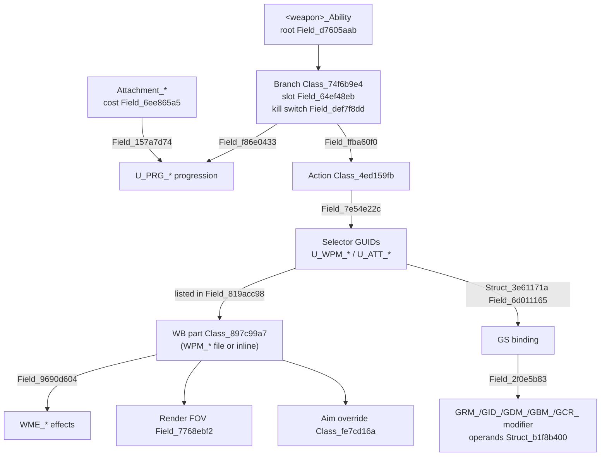

# How the Frosty assets link

[Frosty docs](README.md) · [Field map](FIELD_MAP.md) · [Weapons](WEAPONS.md) · [Attachments](ATTACHMENTS.md) · [UI text](UI_TEXT.md)

This page shows how the weapon and attachment assets connect, so you can go from a site
choice to the values that the game applies. Hash meanings are in the
[field map](FIELD_MAP.md). Links in the data show structure; they do not prove that the
game uses a branch at runtime.

## Asset families

| Prefix | Asset | Contents |
|---|---|---|
| `<weapon>_WB` | Weapon blueprint | Part list, render objects, default aim, projectile, fire logic |
| `GS_<weapon>` | Weapon stats | Recoil, dispersion, ADS/move indices, reload; selector bindings to modifiers |
| `<weapon>_Ability` | Weapon ability | Offered attachment branches, slots, kill switches, actions |
| `Equipment_<weapon>` | Equipment | Attachment list and prerequisite rules |
| `Attachment_<weapon>_<slot>_<name>` | Attachment | Cost, category, progression link |
| `U_PRG_*` | Progression unlock | The unlock that an ability branch uses |
| `U_WPM_*`, `U_ATT_*` | Selector unlocks | Package selectors (`U_WPM_*`) and model selectors (`U_ATT_*`) |
| `WPM_*` | Weapon part | Modifier package: effects, render object, aim override |
| `WME_*` | Weapon effect | One effect, for example ADS time or sway |
| `GRM_*`, `GID_*`, `GDM_*`, `GBM_*`, `GCR_*` | GS modifiers | Recoil, index, dispersion array, dispersion behavior, camera recoil |
| `PD_*` | Projectile | Damage curves, gravity, drag |
| `ZDA_*`, `FZT_*`, `AZT_*` | Shared arrays | Spread rows, zoom transitions |
| `Aim_*`, `_ZoomLevels/*` | Aim and zoom | Aim controller → zoom levels (magnification, camera FOV) |
| `AAM_<weapon>`, `AD_*` | UI metadata | Attachment names, labels and descriptions |
| `GRX_Weapons` | GameRemixer registry | Named values; source of most field names |

## From attachment to effect

1. **Attachment.** `Attachment_*` gives the point cost, the category and the progression
   (`U_PRG_*`).
2. **Ability branch.** The weapon ability's root list (`Field_d7605aab`) lists the
   offered branches. The branch with the same progression (`Field_f86e0433`) is the
   attachment's branch. It gives the slot (`Field_64ef48eb`) and the kill switch
   (`Field_def7f8dd`: registry default and local fallback).
3. **Actions.** The branch's actions (`Class_4ed159fb`) list unlocks
   (`Field_7e54e22c`): `U_WPM_*` package selectors and `U_ATT_*` model selectors. One
   action can list several packages ([Attachment bugs](../ATTACHMENT_BUGS.md) has cases
   where the wrong package is selected).
4. **Blueprint parts.** In `<weapon>_WB`, `Field_0cd9f20f` lists parts. A part whose
   `Field_819acc98` lists the selector GUID (as a bare string) is enabled. The effects
   are in `Field_9690d604`. **A package applies to a weapon only if that weapon's WB
   lists the part.**
5. **GS bindings.** In `GS_<weapon>`, a `Struct_3e61171a` whose `Field_6d011165` is the
   selector GUID binds a modifier (`Field_2f0e5b83`). Bindings are per weapon: the same
   package can have a recoil binding on one weapon and none on another.
6. **Operands.** Modifiers hold `Struct_b1f8b400` records: add, multiply or override
   ([field map](FIELD_MAP.md#modifier-operands-and-effects)). The order between modifiers
   on one field is not known.

The resolved graph for every site choice is in
[frosty-site-attachment-mapping-2026-09-13.json](../../reference-data/provenance/frosty-site-attachment-mapping-2026-09-13.json);
`scripts/frosty-configuration.py` (`attachment_graph`) implements the traversal.

### Traps

- **Model parts share selectors.** An inline `U_ATT_*` model part can list the same
  selector as the real package without an aim or effects. Ignore it when you read aim or
  effects (see [Attachments](ATTACHMENTS.md#optic-render-fov-and-zoom)).
- **A branch is not availability.** Check the kill-switch default, the equipment rules
  and in-game menus. Exported defaults do not include live server overrides.
- **`_W##` suffixes are not costs.** 334 of 3,016 suffixed actions have a different
  `Field_6ee865a5`.
- **Selectors with no binding.** Some selectors have no GUID occurrence in their
  weapon's WB or GS. Record them as unbound; do not assign inferred values
  ([evidence](../../reference-data/provenance/frosty-handling-unbound-selector-review.json)).

## Slots and prerequisites

- **Physical slots.** Attachment types assigned to the same slot
  (`Field_64ef48eb`) share one choice. This gives KORD and KTS100 one laser/light slot;
  PP-19 keeps separate side slots.
- **Prerequisites.** `Equipment_<weapon>` `Field_e70ce6be` holds `Struct_4f9523cc`
  rules: `Field_399fae20` is the dependent attachment and `Field_f4142987` lists allowed
  prerequisite IDs. Resolve the IDs against `Attachment_*` `Field_de6f63b3`. A GUID
  search does not find these integer links.
- **PP-19 proof.** All 12 underbarrels list the other five magazine IDs and exclude the
  53-round Extended4 (`0x81260446`); in-game screenshots confirm it
  ([trace](../archive/PP19_53_ROUND_COMPATIBILITY_2026-09-14.md)).
- **Coverage.** 1,391 offered grip/laser/light choices and all 285 dependency entries;
  22 rules map to offered attachments on PP-19, AK-205, RPK-74M and RPKM. The other
  263 concern secondary sights outside the site choices.
- Generated by `scripts/frosty-attachment-compatibility.py`
  ([evidence](../../reference-data/provenance/frosty-attachment-compatibility.json),
  [command](../../MAINTENANCE.md#regenerate-attachment-modifiers)).

## From weapon to projectile and damage

- WB `Class_35259f6b/Field_58d70acb/Struct_29ea5d2b/Field_808dd66c` selects the primary
  projectile (`PD_*`). Ammo attachments select replacement projectiles (Match and
  MatchTungsten through explicit links).
- `PD_*` holds the damage curves, gravity and drag ([Weapons](WEAPONS.md)).
- Hit-zone multipliers are in the level material grids (raw EBX), keyed by projectile
  material and soldier material.

## From optic to zoom

- The weapon default aim is `Class_542ac52c.Field_4f917af5` (all weapons: `Aim_1x50`).
- An optic part overrides it with `Class_fe7cd16a.Field_4f917af5` (for example
  `Aim_01x00_PiP`). Iron-sight parts have no override.
- The aim controller links `_ZoomLevels` assets; each gives the magnification and camera
  FOV ([Attachments](ATTACHMENTS.md#optic-render-fov-and-zoom)).

## From weapon or attachment to UI text

See [UI text](UI_TEXT.md): `UIWeaponAbilityMetaData*` for weapon names and
descriptions, `AAM_<weapon>` and `AD_*` for attachment names, labels and descriptions,
and `fs_us_loc` for the strings.
