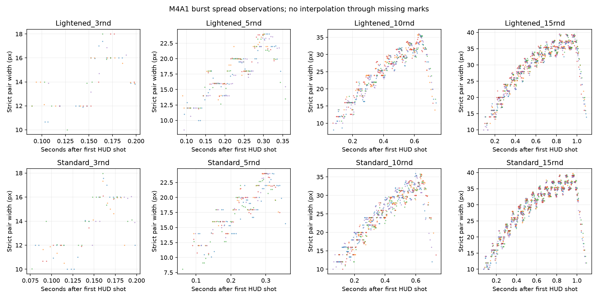
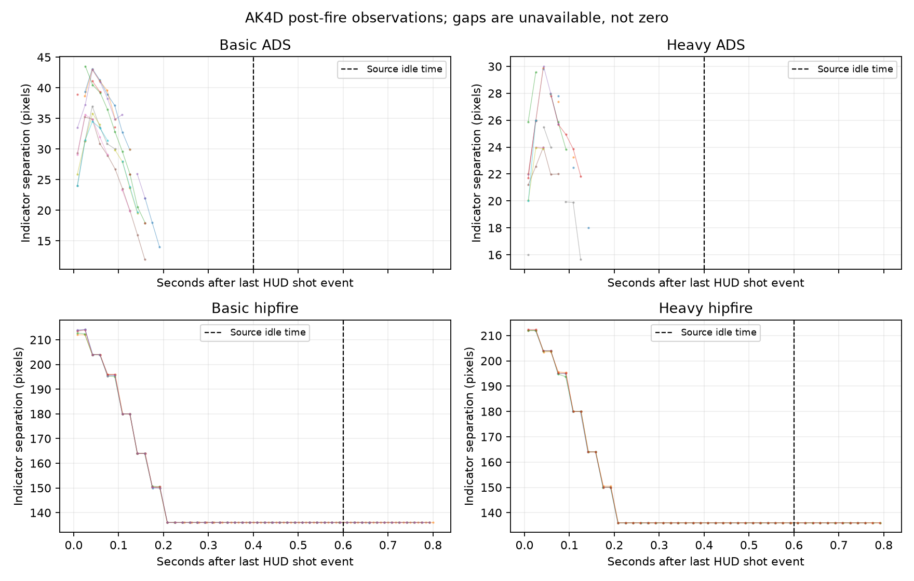
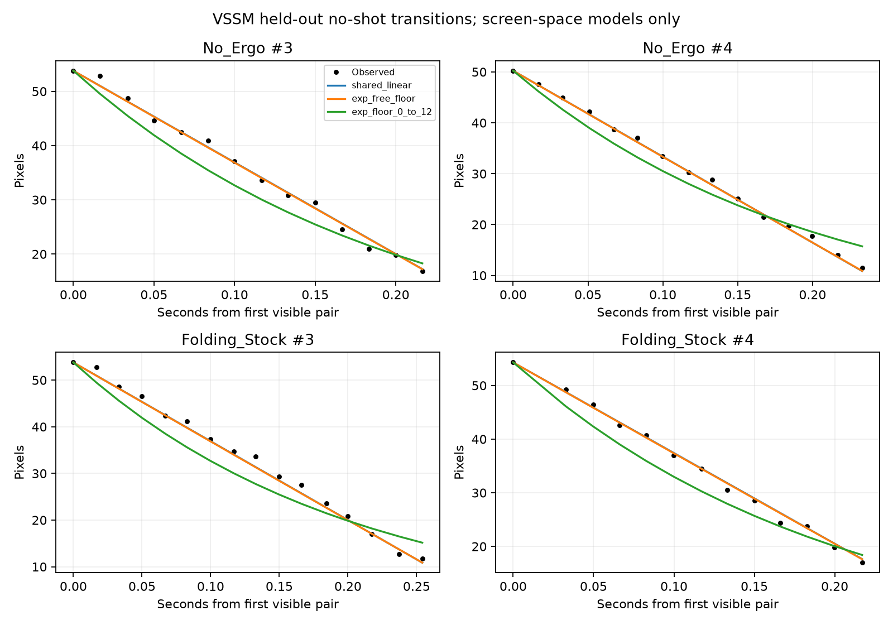
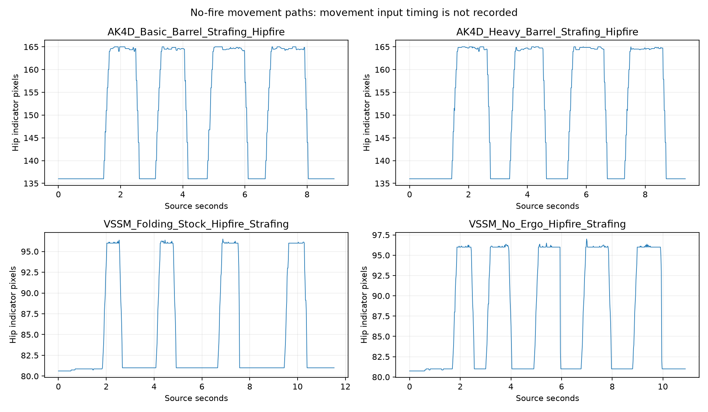

# Existing-recording follow-up analysis — 12 September 2026

**Historical analysis:** This report records the model and evidence available on
12 September. The later source-exponent sampler and light changes supersede its
implementation descriptions, not its measured recording results. See the
[current recording handoff](BF6_RECOIL_SPREAD_RECORDING_HANDOFF.md) and
[current model](../RECOIL_SPREAD_MODEL.md).

## Result and recommendation

The existing recordings support more HUD analysis, but they do not justify a
new simulator formula or parameter change. Keep the current first-shot
multiplier, recoil model, and attachment factors. The useful new results are:

- M4A1 Standard and Lightened have almost equal measured burst spread peaks.
- A change to post-fire recovery fits M4A1 burst HUD traces better than continued
  firing recovery. The exact switch time remains unidentified.
- The first-shot/reset question remains unresolved: no usable spread pairs were
  detected in 100 isolated/rapid/semi-auto shot windows across the reviewed sets.
- AK4D hipfire reaches its standing HUD width at about 0.21 s, well before its
  source hipfire idle time of 0.6 s. This set cannot measure that idle effect.
- VSSM's visible no-shot ADS contraction is better described by a common nearly
  constant pixel rate than by the tested exponential-to-floor model.
- No-fire movement transitions are measurable. AK4D Basic and Heavy have almost
  identical paths. VSSM has real fast-stop exceptions that must be retained.

The next useful capture is a small visibility trial followed by combined
burst-pause-resume and moving-fire tests. Do not repeat the completed stationary
M4A1 or AK4D burst sets, VSSM standing comparison, or no-fire controls.

## Scope, conditions, and evidence

This work uses the standing conditions in the
[active handoff](BF6_RECOIL_SPREAD_RECORDING_HANDOFF.md): build 1.4.2.5, FOV 103,
Mini Flex, and a 20 m wall. The VSSM built-in-range exception remains: distance
is unspecified, and the recorded loadout has the 200MM ASM barrel, 20-round
magazine, and Tungsten Match / Range Penetration ammo. No VSSM angular
calibration is inferred from 20 m.

The analysis includes:

- New HUD extraction from all 20 September 11 M4A1 videos: 400 retained shot
  events, including 40 bursts and 70 isolated/semi-auto shots.
- New native-frame HUD extraction from all six September 10 rapid-fire videos:
  five shots each, across M4A1, AK4D, and TR7 with both suppressors.
- Additional analysis of existing AK4D measurements: 20 ADS burst tails,
  nine matched 15-round hipfire tails, and two hipfire strafe controls. The
  previously identified 16-round Heavy hipfire group remains excluded.
- Additional analysis of the eight VSSM no-shot ADS transitions and both
  hipfire strafe controls.
- Source-frame review of isolated-shot impacts and HUD detections. Existing
  impact-group findings remain separate from per-projectile measurements.

All 61 source files in the selected inventories were checked against their
prior SHA-256 hashes: 45 videos and 16 images. The six older videos have moved
under `09102026`; their contents match the original inventory. Cached
measurement inputs are separately hashed. This analysis did not change the
source videos, existing analysis outputs, simulator, data, or earlier
duration-fallback edit.

During this work, separate commit `f6eba48` changed spread integration to 1 ms
and updated the model guide; `e1785f6` added other research to the handoff.
Those changes are preserved. The two simulator/guide hash differences from the
starting snapshot are exactly explained by `f6eba48` and line-ending
normalization: reversing those changes in memory reproduces the starting
hashes. No source file was reverted. Other monitored code/data files match the
starting snapshot. The separate research additions are not claimed as results
of this pass.

Reproducible local outputs are in
`outputs/recording-followup-2026-09-12/` in the saved checkout.
That directory is Git-ignored. This report retains the conclusions in the
repository; the CSVs, scripts, plots, and source-frame review sheets retain the
detailed evidence locally. The four summary plots below are copied into
`docs/img/recording-reuse-2026-09-12/` so they remain available with this report.

## 1. First-shot spread and reset: useful coverage, insufficient visibility

The M4A1 pass checks 3,354 cropped frames around 70 isolated/semi-auto shots.
Windows extend from 80 ms before to 170 ms after the HUD-event midpoint, at
native frame sampling within 80 ms of the event and approximately 120 Hz
elsewhere. The six older rapid-fire clips add 1,580 native-frame samples across
their complete firing sequences and early tails. Neither pass detects usable
paired red marks in those windows. Source-frame review of the first and last
M4A1 shots in each file, and all five older rapid shots, supports this result.

These are **unavailable spread observations**, not zero spread. Small marks
may be hidden by the optic dot, display rules, impact effects, or resolution.
The 4,934 sampled frames are not independent trials; encoded frames can repeat
rendered content. The 100 shots also cannot be pooled into a projectile
distribution experiment: they mix weapons, loadouts, and recovery conditions.

The September 11 M4A1 interval labels are not the actual intervals:

| Filename label | Standard mean interval | Lightened mean interval |
|---|---:|---:|
| 100 ms | 219 ms | 213 ms |
| 150 ms | 255 ms | 255 ms |
| 250 ms | 370 ms | 370 ms |
| 500 ms | 620 ms | 615 ms |
| 1000 ms | 1109 ms | 1120 ms |

The older M4A1 rapid clips include approximately 120 ms intervals; the older
AK4D/TR7 clips mainly add approximately 160–200 ms intervals. Their HUD-event
brackets are about 37–42 ms wide. These clips improve timing coverage, but do
not provide the missing first-shot spread measurements. The newer M4A1 event
brackets are about 21 ms wide. Neither bracket includes a proven correction
for display latency relative to engine firing.

### Indirect burst-model check

A bounded research comparison used the current M4A1 source inputs, actual
HUD-event midpoints, 1 ms integration, and candidate first increments of
0, 1, or 2 times the normal increase. Each candidate fitted a shared affine
HUD scale, a first-order HUD response, a timing offset, and a post-fire switch
delay using only the first two Standard 5- and 10-shot bursts. Parameters were
then frozen for the other 36 groups, including all Lightened groups and all
3- and 15-shot bursts. The score is the mean of group RMSEs, so each group has
equal weight. These are withheld groups within the existing capture set, not
independent recording-level replication.

| First post-shot increment hypothesis | Switch to not-firing recovery | Continue firing recovery |
|---|---:|---:|
| No first increment | 1.74 px | 2.00 px |
| Normal first increment | 1.71 px | 2.00 px |
| Double first increment | 2.01 px | 2.22 px |

The 0-versus-1 difference is only about 0.03 px. Changing color thresholds or
using Standard groups 3/4 for calibration does not establish a meaningful
reason to change the current multiplier. Normal-increment/switch models score
about 1.66–1.76 px across those checks. This test does **not** identify the
spread used by projectile 1, the order of projectile sampling and spread
addition, or the reset rule after trigger release. It tests hypothetical
post-shot HUD trajectories under an assumed mapping.

**Recommendation:** retain the current multiplier. Use a brief pilot capture
to find an aim state/loadout in which shot growth and the pause remain visible
before recording another full pause series. Repeating the same ADS singles
would mainly reproduce missing observations.

## 2. M4A1 burst spread and post-fire recovery

The new detector follows the magenta optic dot. A fixed screen-center gate
loses valid pairs when the optic moves during recoil. The fixed-gate results
are retained for diagnosis; the final M4A1 metrics use the dot-relative detector.
Strict pairs require both red marks, compatible heights, and a midpoint near
the dot. Questionable small pairs remain in the raw output but are excluded
from the fit. Missing spans are not interpolated.

Median measured peak separation across five bursts per condition:

| Burst length | Standard | Lightened |
|---|---:|---:|
| 3 rounds | 17.33 px | 17.38 px |
| 5 rounds | 24.00 px | 23.97 px |
| 10 rounds | 35.83 px | 35.76 px |
| 15 rounds | 39.25 px | 39.48 px |

The differences are below 0.6% with this detector. This supports using the two
suppressors as matched firing-spread controls. It is not a statistical
equivalence test or evidence that projectile distributions are identical.

The strict contiguous tails end roughly 48–161 ms after the final HUD shot
event, depending on burst length and detection. These are **visibility limits**,
not times to zero or minimum spread. The first strict pairs appear about
60–148 ms after the first HUD event; this does not establish a special shot
number or an engine display threshold.

Switching from firing to not-firing recovery improves the normal-increment
model from 2.00 to 1.71 px. The direction of that result survives the tested
thresholds and alternate calibration groups. The fitted switch delay changes
between roughly 17 and 33 ms, while the HUD response changes between about
33 and 50 ms. These coupled fit parameters are not measured trigger-release
times or engine constants. Keep the existing source recovery distinction;
do not insert a fitted 33 ms timer into the simulator.

## 3. Idle recovery: the current tails cannot expose the transition

The AK4D ADS tail check also uses a dot-relative red detector on existing
source crops. Disconnected late pairs are excluded from the early tail. The
usable red tails end before the 0.4 s ADS idle threshold. Hidden red pairs do
not establish that ADS spread has reached its floor.

Hipfire gives a stronger observation because its indicator remains visible:
all nine matched 15-round groups reach the 136 px standing plateau at about
**0.21 s** after the last HUD event and remain there through the relevant later
window. Sampling is about 60 Hz; the sub-millisecond spread between calculated
midpoints must not be read as sub-millisecond accuracy. Source `IdleTime` is
**0.4 s for ADS and 0.6 s for hipfire**, not 0.4 s for both states.

There is consequently no visible excess left at the hipfire idle threshold
with which to distinguish the not-firing and idle rates. More identical
15-round stationary AK4D groups would not fix that lack of information.

**Recommendation:** before a full idle test, verify in a pilot that measurable
excess survives beyond the selected weapon/aim state's source idle time.
Moving fire is a useful missing condition to try, but it is not guaranteed to
extend recovery. A longer burst is also not guaranteed to help if spread is
already at its firing plateau. Do not add idle activation from these traces.

## 4. VSSM no-shot ADS contraction

The first two existing transitions from each stock setting calibrate a shared
linear pixel rate. The remaining two transitions per setting are withheld.
Predictions for a withheld transition use only its first observed width; they
do not fit its later measurements.

| Screen-space model | Mean withheld-transition RMSE |
|---|---:|
| Shared linear contraction, about 169 px/s | 0.84 px |
| Exponential toward a floor constrained to 0–12 px | 3.10 px |
| Exponential with an unrestricted floor | 0.85 px |

The unrestricted exponential chooses the slowest tested rate and an extreme
negative asymptote, approximately -3,345 px. Over this short interval it acts
almost like a straight line. This is a fit degeneracy, not a physical spread
floor. The 0–12 px bound is a screen-space comparison assumption, not a measured
angular minimum. An unknown nonlinear HUD mapping could change these model
comparisons.

The result strengthens the case for investigating a common no-shot transition
path separately from accumulated firing spread. It does not identify the
ordinary-decrease branch or authorize setting native decay to 169 px/s. The
prior stable-background-scale check and equal stock-mode slopes remain relevant.
Applying the different source not-firing/idle offsets directly still does not
explain the common visible rate.

**Recommendation:** retain the existing transitions as constraints. Do not
repeat them. VSSM hipfire firing and independent scale calibration are the
useful missing measurements.

## 5. Movement paths: new descriptive measurements

The no-fire hipfire controls allow a 10–90% traversal measure between the
observed stationary and moving plateaus. Durations are rounded to the useful
precision of the approximately 60 Hz sampling. Input press/release times and
character velocity are not recorded.

| Condition | Rise, 10–90% | Fall, 90–10% | Repetitions |
|---|---:|---:|---|
| AK4D Basic | about 183 ms | about 117 ms | Four rises and four falls |
| AK4D Heavy | about 183 ms | about 117 ms | Four rises and four falls |
| VSSM No Ergo | about 167 ms | three about 117 ms; two about 33–34 ms | Five rises and five falls |
| VSSM Folding Stock | about 167 ms | three about 117 ms; one about 51 ms | Four rises and four falls |

The VSSM short falls are retained. The sampled source crops show the width
change; they are not caused by a large timestamp gap in the cache. Their
cause is not established. Movement input, character acceleration/deceleration,
and HUD response remain mixed in these paths.

**Recommendation:** no new no-fire strafe capture is needed. These traces
constrain a future dynamic movement model, but do not justify a universal
rise/fall constant. Moving fire, crouch/prone, sprint, jump/landing, and other
unrecorded stance branches still need their own evidence.

## 6. Physical aim and projectile distribution

Additional source-frame sheets inspect isolated M4A1 shots 1, 2, and 5 with
both suppressors, before the event and about 50, 150, and 400 ms afterward.
The reviewed frames contain impact effects and overlapping marks near the
optic dot. They do not provide a reliable new per-projectile coordinate series.
The effect cloud or tracer center must not be substituted for a bullet-hole
center. No new impact-angle or distribution estimate was accepted.

The prior 15-round group-height result remains a separate observation. A final
group height cannot assign each impact to a firing instant, subtract the
instantaneous aim position, or determine the recoil-delivery envelope.

There is also a capture-design limit in the old isolated-shot proposal:
fully reset isolated shots show camera response but do not sample the physical
aim seen by a closely following projectile. Short paired shots or short bursts
are needed for that comparison, with a clean region for each group and a
measurable initial aim point. Even then, the available shot cadence and the
spread uncertainty may not distinguish exact 25/50 ms delivery envelopes.

**Recommendation:** keep the existing isolated camera tracks. For a future
physical-aim test, first verify that each impact in a small paired-shot pilot
can be assigned to its shot. For distribution, use a separate 100–200-shot
fully reset series with individually measurable impacts and shot-time aim
centers. A wider visible spread condition, such as stationary hipfire, may be
more practical than tight ADS; establish visibility in a pilot. Do not pool
the present burst groups as independent spread samples.

## Minimal next-capture order

1. **Visibility pilot:** one short burst and full recovery in the intended
   ADS/hipfire condition. Confirm that the indicator remains measurable through
   the interval being tested. Avoid spending a full session on hidden marks.
2. **Combine reset and post-fire tests:** with a working condition, repeat a
   fixed short burst, pause, then fire one shot or another short burst. Cover
   short pauses near 100/200 ms, the selected idle boundary, a longer pause,
   and full recovery. Measure actual intervals from the recording. Trigger
   release timing, if directly recorded, is more useful than filename labels.
3. **Moving fire and VSSM hipfire firing:** these fill actual gaps. The existing
   stationary and no-fire controls can serve as comparisons. A new Heavy
   transfer test must use a second weapon with matched Basic/Heavy loadouts.
4. **Physical aim/distribution:** proceed only after a small impact-visibility
   pilot succeeds. Keep this separate from the HUD-recovery experiment.

Bolt Smooth validation and PP-19 Flash Comp source mapping are not covered by
the current recordings. They remain separate tasks. No new footage is needed
to retain the already accepted implementation.

## Reproduction and verification

Run from the saved Analyzer checkout with the bundled Python runtime. The
scripts are local under `outputs/recording-followup-2026-09-12/`:

1. `verify_inputs.py` compares original source hashes and checks the simulator/
   data baseline. Older rapid-video path relocation is explicit.
2. `extract_m4.py` creates the cropped native-timestamp M4A1 cache.
3. `dynamic_marks.py` measures dot-relative pairs; `m4_analysis.py` writes the
   visibility counts, group metrics, charts, and source-crop review sheets.
4. `older_rapid.py` checks the six older rapid-fire clips.
5. `ak_dynamic.py` remeasures AK4D ADS marks from the existing larger crops;
   `cached_analysis.py` writes tail, VSSM transition, and movement results.
6. `m4_model_check.py` runs the bounded model comparison. Repeat with
   `--threshold 85`, `--threshold 125`, and `--fold late` for the retained
   sensitivity checks.
7. `impact_feasibility.py` and `additional_qa.py` create the impact, hipfire-tail,
   and fast-stop source-frame sheets.
8. `summarize_results.py` collects the final metrics, hashes the 43 cached/data
   input files, and checks expected file, event, group, and comparison counts.
   Run `verify_inputs.py` again for the final integrity check.

Plots use Matplotlib installed only in the ignored local `python-deps` folder;
no project dependency or system Python package was changed. Source frames use
PyAV and OpenCV. The code retains missing observations and exclusions, uses
presentation timestamps, and does not treat encoded frame count as independent
engine updates. The model comparison is research code, not a replay of the
shipped simulator. No production test suite was needed because production code
and data were unchanged by this analysis.
